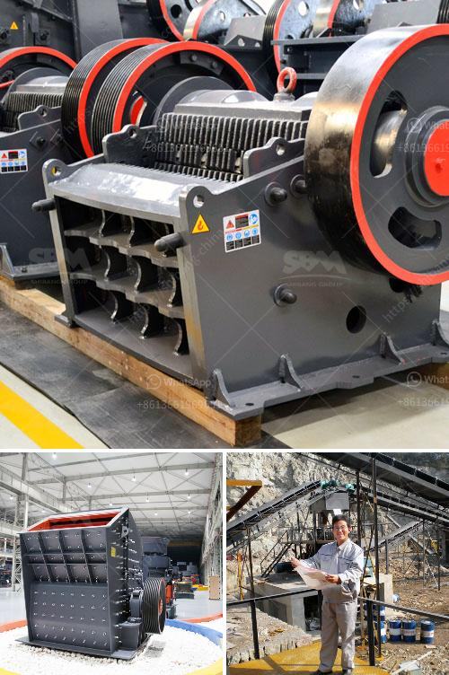

<h3>calcium carbide making machine used</h3>
Calcium carbide making machine is an essential device in the calcium carbide production process, which is suitable for making carbide bricks for industrial use. So, how to select the most suitable calcium carbide making machine, preferably with advantages of high efficiency, low energy consumption, and environmentally friendly features? This article will give you a brief overview.

Firstly, when choosing a calcium carbide making machine, it is necessary to consider the production capacity. Different machines have different production capacities, so it is important to assess the required output based on your specific needs. The capacity of a calcium carbide making machine usually ranges from several tons to hundreds of tons per day.

Secondly, energy consumption is another crucial factor to consider. A high-quality calcium carbide making machine should have low energy consumption to minimize production costs. Look for a machine that utilizes advanced technology and equipment, such as energy-saving motor and control systems, to ensure efficient and sustainable production.

Additionally, choose a calcium carbide making machine that is easy to operate and maintain. The machine should be equipped with a user-friendly interface and simple controls. It should also require minimal maintenance to reduce downtime and increase overall productivity.

Furthermore, environmental concerns have become increasingly important in industrial production. Therefore, it is recommended to select a calcium carbide making machine that has integrated environmental protection features. These may include dust collection systems, smoke and gas purifiers, and noise reduction technology, which can help minimize pollution and create a safer working environment.

In conclusion, when looking for a calcium carbide making machine, it is vital to consider factors such as production capacity, energy consumption, ease of operation and maintenance, and environmental protection features. By selecting a suitable machine, you can optimize your calcium carbide production process, enhance efficiency, and contribute to a sustainable and eco-friendly industrial operation.
<h3>Contact us</h3><ul><li><strong>Whatsapp:&nbsp;<a href="https://wa.me/8613661969651">+8613661969651</a></strong></li><li><a href="https://swt.shibang-china.com/?git&amp;zhl&amp;calcium carbide making machine used"><strong>Online Service(chat now)</strong></a></li></ul><h3>Related</h3><ul><li><a href='chrome processing plant price.md'>chrome processing plant price</a></li><li><a href='roll crushers for sale.md'>roll crushers for sale</a></li><li><a href='crush molybdenum equipment.md'>crush molybdenum equipment</a></li><li><a href='sand vsi crusher.md'>sand vsi crusher</a></li><li><a href='concrete crushing plant in dubai.md'>concrete crushing plant in dubai</a></li></ul>