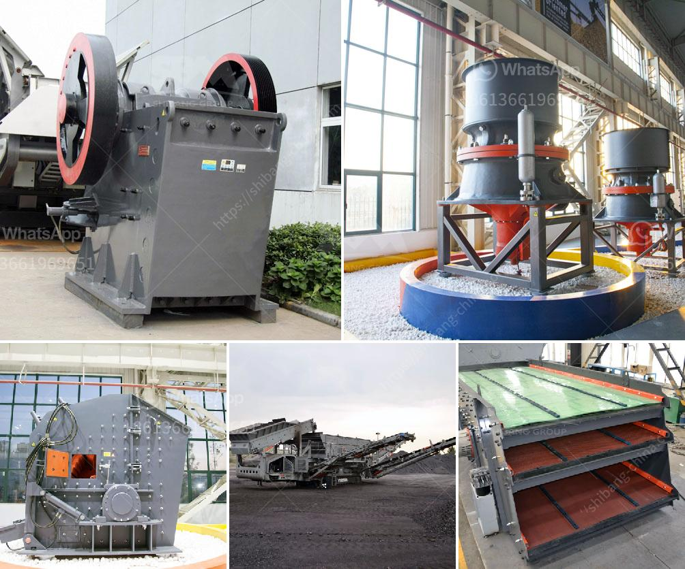

<h3>calcium carbonate ball mill process</h3>
Calcium carbonate (CaCO3) is a common material found in rocks, pearls, and shells. Senku, a character from the popular anime, Dr. Stone, knows exactly how to extract this substance, making it a valuable resource for various industries. One process that is often used to obtain calcium carbonate is through a ball mill.

The ball mill can be used to grind and process various materials, including calcium carbonate, creating a wide range of powders. In addition to grinding calcium carbonate, the ball mill can also be used to grind other minerals, such as limestone, calcite, marble, kaolin, and gypsum.

Calcium carbonate is a chemical compound with the formula CaCO3. It is a common substance found in rocks, as the minerals calcite and aragonite (most notably as limestone), which is a type of sedimentary rock consisting mainly of calcite. This compound is used in various industries for different purposes.

In the ball mill process, the raw materials are mixed dry or wet and ground in the ball plant to obtain finer particles. The finely ground material is then sieved to obtain the desired particle size distribution. The obtained powder can be used in various applications, such as in the paper, paint, plastic, rubber, and pharmaceutical industries.

The ball mill process for calcium carbonate is the most commonly utilized method. This process involves rotating the drum containing the material, adding water or other liquids along with additives, and grinding the mixture using steel balls. Milling duration can be anywhere from a few hours to several days, depending on the desired fineness.

During the grinding process, the steel balls in the ball mill tumble and impact with the raw material, constantly breaking larger particles into smaller ones. This results in a reduction in particle size and an increase in surface area, which enhances the reactivity and solubility of the calcium carbonate.

The efficiency of the ball mill process in producing fine particles primarily depends on the rotational speed of the drum, the grinding media size, and the time of grinding. Other factors such as the addition of dispersing agents or grinding aids can also influence the efficiency of the process.

One of the advantages of the ball mill process is its versatility. It can be used for both wet and dry grinding with wet grinding being more common due to lower energy consumption. This allows for easy control of particle size distribution and the production of uniform and fine powders.

In conclusion, the ball mill process is an effective method to grind calcium carbonate into fine powders. The process utilizes rotating drums along with steel balls and other additives to break down the raw material, resulting in a finely ground product. This versatile process is used in various industries to produce calcium carbonate powders with different particle size distributions.
<h3>Contact us</h3><ul><li><strong>Whatsapp:&nbsp;<a href="https://wa.me/8613661969651">+8613661969651</a></strong></li><li><a href="https://swt.shibang-china.com/?git&amp;zhl&amp;calcium carbonate ball mill process"><strong>Online Service(chat now)</strong></a></li></ul><h3>Related</h3><ul><li><a href='industrial jaw crushers.md'>industrial jaw crushers</a></li><li><a href='business plan on manganese ore mining crusher.md'>business plan on manganese ore mining crusher</a></li><li><a href='project proposal on stone crushing mill small scale.md'>project proposal on stone crushing mill small scale</a></li><li><a href='limestone processing limestone processing plant.md'>limestone processing limestone processing plant</a></li><li><a href='ball mill installation.md'>ball mill installation</a></li></ul>