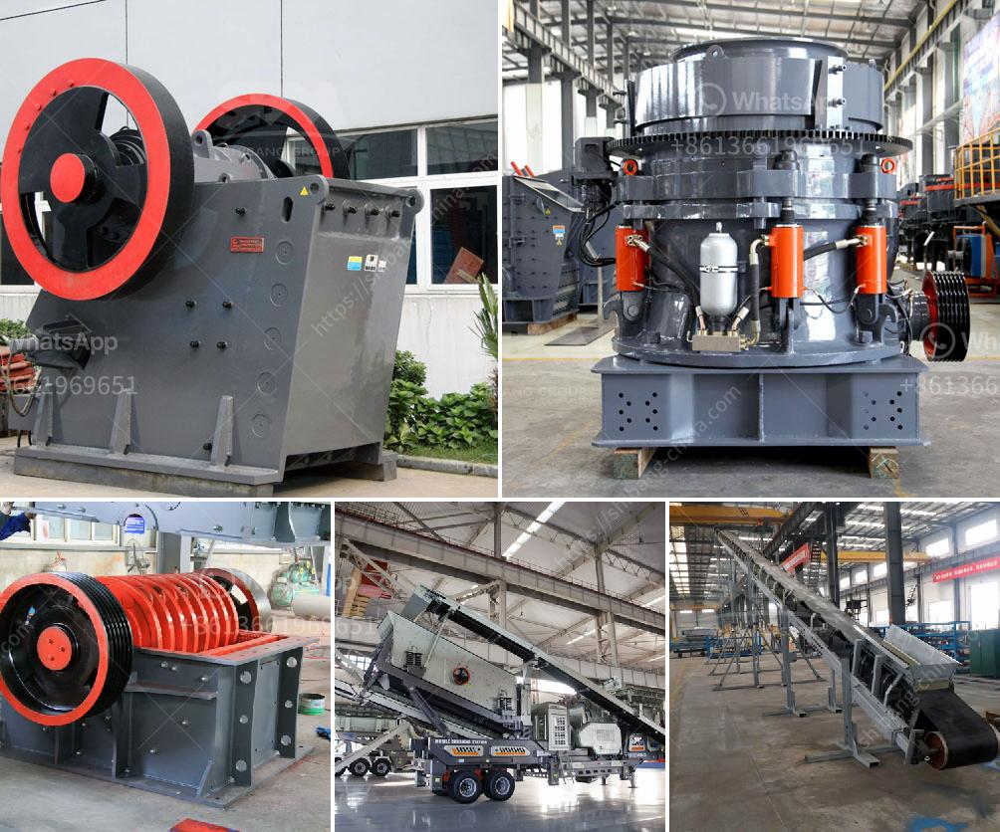

<h3>calcium carbonate crushing plant</h3>
Calcium carbonate is a chemical compound found in natural resources such as limestone, marble, and chalk. It is one of the most widely used substances in various industries, including construction, healthcare, and food production. To meet the growing demand for calcium carbonate, industries require an efficient and reliable crushing plant.

A calcium carbonate crushing plant consists of a series of machines designed to achieve the desired size reduction of calcium carbonate. The crushing stage is an essential component for the production of calcium carbonate, as it determines the final particle size and quality of the product.

The primary crusher is essential in this process. It takes large pieces of calcium carbonate and reduces them to smaller, more manageable sizes. The jaw crusher is commonly used as the primary crusher in calcium carbonate crushing plants due to its high processing capacity and low operating cost.

Next, the crushed calcium carbonate is fed into a secondary crusher, such as an impact crusher or cone crusher, to further reduce its size. The secondary crushers are designed to produce specific sizes of calcium carbonate for various industrial applications. They provide a finer and more consistent product compared to the primary crusher.

After the secondary crushing stage, the calcium carbonate can undergo additional processing steps, such as grinding and classification, to further refine its particle size distribution. This is crucial for industries that require specific sizes and shapes of calcium carbonate particles.

Investing in a calcium carbonate crushing plant can bring multiple advantages to industries. First and foremost, it ensures a consistent supply of calcium carbonate, eliminating the need for companies to rely on external suppliers. This results in cost savings and improved production efficiency.

Additionally, having a crushing plant on-site allows companies to have better control over the quality of their calcium carbonate products. They can optimize the production process and adjust the parameters to meet the specific requirements of their customers.

In conclusion, a calcium carbonate crushing plant is a valuable investment for any industry that requires calcium carbonate as a raw material. By investing in a crushing plant, companies can ensure a steady supply of calcium carbonate and improve their overall production efficiency. Furthermore, having a crushing plant on-site provides better control over product quality, resulting in greater customer satisfaction.
<h3>Contact us</h3><ul><li><strong>Whatsapp:&nbsp;<a href="https://wa.me/8613661969651">+8613661969651</a></strong></li><li><a href="https://swt.shibang-china.com/?git&amp;zhl&amp;calcium carbonate crushing plant"><strong>Online Service(chat now)</strong></a></li></ul><h3>Related</h3><ul><li><a href='aggregate processing equipment.md'>aggregate processing equipment</a></li><li><a href='feldspar stone crusher.md'>feldspar stone crusher</a></li><li><a href='crushing of gold.md'>crushing of gold</a></li><li><a href='stone crushers for sale south africa second hand.md'>stone crushers for sale south africa second hand</a></li><li><a href='hammer mills kenya.md'>hammer mills kenya</a></li></ul>