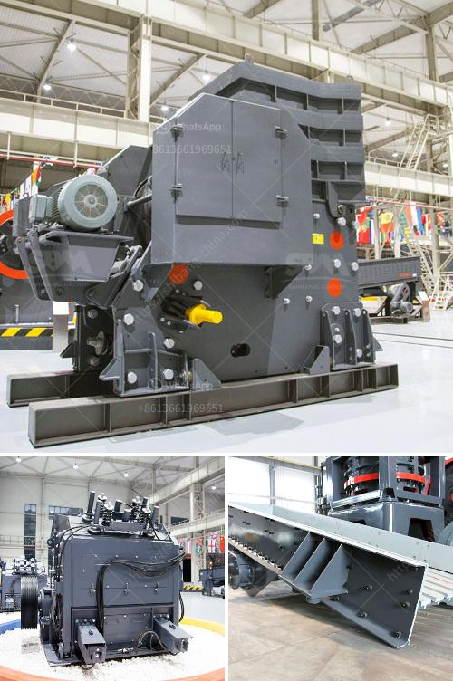

<h3>calcium carbonate grinding industries in india</h3>
India is the world's largest producer and consumer of calcium carbonate, a mineral that is widely used in various industries. The country has a vibrant calcium carbonate grinding industry, which plays a crucial role in the economy of India.

Calcium carbonate is used in a wide range of products, including paints, plastics, adhesives, sealants, and papers. It is also used as a dietary supplement for treating calcium deficiencies in humans and animals. The growing demand for these products has fueled the growth of the calcium carbonate grinding industry in India.

One of the major factors contributing to the growth of this industry is the abundance of raw materials in India. The country has significant reserves of high-quality limestone, which is the major source of calcium carbonate. These limestone deposits are found in several states in India, including Rajasthan, Andhra Pradesh, and Gujarat. The presence of these reserves ensures a steady supply of raw materials to the calcium carbonate grinding industries.

Another important factor driving the growth of this industry is the favorable government policies. The Indian government has implemented several initiatives to promote the manufacturing sector, including the calcium carbonate grinding industry. These initiatives include tax incentives, subsidies, and simplified regulations for setting up and operating grinding plants. These favorable policies have attracted both domestic and foreign investments in the industry, further boosting its growth.

The calcium carbonate grinding industry in India has witnessed significant technological advancements in recent years. The use of advanced grinding machinery and equipment has led to increased productivity and efficiency in the manufacturing process. The adoption of efficient grinding techniques has also resulted in improved product quality. This has enabled Indian manufacturers to meet the stringent quality standards demanded by domestic and international markets.

India is not only a major producer but also a major exporter of calcium carbonate products. The calcium carbonate grinding industry in India exports its products to various countries, including the United States, United Kingdom, Germany, and Japan. The growth of the Indian economy and the increase in disposable income have led to a rise in the demand for calcium carbonate products in these countries. The high-quality and competitive pricing of Indian calcium carbonate products have made them popular among global customers.

However, the calcium carbonate grinding industry in India is not without its challenges. One of the major challenges faced by manufacturers is the rising cost of energy. Grinding limestone into calcium carbonate requires a significant amount of energy, which contributes to the overall production cost. The volatility of energy prices makes it difficult for manufacturers to plan and budget their operations effectively.

Environmental concerns are another challenge faced by the calcium carbonate grinding industry in India. Grinding plants generate a considerable amount of dust and particulate matter, which can pollute the air and surrounding areas. Manufacturers are required to comply with stringent environmental regulations to mitigate the negative impact of their operations. Investing in pollution control technologies and adopting sustainable practices are crucial for the long-term survival and growth of the industry.

Despite these challenges, the calcium carbonate grinding industry in India continues to grow at a steady pace. The availability of raw materials, favorable government policies, technological advancements, and increasing exports have contributed to the success of this industry. As the demand for calcium carbonate products continues to rise, Indian manufacturers are well-positioned to capitalize on the opportunities provided by the global market.
<h3>Contact us</h3><ul><li><strong>Whatsapp:&nbsp;<a href="https://wa.me/8613661969651">+8613661969651</a></strong></li><li><a href="https://swt.shibang-china.com/?git&amp;zhl&amp;calcium carbonate grinding industries in india"><strong>Online Service(chat now)</strong></a></li></ul><h3>Related</h3><ul><li><a href='portable diamond washing plant.md'>portable diamond washing plant</a></li><li><a href='iron ore crusher plant.md'>iron ore crusher plant</a></li><li><a href='rotary vacuum paddle dryer india.md'>rotary vacuum paddle dryer india</a></li><li><a href='cost estimates of a chrome processing plant.md'>cost estimates of a chrome processing plant</a></li><li><a href='crusher screening plant.md'>crusher screening plant</a></li></ul>