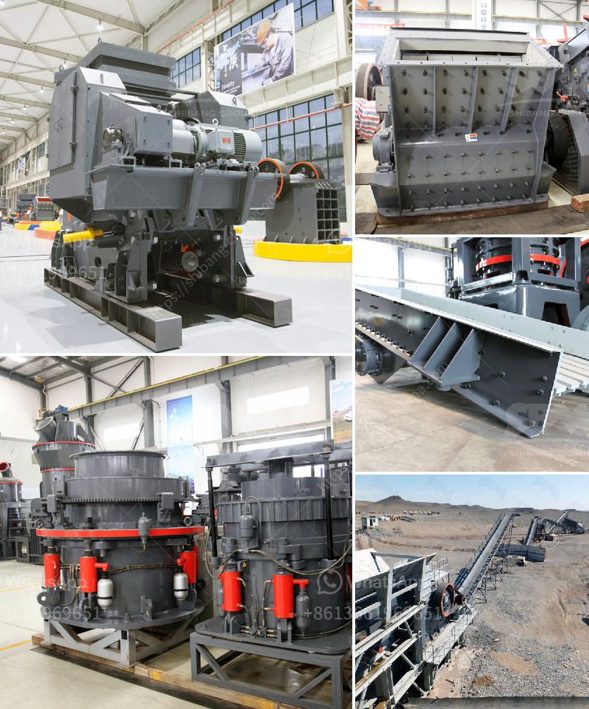

<h3>calcium carbonate grinding plant</h3>
Calcium carbonate grinding plant is an essential process in the production of calcium carbonate powder. It plays a crucial role in the cement production process and also has an important impact on the economy. With the continuous development of society, calcium carbonate grinding plant is widely used in many industries.

Firstly, let's take a closer look at what calcium carbonate grinding plant is. Calcium carbonate is a compound found in rocks, minerals, and shells of marine organisms. It is one of the most common substances on earth and can be found in various forms, such as limestone, chalk, and marble. Calcium carbonate grinding plant is the main equipment for processing calcium carbonate powder. Now, let's see how this equipment works.

The calcium carbonate grinding plant consists of a host machine, an analysis machine, a blower, a finished product cyclone separator, a pipe device, and a motor. The main machine consists of a grinding roller assembly, a grinding ring, a blade, a Raymond mill blade, and a cover assembly. The size of the finished calcium carbonate powder can be adjusted freely within the range of 80-400 mesh.

The calcium carbonate grinding plant is often used in large-scale grinding plants, which has a large output and excellent performance. The equipment has stable operation, low power consumption, and high grinding efficiency. The whole system adopts a closed-circuit process, which ensures the cleanliness and environmental protection of the workshop.

Now, let's discuss the application of calcium carbonate grinding plant. In the construction industry, calcium carbonate is often used as a raw material for the production of cement. Adding calcium carbonate to cement can improve its strength, reduce costs, and improve workability. In addition, it can enhance the corrosion resistance of concrete, extend the life of buildings, and reduce maintenance costs.

Calcium carbonate grinding plant is also widely used in the fields of papermaking, rubber, paint, coatings, plastics, and other industries. It is used as a filler, whitening agent, and pigment in papermaking. In the rubber industry, it can improve the processing performance and wear resistance of rubber products. In the paint and coatings industry, it can improve the gloss, color, and hiding power of coatings.

In conclusion, calcium carbonate grinding plant plays a crucial role in industrial production. It is an important process for the production of various calcium carbonate powders, which are widely used in many industries. With the continuous development of society, the demand for calcium carbonate grinding plant will continue to increase. Therefore, it is necessary to improve the grinding technology and equipment to meet the needs of industrial development.
<h3>Contact us</h3><ul><li><strong>Whatsapp:&nbsp;<a href="https://wa.me/8613661969651">+8613661969651</a></strong></li><li><a href="https://swt.shibang-china.com/?git&amp;zhl&amp;calcium carbonate grinding plant"><strong>Online Service(chat now)</strong></a></li></ul><h3>Related</h3><ul><li><a href='lime stone crusher plant.md'>lime stone crusher plant</a></li><li><a href='simple stone crushing machine price in kenya.md'>simple stone crushing machine price in kenya</a></li><li><a href='feasibility study for coal mining.md'>feasibility study for coal mining</a></li><li><a href='gyratory crusher advantages and disadvantages.md'>gyratory crusher advantages and disadvantages</a></li><li><a href='grinding coal mill.md'>grinding coal mill</a></li></ul>