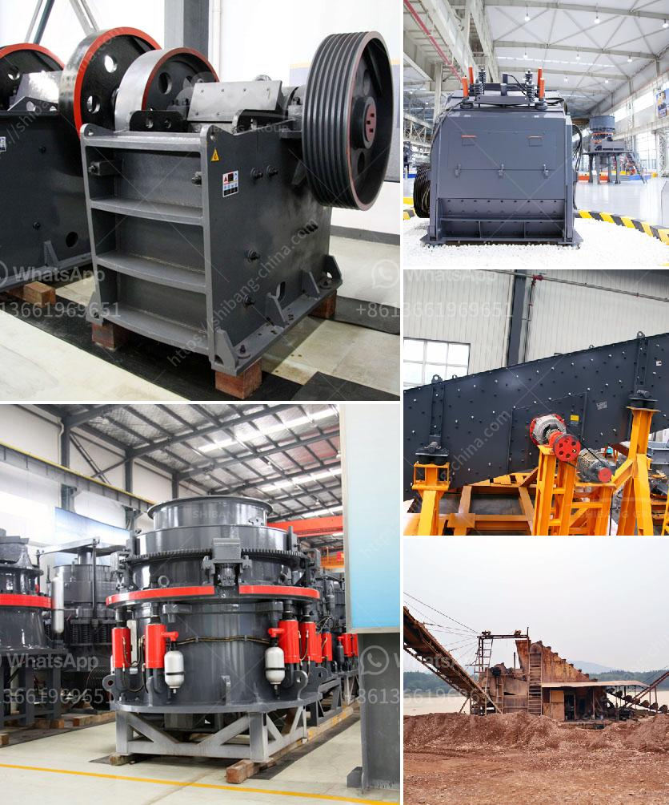

<h3>calcium carbonate grinding</h3>
Calcium carbonate is a mineral compound found abundantly in the earth's crust. It is widely used for various industrial purposes, such as building materials, agriculture, pharmaceuticals, and more. One of the most common applications of calcium carbonate is in the grinding and processing of limestone to produce ground calcium carbonate (GCC).

Grinding calcium carbonate involves various techniques and machines for processing the lime effectively, such as jaw crusher, hammer mill, and raymond mill. The roller mill and ball mill are also commonly used in grinding calcium carbonate. But in recent years, due to the development of ultra-fine powder technology, more and more applications of calcium carbonate are also being discovered.

The grinding process of calcium carbonate usually consists of several stages, such as crushing, grinding, classifying, powder collecting, and packing. The equipment required for each stage may vary depending on the hardness and feed size of the limestone material. However, the basic principle remains the same - to grind the limestone into a fine powder.

First, the limestone blocks are crushed into smaller pieces by jaw crusher or hammer mill. Then they are sent to the grinding mill for further grinding. In the grinding mill, the limestone particles are ground by grinding media, such as steel balls or ceramic balls, to the desired fineness.

After the grinding process, the ground calcium carbonate particles are classified by a classifier. The classified particles are then collected and stored in silos or bagged for use in various applications. The fineness of the ground calcium carbonate can be adjusted by changing the grinding media, grinding time, and feed size.

The grinding of calcium carbonate requires high energy consumption and the use of specialized equipment. However, the benefits of using calcium carbonate outweigh the costs for many industries. Calcium carbonate is a versatile and cost-effective mineral that can improve the quality and performance of various products.

In conclusion, grinding calcium carbonate is a crucial step in the production of ground calcium carbonate. It involves various techniques and machines to achieve the desired fineness. The grinding process is energy-intensive but essential for industries that rely on calcium carbonate for their products. With advancements in technology, the grinding process has become more efficient, leading to better-quality calcium carbonate products.
<h3>Contact us</h3><ul><li><strong>Whatsapp:&nbsp;<a href="https://wa.me/8613661969651">+8613661969651</a></strong></li><li><a href="https://swt.shibang-china.com/?git&amp;zhl&amp;calcium carbonate grinding"><strong>Online Service(chat now)</strong></a></li></ul><h3>Related</h3><ul><li><a href='jaw crusher prices.md'>jaw crusher prices</a></li><li><a href='packing plant in cement industry.md'>packing plant in cement industry</a></li><li><a href='gypsum crusher plants in pakistan.md'>gypsum crusher plants in pakistan</a></li><li><a href='vibrating screen peru.md'>vibrating screen peru</a></li><li><a href='granite crushing process.md'>granite crushing process</a></li></ul>