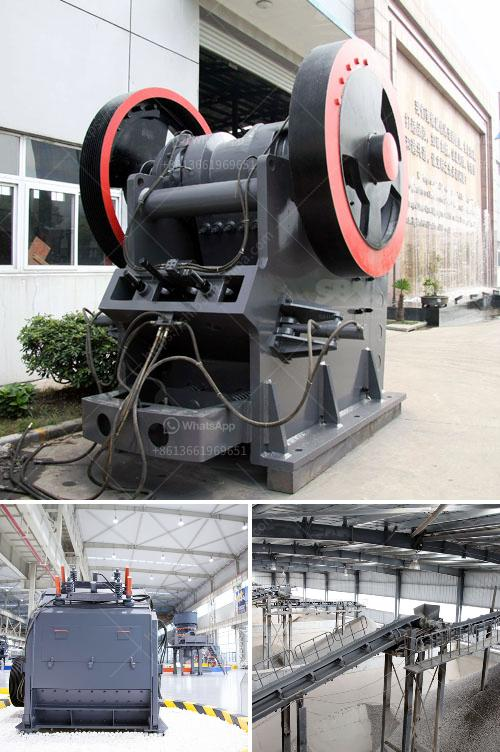

<h3>calcium carbonate mines in pakistan</h3>
Pakistan is blessed with immense natural resources, including minerals such as calcium carbonate, which is predominantly found in the form of limestone. With its numerous applications across various industries, calcium carbonate mining is an integral part of Pakistan's flourishing mining industry. This article explores the vast potential of calcium carbonate mines in Pakistan, highlighting their economic significance and untapped opportunities for development.

Pakistan possesses significant reserves of calcium carbonate, primarily in the form of limestone. The country's limestone deposits stretch over thousands of square kilometers, particularly in the provinces of Punjab, Balochistan, Khyber Pakhtunkhwa, and Gilgit-Baltistan. These extensive reserves make Pakistan one of the leading calcium carbonate producers in the world.

Calcium carbonate is a versatile mineral that finds usage across various industries due to its unique properties. In the construction industry, it is employed as a building material in the form of crushed limestone or marble. Its high calcium content makes it ideal for cement production, thus supporting the infrastructure development in Pakistan.

Furthermore, the pharmaceutical industry extensively uses calcium carbonate as a supplement to increase calcium levels in the body. It is also used as an antacid in various medications. Additionally, it is widely utilized in the production of various plastics, paints, paper, and cosmetics due to its attributes such as white color, fine particle size, and chemical stability.

The calcium carbonate mining industry holds tremendous economic potential for Pakistan. The government has recognized the importance of this sector and is encouraging foreign investment to assist in the modernization and development of mines across the country. The establishment of efficient mining techniques and infrastructural support can lead to substantial economic gains, generating employment opportunities and bolstering economic growth.

Pakistan possesses vast untapped potential when it comes to exporting calcium carbonate. The global demand for calcium carbonate is increasing due to its wide-ranging applications. However, Pakistan is still exporting the mineral in its crude, raw form. To fully capitalize on this resource, investment in value addition and the establishment of processing facilities is crucial. By processing calcium carbonate into finer grades, Pakistan can tap into high-end markets, resulting in greater export earnings.

While the mining of calcium carbonate holds the potential for economic growth, it is essential to address the environmental concerns associated with such operations. Proper measures should be adopted to ensure sustainable mining practices, minimizing the impact on ecosystems and local communities. Implementing strict regulations and utilizing advanced technologies can help mitigate potential environmental and social risks.

Pakistan's commercially significant calcium carbonate mines are a valuable asset that remains largely untapped. With a vast resource base and diverse industrial applications, calcium carbonate mining holds immense potential for Pakistan's economy. By focusing on sustainable practices, investing in infrastructure, and adding value to the mineral through processing, the country can unlock further economic opportunities whilst protecting the environment. The development of this sector will not only bring economic growth but also create employment prospects, contributing to the overall welfare of Pakistan and its people.
<h3>Contact us</h3><ul><li><strong>Whatsapp:&nbsp;<a href="https://wa.me/8613661969651">+8613661969651</a></strong></li><li><a href="https://swt.shibang-china.com/?git&amp;zhl&amp;calcium carbonate mines in pakistan"><strong>Online Service(chat now)</strong></a></li></ul><h3>Related</h3><ul><li><a href='complete crusher plant for sale south africa.md'>complete crusher plant for sale south africa</a></li><li><a href='artificial sand machine.md'>artificial sand machine</a></li><li><a href='cone crusher in mexico.md'>cone crusher in mexico</a></li><li><a href='working principle of ball mill pdf.md'>working principle of ball mill pdf</a></li><li><a href='how to make copper concentrate.md'>how to make copper concentrate</a></li></ul>