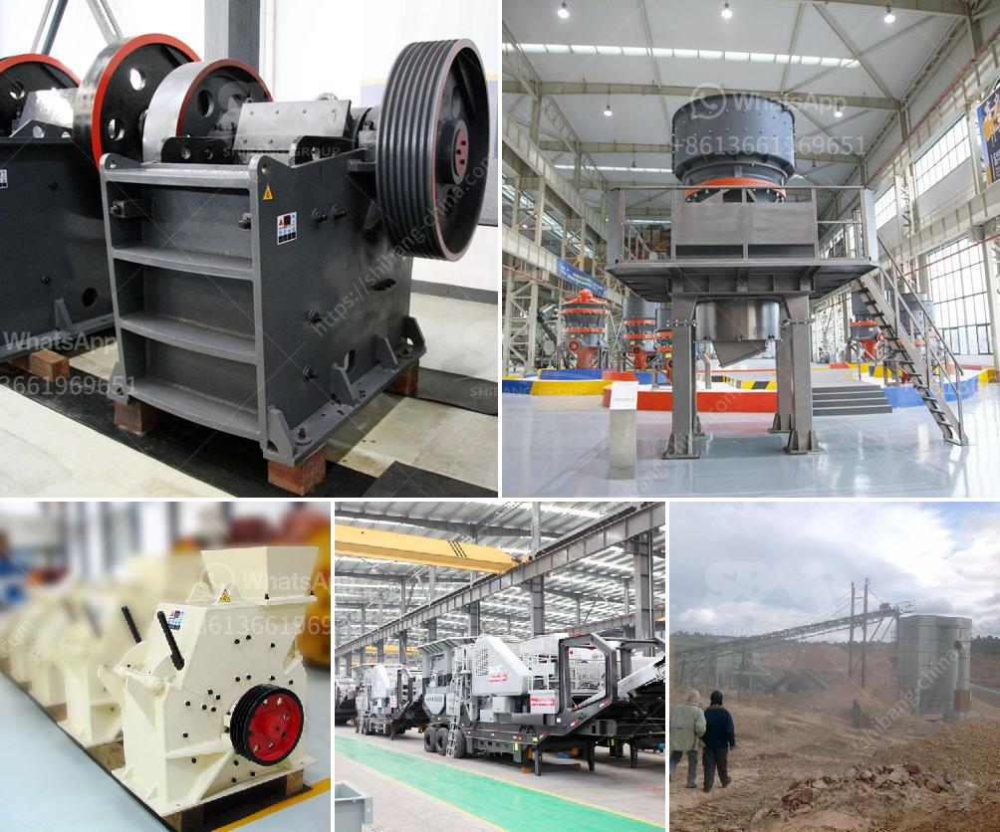

<h3>calcium carbonate multiplication process</h3>
Calcium carbonate is a popular mineral compound used in various industrial applications, such as construction, agriculture, pharmaceuticals, and even food production. It is known for its versatility, low cost, and abundance in nature. Understanding the process of calcium carbonate multiplication is crucial for controlling its quality and quantity in manufacturing processes.

The multiplication process of calcium carbonate involves transforming raw materials into a finely divided powder or granular form. Limestone, the most common source of calcium carbonate, undergoes a series of steps in this process.

Firstly, limestone is extracted from quarries and blasted into smaller, manageable pieces. This raw material often contains impurities like clay or silica, which are removed through processes like washing and screening. These initial steps ensure the purity and quality of the calcium carbonate produced.

Next, the limestone is crushed into smaller fragments to increase its surface area and facilitate further processing. It is then sent to a mill, where it undergoes grinding. The grinding process reduces the limestone particles to a desired size, ranging from a few microns to several millimeters.

After grinding, the resulting calcium carbonate powder is classified according to its particle size distribution. This sorting process ensures consistency and uniformity in the final product. Depending on the intended use, different particle sizes are selected and further processed.

In some cases, specialized purification techniques, such as flotation or centrifugation, may be employed to remove impurities and enhance the quality of the calcium carbonate. The purified powder is then dried and packaged for distribution.

While the multiplication process is relatively straightforward, it requires strict control of various parameters, such as the limestone quality, grinding conditions, and particle size distribution. These factors can significantly impact the properties and performance of the final product. Additionally, ensuring environmental sustainability in the extraction and production of calcium carbonate is equally important.

In conclusion, the calcium carbonate multiplication process involves extracting, crushing, grinding, and sorting limestone to obtain a desired particle size distribution. It is crucial to carefully control various parameters to achieve consistent quality and performance of the final product. Mastering this process allows industries to harness the benefits of calcium carbonate in their respective applications efficiently and effectively.
<h3>Contact us</h3><ul><li><strong>Whatsapp:&nbsp;<a href="https://wa.me/8613661969651">+8613661969651</a></strong></li><li><a href="https://swt.shibang-china.com/?git&amp;zhl&amp;calcium carbonate multiplication process"><strong>Online Service(chat now)</strong></a></li></ul><h3>Related</h3><ul><li><a href='dealing in portable crusher machine.md'>dealing in portable crusher machine</a></li><li><a href='crushers south africa.md'>crushers south africa</a></li><li><a href='machines use for mining sand from river.md'>machines use for mining sand from river</a></li><li><a href='hot selling coal mine roller crushing plant in india.md'>hot selling coal mine roller crushing plant in india</a></li><li><a href='feldspar quarry processing plant.md'>feldspar quarry processing plant</a></li></ul>