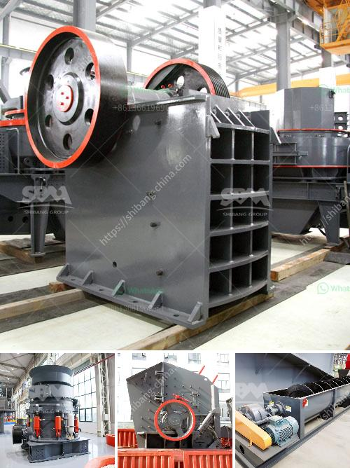

<h3>calcium carbonate plant contractors</h3>
The minerals industry plays a crucial role in various sectors, including construction, agriculture, and pharmaceuticals. Among the multitude of minerals used, calcium carbonate stands as a significant compound due to its versatile applications. To meet the growing demand, calcium carbonate plant contractors have become instrumental in facilitating the production process. With their expertise, these contractors help streamline operations and ensure efficient manufacturing of this essential mineral.

Calcium carbonate is primarily found in rocks and minerals, making it readily abundant. However, extracting and processing this compound requires specialized knowledge and equipment. Calcium carbonate plant contractors, with their in-depth understanding of the process, contribute to the optimization of production.

One crucial aspect of calcium carbonate plant contracting is the equipment used for extraction and processing. Contractors invest in high-quality machinery that ensures reliable and efficient operations. This equipment includes crushers, grinders, and classifiers, which are essential for breaking down and refining the raw materials.

Furthermore, calcium carbonate plant contractors employ advanced technologies to enhance the production process. For instance, they utilize modern air classifiers that enable the separation of different particle sizes, resulting in the desired product quality. These technological advancements not only improve manufacturing efficiency but also help reduce the overall environmental impact.

Additionally, contractors are responsible for meeting environmental regulations and ensuring sustainable practices. Calcium carbonate plant contracting involves understanding and implementing measures that minimize resources consumption and waste generation. By incorporating eco-friendly practices, contractors contribute to the overall sustainability of the minerals industry.

Another vital aspect of calcium carbonate plant contracting is the expertise in product development and customization. Contractors work closely with their clients to understand their specific requirements and tailor the production process accordingly. This customization enables the production of calcium carbonate with diverse particle sizes, whiteness, and chemical compositions, catering to a wide range of industries such as plastics, paints, and paper.

The role of calcium carbonate plant contractors extends beyond the construction and commissioning phase. These contractors offer ongoing technical support and maintenance services to ensure uninterrupted operations. They collaborate with plant operators to optimize processes, troubleshoot issues, and implement necessary upgrades or modifications.

Furthermore, calcium carbonate plant contractors are well-versed in quality control and assurance. They maintain strict adherence to international standards to ensure that the produced calcium carbonate meets the required specifications consistently. This emphasis on quality assurance guarantees customers get a reliable and consistent product, which is crucial for industries relying on calcium carbonate as a key ingredient.

Overall, calcium carbonate plant contractors are essential partners in the minerals industry. Through their specialized knowledge, cutting-edge technology, and commitment to sustainability, they contribute to the efficient production and supply of this versatile compound. Their expertise in equipment, process optimization, customization, and quality assurance ensure that calcium carbonate remains readily available for countless applications worldwide.

In conclusion, the contribution of calcium carbonate plant contractors in the minerals industry cannot be understated. These contractors enhance the manufacturing process through their expertise, advanced technology, and sustainable practices. Their role in equipment procurement, process optimization, customization, and quality control propels the production and supply of calcium carbonate, fueling various industries and supporting economic growth.
<h3>Contact us</h3><ul><li><strong>Whatsapp:&nbsp;<a href="https://wa.me/8613661969651">+8613661969651</a></strong></li><li><a href="https://swt.shibang-china.com/?git&amp;zhl&amp;calcium carbonate plant contractors"><strong>Online Service(chat now)</strong></a></li></ul><h3>Related</h3><ul><li><a href='manufacturer of slag roller crusher in philippines.md'>manufacturer of slag roller crusher in philippines</a></li><li><a href='medium ballast making machine.md'>medium ballast making machine</a></li><li><a href='ball mill suppliers usa.md'>ball mill suppliers usa</a></li><li><a href='canadian gold mining equipment manufacturers.md'>canadian gold mining equipment manufacturers</a></li><li><a href='used ft crusher for sale.md'>used ft crusher for sale</a></li></ul>