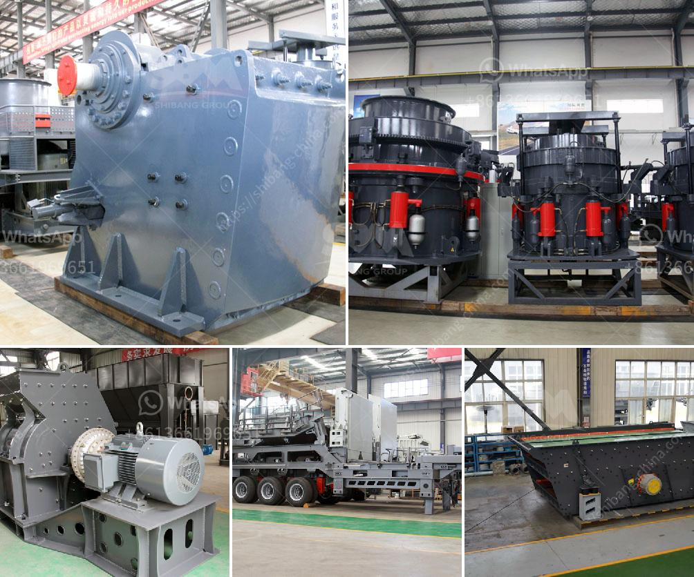

<h3>calcium carbonate powder crusher origin usa</h3>
Calcium carbonate powder crusher, also known as the European version of jaw crusher is a new type of mobile sand making equipment designed and developed for the global customers. The crusher equipment of Calcium Carbonate Powder plays an important role in the construction of basic infrastructure such as roads, railways and buildings.

As the world’s economic development continues to accelerate, the infrastructure construction has also been put on the agenda. In order to ensure the construction quality, it is necessary to use high-quality construction materials. Calcium carbonate powder has become an excellent construction material due to its physical and chemical properties.

Calcium carbonate powder crusher is widely used in the industry and it is also an indispensable equipment in mining crushing and milling industries. The crusher for calcium carbonate is manufactured with high-quality wear-resistant components and coating materials. It can effectively reduce the wear and tear of the equipment, extend the service life of the equipment, and ensure the efficient operation of the production line.

Calcium carbonate powder crusher is designed to crush and grind limestone, marble, chalk, talcum powder, crushed coal, gypsum, calcium carbonate, limestone, etc. Due to the many advantages of calcium carbonate powder crusher, it is an ideal choice for many enterprises.

The equipment of calcium carbonate powder crusher crushes materials by the principle of impact, extrusion, and grinding. The motor drives the rotor to rotate at a high speed. When the material enters the crushing chamber, it impacts and breaks with the hammer on the rotor, and then is thrown to the counter liner for secondary crushing. Finally, the material is sent to the powder concentrator by the blower to be graded and classified, and then the qualified powder is collected through the powder concentrator, and the unqualified powder is returned to the crusher for re-crushing until it reaches the required fineness.

In addition, the calcium carbonate powder crusher has a wide range of applications. It can not only be used in the construction industry but also in the chemical industry, metallurgy, agriculture, and other fields. For example, it can be used as filler in the rubber industry, paint industry, plastic industry, and paper-making industry. It can also be used as a raw material for the production of calcium carbide, calcium chloride, calcium nitrate, etc.

In conclusion, calcium carbonate powder crusher is a necessary equipment in the construction industry. It is widely used and has a wide range of applications. It can effectively crush and grind high-hardness materials for the production of calcium carbonate powder. With the continuous development of the economy, the demand for calcium carbonate powder crusher is also increasing. The crusher equipment originated in the USA, and its high-quality components and materials ensure its excellent performance and long service life, making it an ideal choice for enterprises.
<h3>Contact us</h3><ul><li><strong>Whatsapp:&nbsp;<a href="https://wa.me/8613661969651">+8613661969651</a></strong></li><li><a href="https://swt.shibang-china.com/?git&amp;zhl&amp;calcium carbonate powder crusher origin usa"><strong>Online Service(chat now)</strong></a></li></ul><h3>Related</h3><ul><li><a href='chinese mobile crusher.md'>chinese mobile crusher</a></li><li><a href='process for chromium separation from chromite ore.md'>process for chromium separation from chromite ore</a></li><li><a href='manufacturer of quartz powder in india.md'>manufacturer of quartz powder in india</a></li><li><a href='gypsum board making process.md'>gypsum board making process</a></li><li><a href='jaw crusher animation.md'>jaw crusher animation</a></li></ul>