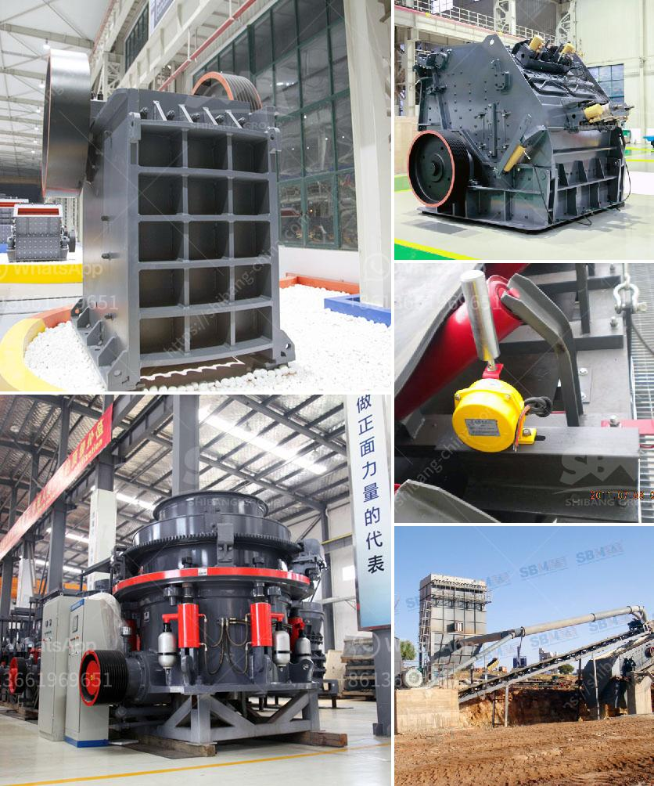

<h3>calcium carbonate processing plant cost</h3>
Calcium carbonate is a common mineral found in rocks and other natural deposits. It has been used in various industries for many years due to its versatility and wide range of applications. One of the most common uses of calcium carbonate is in the production of paper, where it acts as a filler and a coating material to improve brightness and smoothness.

To meet the growing demand for calcium carbonate, many companies have invested in calcium carbonate processing plants. These plants produce calcium carbonate in different forms, such as powder, granules, or slurry. The cost of a calcium carbonate processing plant can vary greatly depending on the size, capacity, and other factors.

The cost of the calcium carbonate processing plant involves the initial investment, operational costs, and other costs associated with running the plant efficiently. The initial investment cost includes the cost of purchasing the equipment required for the plant, such as crushers, conveyors, storage bins, and vibrating screens. It also includes the cost of installation, commissioning, and site preparation.

Operational costs are the ongoing expenses incurred in running the plant, such as labor, energy consumption, maintenance, and raw material costs. Labor costs depend on the size of the plant and the number of employees required to operate and maintain it. Energy consumption is a significant expense in calcium carbonate processing plants, as various processes, such as grinding and drying, consume a substantial amount of energy. Maintenance costs include regular equipment inspections, repairs, and replacement of worn-out parts. The cost of raw materials, especially limestone or marble, can also impact the overall operational costs.

To minimize the cost of running a calcium carbonate processing plant, companies can implement various strategies. Energy-saving measures, such as using more efficient grinding and drying equipment, can significantly reduce energy consumption and lower operational costs. Regular maintenance and inspections can help identify and fix issues before they become major problems, thus reducing downtime and costly repairs. Implementing proper inventory management can also optimize the purchasing and use of raw materials, preventing wastage and improving cost efficiency.

Another factor that influences the cost of a calcium carbonate processing plant is the location. Plants located near limestone or marble quarries can benefit from lower transportation costs, as the raw materials can be sourced locally. Additionally, proximity to customers can help reduce shipping costs for the final products.

In conclusion, the cost of a calcium carbonate processing plant can vary depending on factors such as the size, capacity, location, and operational efficiency. Investing in energy-saving equipment, implementing proper maintenance practices, and optimizing raw material procurement can help minimize costs and increase profitability. With the growing demand for calcium carbonate in various industries, setting up an efficient processing plant can be a profitable venture.
<h3>Contact us</h3><ul><li><strong>Whatsapp:&nbsp;<a href="https://wa.me/8613661969651">+8613661969651</a></strong></li><li><a href="https://swt.shibang-china.com/?git&amp;zhl&amp;calcium carbonate processing plant cost"><strong>Online Service(chat now)</strong></a></li></ul><h3>Related</h3><ul><li><a href='calcite quarry crusher sri lanka.md'>calcite quarry crusher sri lanka</a></li><li><a href='antimony processing plant design.md'>antimony processing plant design</a></li><li><a href='puzzolana crushers coimbatore.md'>puzzolana crushers coimbatore</a></li><li><a href='working principle of ball mill pdf.md'>working principle of ball mill pdf</a></li><li><a href='small bleaching powder manufacturing plant project report.md'>small bleaching powder manufacturing plant project report</a></li></ul>