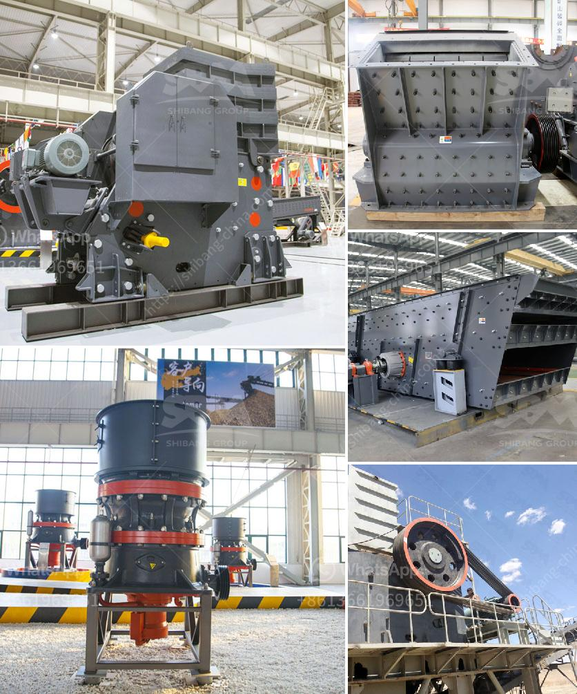

<h3>calcium phosphate crusher</h3>
Calcium phosphate crusher, also known as vertical compound crusher, is a common equipment used in crushing materials with medium hardness such as limestone, clinker, coal and other minerals in the building materials industry, metallurgy industry, chemical industry, and hydropower industry.

Calcium phosphate crusher has the characteristics of large crushing ratio, high production efficiency, stable operation, and environmental protection. It can process a variety of materials with a compressive strength not exceeding 140 MPa. The crushing ratio is large, the particle size of the finished product is uniform, and the energy consumption is low. It is a reliable and efficient crushing equipment.

Firstly, calcium phosphate crusher has significant advantages in the crushing of large pieces of limestone. With the development of the construction industry, large-scale infrastructure projects such as roads, railways, and buildings are increasing, resulting in a huge demand for limestone. Calcium phosphate crusher can crush large chunks of limestone into small particles to meet the production requirements of various industries. The crushed limestone has uniform particle size and high quality, which is widely used in various fields.

Secondly, calcium phosphate crusher has excellent performance in crushing clinker. Clinker is a necessary raw material for the production of cement. The quality of clinker directly affects the quality of cement. The calcium phosphate crusher can crush the clinker into small particles with a particle size of 3-6mm, which can effectively improve the quality of cement.

Thirdly, calcium phosphate crusher is widely used in the crushing of coal. Coal is an important energy source and plays a crucial role in the development of various industries. The calcium phosphate crusher can crush coal particles of different sizes to meet the production needs of different industries. It has distinctive features of uniform particle size, less dust generation, and low noise during operation, which effectively improves the environmental protection performance of coal crushing.

Lastly, calcium phosphate crusher is suitable for crushing various ores and rocks in the chemical industry and hydropower industry. It can crush materials with a compressive strength not exceeding 140 MPa, such as bauxite, iron ore, concrete, etc. The crushed materials have uniform particle size, fine particle shape, and stable performance, which is favored by users in various industries.

In summary, calcium phosphate crusher is a reliable and efficient crushing equipment with broad development prospects. With its significant advantages in the crushing of limestone, clinker, coal, and other materials, it plays an important role in various industries. As the demand for building materials continues to increase, the calcium phosphate crusher will continue to provide strong technical support for the development of the industry, promoting economic growth and environmental protection.
<h3>Contact us</h3><ul><li><strong>Whatsapp:&nbsp;<a href="https://wa.me/8613661969651">+8613661969651</a></strong></li><li><a href="https://swt.shibang-china.com/?git&amp;zhl&amp;calcium phosphate crusher"><strong>Online Service(chat now)</strong></a></li></ul><h3>Related</h3><ul><li><a href='cost of jaw crusher in kenya.md'>cost of jaw crusher in kenya</a></li><li><a href='chrome washing plant for sale south africa.md'>chrome washing plant for sale south africa</a></li><li><a href='stone crusher philippines.md'>stone crusher philippines</a></li><li><a href='granite quarry machine.md'>granite quarry machine</a></li><li><a href='used stone crushers in south korea.md'>used stone crushers in south korea</a></li></ul>