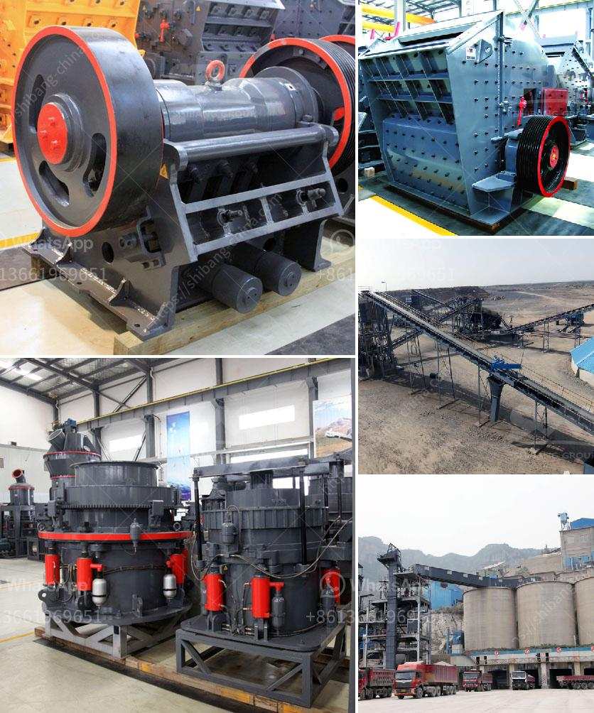

<h3>calcuim production machines</h3>
Calcium holds a significant position in various industries due to its numerous applications and benefits. From construction materials and cement to medicinal supplements and dietary products, the demand for calcium is skyrocketing. With such high demand, manufacturers are constantly striving to optimize their production processes in order to meet the market requirements efficiently. Calcium production machines have emerged as a game-changer in this regard, revolutionizing the manufacturing processes and enhancing the overall productivity.

Traditionally, the production of calcium involved tedious and time-consuming methods. However, modern calcium production machines have drastically transformed this landscape. These machines are equipped with advanced technology and innovative features, making the process faster, safer, and more efficient.

One of the key components of calcium production machines is the kiln. The kiln is responsible for the complete dissociation of calcium carbonate into calcium oxide and carbon dioxide gases. Modern kilns incorporated in the production machines offer superior control over temperature, airflow, and combustion, resulting in optimal calcium extraction. The precise control over these parameters ensures a consistent quality of calcium production, conforming to strict industry standards.

Moreover, the use of automation in calcium production machines has significantly contributed to improved production rates and reduced reliance on manual labor. Automated machines are capable of performing multiple functions simultaneously, eliminating human error and maximizing efficiency. This has not only increased the speed of production but has also enhanced the overall safety of the workers by minimizing their exposure to hazardous environments.

In addition to automation, calcium production machines have also adopted advanced filtration systems to ensure the quality of the final product. These filtration systems are designed to remove impurities, ensuring that the calcium produced is of the highest possible purity. Consequently, this has expanded the application areas of calcium as it can now be used in pharmaceuticals, food products, and many other industries where purity is of utmost importance.

Furthermore, the incorporation of monitoring and control systems in calcium production machines has proved to be vital for efficient and economical operations. These systems continuously monitor various parameters such as temperature, pressure, and flow rates, enabling real-time adjustments to optimize the production process. Additionally, they provide valuable data and insights into machine performance, enabling timely maintenance and minimizing downtime.

The utilization of calcium production machines not only benefits the manufacturers but also has a positive impact on the environment. These machines are designed with environmental sustainability in mind, employing energy-efficient mechanisms to minimize greenhouse gas emissions and reduce the overall carbon footprint. This "green" approach aligns with the global efforts towards sustainable development, making calcium production a responsible and eco-friendly process.

In conclusion, calcium production machines have revolutionized the manufacturing processes in various industries. With their advanced features, automation, and precise control systems, these machines offer enhanced efficiency, improved safety, and higher production rates. They ensure the production of consistently high-quality calcium products, meeting the stringent industry standards. Furthermore, with their environmental sustainability features, calcium production machines contribute to greener practices, aligning with the global focus on sustainable development. As the demand for calcium continues to rise, these machines will play a crucial role in optimizing production processes and meeting market requirements efficiently.
<h3>Contact us</h3><ul><li><strong>Whatsapp:&nbsp;<a href="https://wa.me/8613661969651">+8613661969651</a></strong></li><li><a href="https://swt.shibang-china.com/?git&amp;zhl&amp;calcuim production machines"><strong>Online Service(chat now)</strong></a></li></ul><h3>Related</h3><ul><li><a href='ballast crushing equipment in kenya.md'>ballast crushing equipment in kenya</a></li><li><a href='gypsum crusher in salalah oman.md'>gypsum crusher in salalah oman</a></li><li><a href='jaw crusher for sale in ghana.md'>jaw crusher for sale in ghana</a></li><li><a href='stone crusherproduction line.md'>stone crusherproduction line</a></li><li><a href='mobile gold processing plant with price.md'>mobile gold processing plant with price</a></li></ul>