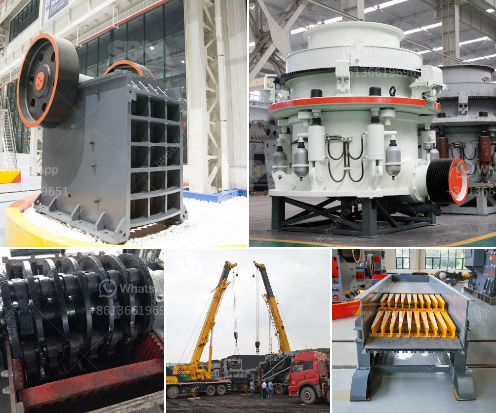

<h3>calculate costs of crushing limestone</h3>
Limestone is a sedimentary rock composed mainly of calcium carbonate (CaCO3), usually in the form of calcite or aragonite. It is a common and widely used material for building structures and roads. When crushed, limestone can be used in a variety of applications, such as concrete and asphalt mixtures, soil stabilization, and base material for roads. However, before using limestone in these applications, it is important to calculate the costs associated with crushing the material.

There are several factors to consider when calculating the costs of crushing limestone. These include the cost of the equipment, the cost of labor, energy costs, and material transportation costs. By understanding these factors, you can make informed decisions regarding the crushing process and efficiently manage your budget.

The first factor to consider is the cost of the equipment. This includes the cost of purchasing or renting the necessary machinery for the crushing process. Different types of crushers are available, such as jaw crushers, impact crushers, and cone crushers. Each type has its own operating costs and efficiency. It is important to choose the right equipment for your specific needs, taking into account long-term maintenance and repair costs.

Labor costs are another crucial component in calculating the overall costs of crushing limestone. Labor costs include wages, benefits, and other related expenses for the workers involved in the crushing process. The number of workers required depends on the size and scale of the operation. It is important to consider labor costs when planning and scheduling the crushing process to optimize efficiency and reduce unnecessary expenses.

Energy costs also need to be taken into account when calculating the costs of crushing limestone. The crushing process requires energy to power the equipment. This energy can come from electricity or fuel, such as diesel. The cost of electricity or fuel depends on the region and current market prices. Efficient equipment can help reduce energy consumption and, therefore, lower the overall costs.

Material transportation costs are an essential factor to consider as well. After crushing, the limestone needs to be transported to the desired location for further use. The distance, mode of transportation (truck, conveyor belt, etc.), and its associated costs need to be considered. Efficient transportation methods can help reduce costs, such as using nearby limestone quarries or optimizing truck routes.

In conclusion, calculating the costs of crushing limestone is crucial to effectively manage your budget and make informed decisions. Factors such as equipment costs, labor costs, energy costs, and material transportation costs need to be carefully considered. By understanding these factors, you can optimize the crushing process, reduce unnecessary expenses, and make the most of your limestone resources. Proper planning and budgeting will ensure that crushing limestone is a cost-effective and efficient process for your specific needs.
<h3>Contact us</h3><ul><li><strong>Whatsapp:&nbsp;<a href="https://wa.me/8613661969651">+8613661969651</a></strong></li><li><a href="https://swt.shibang-china.com/?git&amp;zhl&amp;calculate costs of crushing limestone"><strong>Online Service(chat now)</strong></a></li></ul><h3>Related</h3><ul><li><a href='limestone grinding roller mill.md'>limestone grinding roller mill</a></li><li><a href='crusher machine price in nigeria.md'>crusher machine price in nigeria</a></li><li><a href='cost of stone crushing machine stone crusher quarry.md'>cost of stone crushing machine stone crusher quarry</a></li><li><a href='gold crusher for sale.md'>gold crusher for sale</a></li><li><a href='iron ore processing equipment china for sale.md'>iron ore processing equipment china for sale</a></li></ul>