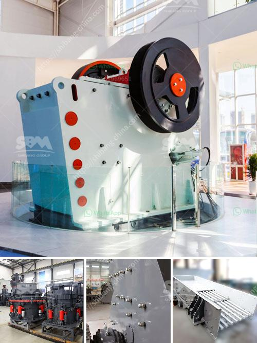

<h3>calculation coal crusher</h3>
Coal, a fossil fuel, has been used for centuries as a fuel source for heating and powering industries. In today's modern world, coal is still an important resource for generating electricity. However, before coal can be used in power plants, it needs to be crushed into smaller pieces to make it more manageable and efficient. This is where coal crushers come into play.

Coal crushers are machines that crush coal into smaller-sized pieces. These machines work by compressing coal against a hard surface in order to break it apart and reduce its size. Crushing coal can help increase its burning efficiency, allowing it to be used as a valuable fuel source for power plants and other industrial applications.

Calculating the proper coal crusher size is key to ensuring efficient operation of the crusher and crushing process. The size of the coal crusher should be chosen based on the size of the coal to be processed. After all, crushing is the first step in the coal processing chain, and so it is necessary to select a crusher suitable for the size of the coal to be crushed.

When selecting a crusher, several factors need to be considered, including the maximum feed size, the required product size, and the throughput capacity. The maximum feed size refers to the largest piece of coal that can enter the crusher. It is important to choose a crusher with a maximum feed size that is larger than the largest piece of coal to be processed. This ensures that the crusher can handle the size of the coal without being overloaded.

The required product size refers to the size of the coal after it has been crushed. Different power plants and industries have different requirements for the size of the coal they use, so it is important to choose a crusher that can produce the desired product size. The throughput capacity of the crusher refers to the amount of coal it can process in a given period of time. It is important to choose a crusher with a throughput capacity that matches the needs of the power plant or industry.

Calculating the maximum feed size, required product size, and throughput capacity can be done using various methods, including laboratory tests and mathematical models. These calculations help determine the appropriate crusher size for a given application. Furthermore, it is also necessary to consider other factors such as the power requirements, maintenance requirements, and the cost of the crusher.

In conclusion, calculating the proper size of a coal crusher is vital for efficient operation and production in power plants and other industrial applications. By considering factors such as the maximum feed size, required product size, and throughput capacity, one can choose the right crusher for the job. Furthermore, it is important to consider other factors such as power requirements, maintenance requirements, and cost. By taking all of these factors into account, one can ensure that the coal crusher chosen is the right size for the job at hand.
<h3>Contact us</h3><ul><li><strong>Whatsapp:&nbsp;<a href="https://wa.me/8613661969651">+8613661969651</a></strong></li><li><a href="https://swt.shibang-china.com/?git&amp;zhl&amp;calculation coal crusher"><strong>Online Service(chat now)</strong></a></li></ul><h3>Related</h3><ul><li><a href='m sand manufacturing machine.md'>m sand manufacturing machine</a></li><li><a href='cost of mining conveyor belt.md'>cost of mining conveyor belt</a></li><li><a href='crusher plants in kuwait.md'>crusher plants in kuwait</a></li><li><a href='ballast crushers alibaba.md'>ballast crushers alibaba</a></li><li><a href='cost of stone crushing machine stone crusher quarry.md'>cost of stone crushing machine stone crusher quarry</a></li></ul>