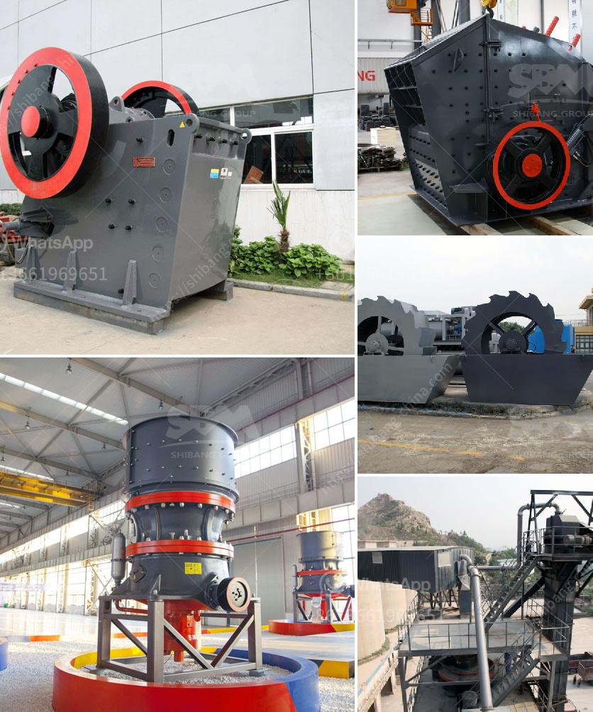

<h3>calculations for belt conveyor structural bents</h3>
Belt conveyors are widely used in industries, warehouses, and distribution centers to transport materials from one location to another. They are designed to efficiently move bulky and heavy loads, which makes them an essential component in modern production systems.

One important aspect of designing a belt conveyor system is the structural bents, which provide support and stability to the conveyor. These bents are typically made of steel or reinforced concrete and are positioned at regular intervals along the conveyor route.

Calculating the structural bents for a belt conveyor involves various considerations and engineering calculations. The primary objective is to ensure that the bents are strong enough to withstand the load and forces imposed by the conveyor system. Here are some of the key calculations involved:

The first step is to determine the total load that the conveyor system will carry. This includes the weight of the materials being transported, the weight of the conveyor itself, and any other additional equipment or components. The load calculation is crucial in determining the size and strength requirements for the structural bents.

Deflection is the degree to which a structural bent bends or sags under load. Excessive deflection can affect the overall performance and efficiency of the conveyor system. Engineers need to calculate the maximum allowable deflection for the bents to ensure proper conveyor operation and prevent any potential issues.

Forces and moments are exerted on the structural bents due to the load, acceleration, speed, and direction of the conveyor system. Engineers need to calculate these forces and moments to evaluate their impact on the bents and determine their strength requirements.

Ensuring the stability of the structural bents is essential for the safe operation of the conveyor system. Stability calculations involve assessing the resistance of the bents against overturning, sliding, and other stability issues. Factors such as wind loads, seismic forces, and soil conditions are taken into account to ensure the stability of the bents.

Choosing the appropriate material for the bents is another crucial calculation. Steel and reinforced concrete are commonly used due to their strength and durability. The material selection is based on factors such as the load requirements, environmental conditions, maintenance considerations, and cost-effectiveness.

Designing and calculating the structural bents for a belt conveyor requires expertise and a thorough understanding of engineering principles. It is essential to adhere to applicable codes and standards to ensure the safety and reliability of the conveyor system.

In conclusion, calculations for belt conveyor structural bents are a critical part of designing a conveyor system. Load calculations, deflection calculations, force and moment calculations, stability calculations, and material selection all contribute to the overall design and strength of the bents. By accurately calculating these parameters, engineers can ensure the safe and efficient operation of belt conveyor systems.
<h3>Contact us</h3><ul><li><strong>Whatsapp:&nbsp;<a href="https://wa.me/8613661969651">+8613661969651</a></strong></li><li><a href="https://swt.shibang-china.com/?git&amp;zhl&amp;calculations for belt conveyor structural bents"><strong>Online Service(chat now)</strong></a></li></ul><h3>Related</h3><ul><li><a href='machinery required for marble quarry crusher.md'>machinery required for marble quarry crusher</a></li><li><a href='cement grinding mill manufacturer india.md'>cement grinding mill manufacturer india</a></li><li><a href='conveyor belt supplier in shanghai china.md'>conveyor belt supplier in shanghai china</a></li><li><a href='hammer mill in japan.md'>hammer mill in japan</a></li><li><a href='coal mining process machinery.md'>coal mining process machinery</a></li></ul>