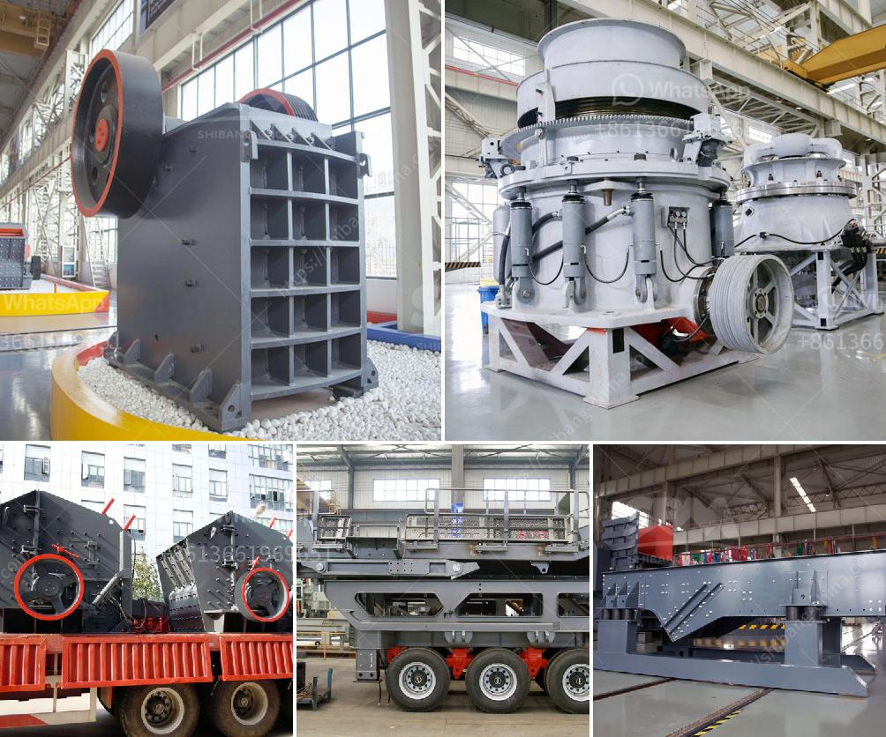

<h3>canadian gold mining equipment manufacturers</h3>
Canadian gold mining equipment manufacturers are well-known for their high-quality equipment built to withstand the challenging conditions of gold mining operations. They provide a wide range of innovative mining equipment for sale and rent, catering to both small and large-scale mining operations.

One of the renowned Canadian gold mining equipment manufacturers is Savona Equipment. With over 30 years of experience in the industry, Savona Equipment offers a comprehensive range of mining equipment, including gold concentrators, gold dredges, sluice boxes, shaking tables, crushers, and trommels. Their equipment is designed to maximize gold recovery and minimize the chances of losing precious metals during the mining process.

Another reputable Canadian manufacturer is Westpro Machinery. Established in 1985, Westpro Machinery specializes in manufacturing custom-designed mineral processing equipment for various industries, including gold mining. They offer a wide range of equipment, such as agglomerators, attrition scrubbers, flotation machines, and thickeners, to meet the specific needs of gold mining operations. All of their equipment is built to withstand the harsh conditions encountered in the mining sector.

In addition to Savona Equipment and Westpro Machinery, there are several other Canadian manufacturers that contribute to the gold mining industry. These manufacturers provide equipment such as ball mills, crushers, conveyors, and flotation machines, among others, to facilitate efficient gold extraction. Some of these manufacturers include Sepro Mineral Systems, Falcon Concentrators, and Eriez Manufacturing.

The Canadian gold mining equipment manufacturers adhere to strict quality standards to ensure that their equipment meets the needs and expectations of their customers. They continuously invest in research and development to improve efficiency, safety, and sustainability in the mining industry.

In conclusion, Canadian gold mining equipment manufacturers play a crucial role in supplying high-quality equipment to the gold mining industry. Their innovative equipment helps maximize gold recovery, optimize operations, and reduce environmental impacts. Their dedication to quality and continuous improvement reflects the Canadian mining sector's commitment to sustainable and responsible mining practices.
<h3>Contact us</h3><ul><li><strong>Whatsapp:&nbsp;<a href="https://wa.me/8613661969651">+8613661969651</a></strong></li><li><a href="https://swt.shibang-china.com/?git&amp;zhl&amp;canadian gold mining equipment manufacturers"><strong>Online Service(chat now)</strong></a></li></ul><h3>Related</h3><ul><li><a href='calcium carbonate multiplication process.md'>calcium carbonate multiplication process</a></li><li><a href='granite crushing process.md'>granite crushing process</a></li><li><a href='2000 kilos hammer mill.md'>2000 kilos hammer mill</a></li><li><a href='dolomite roller mill.md'>dolomite roller mill</a></li><li><a href='gypsum recycling plant.md'>gypsum recycling plant</a></li></ul>