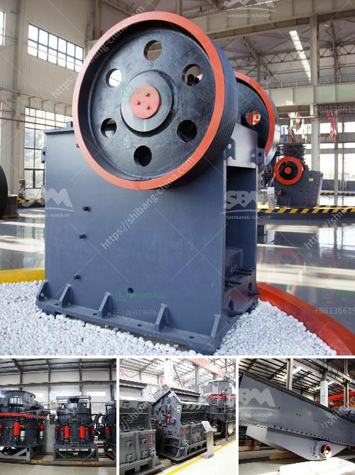

<h3>captain of crusher zenith</h3>
In the world of competitive car crushing, one outstanding leader has emerged as a force to be reckoned with – Captain of Crusher Zenith. Known for his exceptional skills, unwavering dedication, and unyielding determination, Captain Zenith has consistently displayed the qualities of a remarkable leader, setting an inspiring benchmark for his team and the entire industry.

Captain Zenith's journey began in his early years, when he discovered his innate passion for heavy machinery and their limitless potential. As he honed his skillset, it became evident that his true calling lay in the world of car crushing. Zealously determined to make a difference, Captain Zenith set out to revolutionize the industry by developing a crushing machine that surpassed all existing standards.

Ever aware that greatness cannot be achieved alone, Captain Zenith founded the formidable Zenith Team – a group of like-minded individuals who shared his vision and devotion to excellence. Assembling a team of experts from various fields including engineering, mechanics, and technology, Captain Zenith created an environment where innovation thrived, enabling the team to push the limits of car crushing performance.

At the core of Captain Zenith's leadership style is his ability to inspire his team to achieve the seemingly impossible. He instills an unwavering belief in the Zenith Team, showcasing the invaluable power of perseverance, resilience, and teamwork. Leading by example, Captain Zenith can often be found shoulder-to-shoulder with his crew, tirelessly working to overcome challenges, foster innovation, and refine their game-changing crushing techniques.

Crafting a legacy that extends beyond performance, Captain Zenith places utmost importance on safety. His team's commitment to responsible and safe practices shines through in every aspect of their work. From meticulously calibrating the crushing machinery to adhering to strict operating procedures, Captain Zenith ensures that his team operates in an environment prioritizing the safety of both personnel and surroundings.

Captain Zenith's dedication to continuous improvement has propelled Crusher Zenith to new heights. Fueled by his unwavering pursuit of greatness, the team has set numerous records in the car crushing industry, surpassing expectations and redefining what was once thought possible. Each record broken stands testament to their ceaseless drive to push boundaries and conquer new frontiers.

Captain Zenith's impact extends beyond the crushing yard. Through his accomplishments and the success of the Zenith Team, he has inspired a new generation of aspiring car crushers. Young enthusiasts now look up to Captain Zenith with awe and admiration, recognizing him as a symbol of what exemplary leadership, innovation, and teamwork can accomplish.

Captain of Crusher Zenith is a true industry pioneer, blending passion, skill, and exceptional leadership seamlessly to create a crushing force to be reckoned with. Through his relentless pursuit of excellence, Captain Zenith and his Zenith Team continue to redefine the boundaries of what is possible in the world of car crushing. With each crushing victory, they inspire us all to realize our potential and reach for the stars.
<h3>Contact us</h3><ul><li><strong>Whatsapp:&nbsp;<a href="https://wa.me/8613661969651">+8613661969651</a></strong></li><li><a href="https://swt.shibang-china.com/?git&amp;zhl&amp;captain of crusher zenith"><strong>Online Service(chat now)</strong></a></li></ul><h3>Related</h3><ul><li><a href='limestone quarry operations.md'>limestone quarry operations</a></li><li><a href='20 tph ball mills price.md'>20 tph ball mills price</a></li><li><a href='gypsum powder making machine pdf.md'>gypsum powder making machine pdf</a></li><li><a href='calcium carbonate multiplication process.md'>calcium carbonate multiplication process</a></li><li><a href='cost in india of 100 ton mobile limestone crusher.md'>cost in india of 100 ton mobile limestone crusher</a></li></ul>