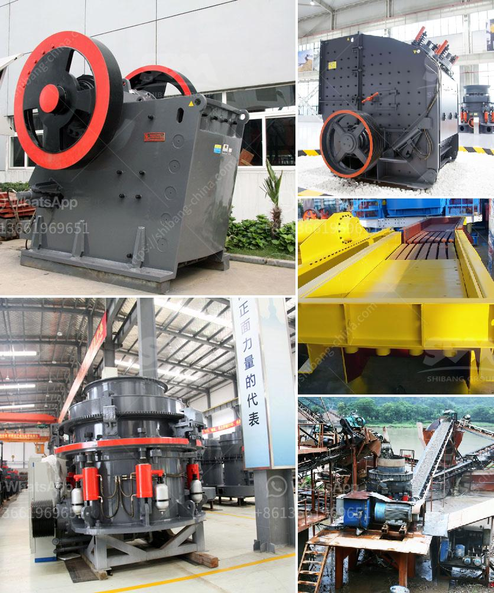

<h3>cara pemasangan belt conveyor</h3>
The belt conveyor system is an indispensable tool in the manufacturing industry, providing a seamless and efficient way to transport materials from one point to another. Its ability to handle a wide range of materials and loads makes it a popular choice for various industries such as mining, construction, and packaging. However, installing a belt conveyor system can be a complex process that requires careful planning and execution. In this article, we will discuss the steps involved in the installation of a belt conveyor system.

The first step in the installation process is to determine the layout of the conveyor system. This involves identifying the start and end points of the conveyor line, as well as any turns or inclines that may be required. It is crucial to ensure that the layout allows for smooth and uninterrupted material flow.

After determining the layout, the next step is to assemble the conveyor components. This includes connecting the different sections of the conveyor, such as the drive unit, idlers, and pulleys, using bolts and fasteners. It is essential to follow the manufacturer's instructions and guidelines to ensure proper alignment and secure connections.

Once the conveyor components are assembled, the belt can be installed. The belt is typically made of durable materials such as rubber or fabric-reinforced rubber, designed to withstand the demands of material handling. The belt is fitted onto the pulleys, ensuring that it runs smoothly and without any obstructions.

After the belt is installed, it is essential to tension it correctly. Proper tensioning of the belt ensures that it remains in place during operation and eliminates any slack that could cause slippage or damage. This can be achieved by adjusting the conveyor's tensioning mechanism, usually a combination of screws and clamps.

Finally, the last step in the installation process is to test the conveyor system. This involves running the conveyor with a moderate load to check for any issues such as abnormal noises, vibrations, or misalignment. It is crucial to address any problems before putting the conveyor system into regular operation.

In conclusion, the installation of a belt conveyor system requires careful planning and precision. Following the correct procedures and guidelines will ensure a smooth and efficient material handling process. By simplifying material transportation, a belt conveyor system contributes to increased productivity and reduced manual labor.
<h3>Contact us</h3><ul><li><strong>Whatsapp:&nbsp;<a href="https://wa.me/8613661969651">+8613661969651</a></strong></li><li><a href="https://swt.shibang-china.com/?git&amp;zhl&amp;cara pemasangan belt conveyor"><strong>Online Service(chat now)</strong></a></li></ul><h3>Related</h3><ul><li><a href='coal mining equipment for sale.md'>coal mining equipment for sale</a></li><li><a href='ball mill installation.md'>ball mill installation</a></li><li><a href='price of tph stone crusher.md'>price of tph stone crusher</a></li><li><a href='impact crusher manufacturers in germany.md'>impact crusher manufacturers in germany</a></li><li><a href='hammer mill for oregano.md'>hammer mill for oregano</a></li></ul>