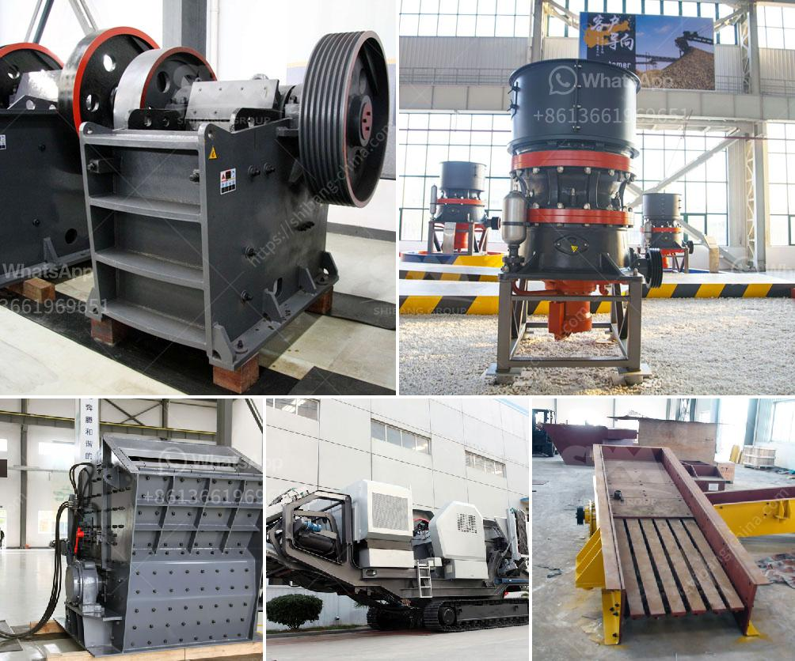

<h3>carbon black grinder pulvilizer fine powder india</h3>
The carbon black industry plays a significant role in various industrial sectors, including rubber, plastic, ink, and paints. Carbon black is a finely divided form of carbon, produced by the incomplete combustion of hydrocarbon. It is widely used as a reinforcing filler and pigment due to its unique properties, such as high tinting strength, UV protection, and electrical conductivity.

One of the essential components for the successful use of carbon black is its finely ground form, which is achieved through grinding techniques. In India, the carbon black grinder pulverizer fine powder industry has been witnessing steady growth due to the increasing demand for carbon black particles with customized properties.

The carbon black grinder pulverizer fine powder industry in India is primarily dominated by a few major players. These companies have adopted advanced technologies and equipment to meet the specific requirements of customers. One of the prominent names in the industry is Ultra Febtech Pvt Ltd., known for its high-quality and reliable grinding machines.

Ultra Febtech Pvt Ltd. offers a wide range of carbon black grinder pulverizer fine powder machines that are designed to obtain the desired particle size and shape. These machines are capable of grinding carbon black into a fine powder ranging from 200 to 3000 mesh. The finer the particle size, the better the dispersion and reinforcement properties of carbon black in the final product.

The key features of the carbon black grinder pulverizer fine powder machines provided by Ultra Febtech Pvt Ltd. include:

1. High Grinding Efficiency: The machines are equipped with advanced grinding mechanisms that ensure efficient and uniform grinding of carbon black particles, leading to higher production rates.

2. Precision Control System: The machines are equipped with intelligent control systems that allow precise control over the grinding process, ensuring consistent particle size and shape.

3. Low Energy Consumption: The machines are designed to minimize energy consumption while maintaining high grinding efficiency. This not only reduces operating costs but also contributes to environmental sustainability.

4. Easy Operation and Maintenance: The machines are user-friendly, with a simple interface and easy-to-access components for cleaning and maintenance. This helps to minimize downtime and maximize productivity.

The carbon black grinder pulverizer fine powder machines from Ultra Febtech Pvt Ltd. are widely used in various industries, including rubber and tire manufacturing, plastics, and coatings. These machines have been well-received by the industry due to their reliable performance, high productivity, and customized solutions.

In conclusion, the carbon black grinder pulverizer fine powder industry in India is witnessing steady growth, driven by the demand for finely ground carbon black particles with customized properties. Companies like Ultra Febtech Pvt Ltd. are leading the way with their advanced grinding machines, providing high-quality and efficient solutions to meet the industry's requirements. As the carbon black industry continues to expand, these machines will play a crucial role in ensuring the production of superior quality carbon black products.
<h3>Contact us</h3><ul><li><strong>Whatsapp:&nbsp;<a href="https://wa.me/8613661969651">+8613661969651</a></strong></li><li><a href="https://swt.shibang-china.com/?git&amp;zhl&amp;carbon black grinder pulvilizer fine powder india"><strong>Online Service(chat now)</strong></a></li></ul><h3>Related</h3><ul><li><a href='cement grinding mill manufacturer india.md'>cement grinding mill manufacturer india</a></li><li><a href='coal washing plant for sale grinding mill china.md'>coal washing plant for sale grinding mill china</a></li><li><a href='static jaw crusher and plant for sale.md'>static jaw crusher and plant for sale</a></li><li><a href='the crunch hand operated rock crusher.md'>the crunch hand operated rock crusher</a></li><li><a href='jaw crusher moby 600.md'>jaw crusher moby 600</a></li></ul>