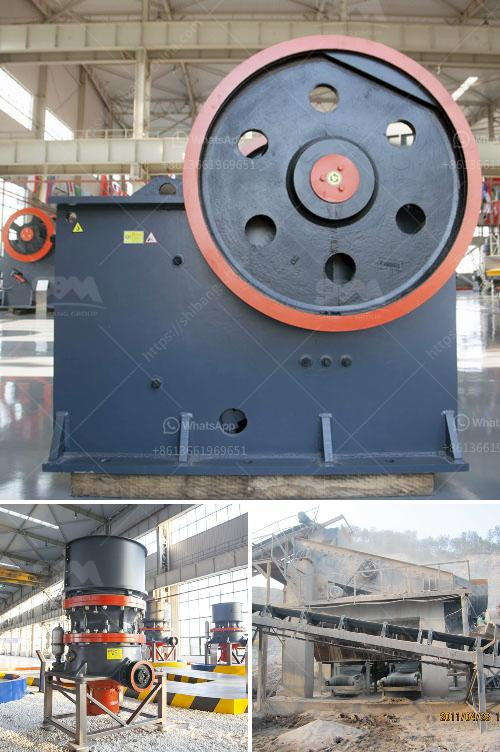

<h3>caterpillar jaw crusher for sale ebay</h3>
If you are in the market for a jaw crusher machine, you know that these machines are one of the most important pieces of equipment you can have in your construction and mining business. These machines help to break down larger rocks into smaller, more manageable sizes. The jaw crusher is an essential tool for many industries, including mining, construction, and demolition. If you are looking to invest in a jaw crusher, then you should consider browsing the selection available on eBay.

One particular machine that is worth noting is the Caterpillar jaw crusher. This powerful machine boasts a robust design and is capable of crushing even the toughest materials. With a Caterpillar engine, this jaw crusher has enough power to handle the most demanding tasks. It is ideal for heavy-duty applications and can process large quantities of material quickly and efficiently.

What sets the Caterpillar jaw crusher apart from others on the market is its versatility. With adjustable jaws and a range of different settings, this machine can be customized to suit your specific needs. Whether you are looking to break down large rocks into smaller sizes or need a precise final product size, the Caterpillar jaw crusher can do it all.

Many buyers prefer to purchase machinery on eBay because it offers a wide range of choices and competitive prices. When it comes to purchasing a Caterpillar jaw crusher on eBay, you will find a variety of options available. You can choose between new and used machines, depending on your budget and requirements. eBay also offers a secure payment system, ensuring a safe and straightforward transaction.

When browsing the selection of Caterpillar jaw crushers on eBay, be sure to read the product descriptions carefully. Look for machines that are listed as being in excellent condition and have been well-maintained. It is also advisable to check the seller's reputation and read any feedback left by previous buyers to ensure a positive buying experience.

Before finalizing your purchase, consider contacting the seller directly to ask any questions you may have. This will give you an opportunity to discuss the machine's specifications, condition, and any additional features it may have. It is essential to have all the information you need before making a purchase to ensure that the machine meets your requirements.

In conclusion, if you are in the market for a jaw crusher, the Caterpillar jaw crusher available on eBay is a reliable and powerful option. With its versatility and robust design, this machine can handle even the toughest materials and is suitable for a range of industries. By browsing the selection on eBay, you can find the perfect Caterpillar jaw crusher to suit your needs and budget. Remember to read the product descriptions and contact the seller with any questions before making your final decision.
<h3>Contact us</h3><ul><li><strong>Whatsapp:&nbsp;<a href="https://wa.me/8613661969651">+8613661969651</a></strong></li><li><a href="https://swt.shibang-china.com/?git&amp;zhl&amp;caterpillar jaw crusher for sale ebay"><strong>Online Service(chat now)</strong></a></li></ul><h3>Related</h3><ul><li><a href='how much cost to establish stone crusher south africa.md'>how much cost to establish stone crusher south africa</a></li><li><a href='kaolin crusher processing in japan.md'>kaolin crusher processing in japan</a></li><li><a href='costs of calcium carbonate making machinery in japan.md'>costs of calcium carbonate making machinery in japan</a></li><li><a href='german hammer mill ceramic.md'>german hammer mill ceramic</a></li><li><a href='buy roller crusher.md'>buy roller crusher</a></li></ul>