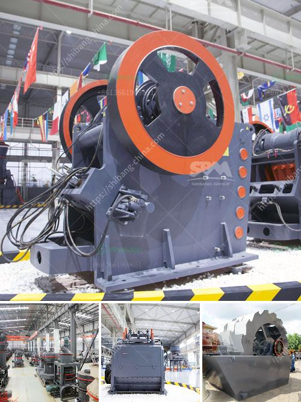

<h3>cement clinker grinding and packing plant</h3>
Cement is a vital component of the construction industry. The clinker grinding and packing plant is an integral part of the cement manufacturing process. It is a complex and energy-intensive operation, involving the grinding of clinker, gypsum, and other additives into a fine powder. The finished product is then packed and dispatched to deliver to consumers.

The first step in the cement manufacturing process is the extraction of raw materials from the quarry. These materials, primarily limestone and clay, are then crushed and transported to the clinker grinding and packing plant.

The clinker grinding process involves grinding clinker, gypsum, and other additives to produce a fine powder that is used to manufacture cement. Clinker is a nodular material produced during the cement manufacturing process and is used as the binder in the final cement product.

Grinding clinker requires a large amount of energy. To optimize the grinding process and reduce energy consumption, manufacturers use various equipment, such as ball mills and vertical roller mills. These mills grind the clinker to a specific fineness, which is then whisked together with gypsum and other additives to produce the final cement product.

After grinding, the cement is transferred to storage silos for further processing. The next step is the packing of cement. The purpose of packing is to protect the cement from moisture and external elements and to facilitate storage and transportation.

Cement packing is done using automatic packing machines or manually, depending on the scale of the plant. The packed cement is then dispatched from the plant to distribution centers or directly to construction sites.

Efficient cement grinding and packing plants are crucial for the sustainability of the cement industry. They not only ensure the quality and consistency of the final product but also optimize energy consumption.

To enhance the efficiency of the grinding and packing process, manufacturers often adopt advanced technologies and equipment. These technologies include high-efficiency separators, which improve the grinding process and reduce energy consumption. Manufacturers also use bag filters to control dust emissions, thus minimizing environmental impact.

Furthermore, automation and digitalization play a significant role in optimizing the cement grinding and packing process. Advanced control systems and real-time monitoring enable manufacturers to achieve better operational efficiency, reduce energy consumption, and improve product quality.

In conclusion, the clinker grinding and packing plant is a key component in the cement manufacturing process. This process not only consumes a considerable amount of energy but also plays a crucial role in the final product quality. With the adoption of advanced technologies and equipment, manufacturers can enhance the efficiency of the grinding and packing process, thus contributing to the sustainability of the cement industry.
<h3>Contact us</h3><ul><li><strong>Whatsapp:&nbsp;<a href="https://wa.me/8613661969651">+8613661969651</a></strong></li><li><a href="https://swt.shibang-china.com/?git&amp;zhl&amp;cement clinker grinding and packing plant"><strong>Online Service(chat now)</strong></a></li></ul><h3>Related</h3><ul><li><a href='concrete crusher business proposal.md'>concrete crusher business proposal</a></li><li><a href='crusher machine in china.md'>crusher machine in china</a></li><li><a href='iron ore cruseher plant price.md'>iron ore cruseher plant price</a></li><li><a href='one ton per hour crushing mill.md'>one ton per hour crushing mill</a></li><li><a href='average cost of graphite mining plant.md'>average cost of graphite mining plant</a></li></ul>