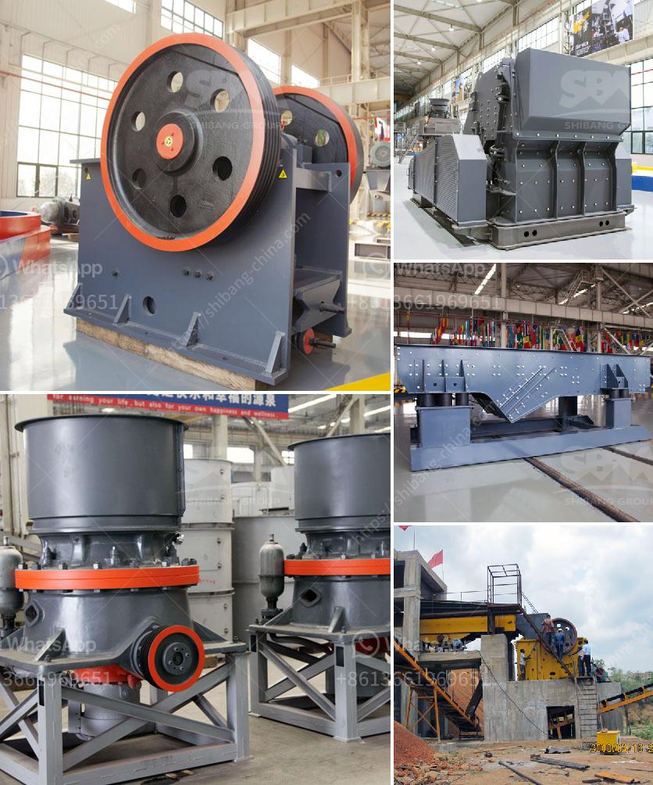

<h3>cement clinker grinding plant in india</h3>
Cement is one of the most widely used building materials in the world, and the demand for cement is growing at an alarming rate. Cement is produced by grinding clinker, a combination of limestone and clay, which is heated to around 1,500 degrees Celsius. The grinding process of clinker results in the production of cement powder, which is used as a binder in concrete and other construction materials.

In India, the cement industry is a significant contributor to the country's GDP and plays a vital role in infrastructural development. With the rapid urbanization and growth of the construction sector, the demand for cement in India has been witnessing a steady rise. To meet this demand, several cement clinker grinding plants have been established across the country.

Clinker, as mentioned earlier, is a key ingredient in the production of cement. To convert clinker into powdered cement, grinding units are designed and set up. These grinding units are known as cement clinker grinding plants that consist of crushers, grinding mills, and other auxiliary equipment. The major inputs and outputs of these grinding units are as follows:

1. Clinker: As mentioned earlier, clinker is the primary raw material required for the manufacturing of cement. It is obtained by heating limestone and clay at high temperatures.

2. Gypsum: Gypsum is added to the clinker during the grinding process to control the setting time of cement and improve its workability.

1. Cement powder: The primary output of a cement clinker grinding plant is powdered cement. This cement powder is used in the production of concrete, mortar, and other construction materials.

2. Clinker dust: During the grinding process, a certain amount of clinker dust is generated. This dust can be collected using various dust collection systems and can be further utilized in the cement manufacturing process.

Setting up a cement clinker grinding plant requires significant investment and expertise. The process involves selecting suitable machinery, procuring raw materials, obtaining necessary permits and clearances, and ensuring compliance with environmental regulations. Additionally, the grinding units need to be strategically located near the sources of raw material and markets to minimize transportation costs.

In recent years, the Indian cement industry has witnessed significant growth, leading to the establishment of several cement clinker grinding plants across the country. These grinding plants not only cater to the domestic demand but also export cement to various countries. This has not only helped meet the demand for cement but has also contributed to the country's economy through revenue generation and employment creation.

To conclude, cement clinker grinding plants play a crucial role in meeting the rising demand for cement in India. These plants not only ensure the availability of cement but also contribute to economic growth and development. With continued investments and advancements in technology, the cement industry is expected to witness further growth, leading to the establishment of more grinding plants in the future.
<h3>Contact us</h3><ul><li><strong>Whatsapp:&nbsp;<a href="https://wa.me/8613661969651">+8613661969651</a></strong></li><li><a href="https://swt.shibang-china.com/?git&amp;zhl&amp;cement clinker grinding plant in india"><strong>Online Service(chat now)</strong></a></li></ul><h3>Related</h3><ul><li><a href='concrete crusher in kenya.md'>concrete crusher in kenya</a></li><li><a href='36 jaw crusher for rent edmonton.md'>36 jaw crusher for rent edmonton</a></li><li><a href='stone crusher accounting in tally.md'>stone crusher accounting in tally</a></li><li><a href='magnetic separator distributor in surabaya.md'>magnetic separator distributor in surabaya</a></li><li><a href='gypsum crusher plants in pakistan.md'>gypsum crusher plants in pakistan</a></li></ul>