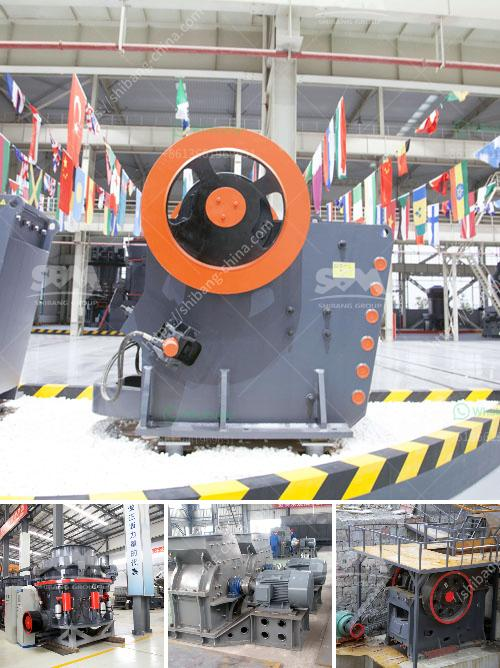

<h3>cement clinker grinding unit</h3>
Cement is the most commonly used building material worldwide, and clinker is the main component in cement production. A clinker grinding unit plays a crucial role in the cement industry as it is responsible for grinding clinker, the main raw material for cement production.

Clinker grinding is the process of converting clinker into a fine powder that can be mixed with gypsum and other additives to produce cement. Clinker grinding units are key components in the cement production process, helping to produce clinker-shaped particles that are then ground into the fine powder used in cement manufacturing.

The grinding process is conducted in closed-circuit ball mills, where clinker is ground to a fine powder with the help of grinding media, consisting of steel balls. The clinker grinding unit is usually a standalone operation that is integrated with the rest of the production line.

The clinker grinding process in cement manufacturing is one of the most energy-intensive processes, consuming up to 70% of the total electrical energy in the plant. Therefore, it becomes important to optimize the process to reduce energy consumption and increase efficiency.

Modern clinker grinding units utilize advanced grinding technologies, such as vertical roller mills (VRM) and high-pressure grinding rolls (HPGR), to achieve more efficient and energy-saving grinding. These technologies provide better particle size distribution and greater control over the grinding process, resulting in higher-quality cement.

In addition to grinding technologies, clinker grinding units are equipped with various auxiliary equipment to improve the overall efficiency of the process. These include pre-grinding systems, which reduce the size of clinker particles before entering the grinding mill, and separator systems that separate the fine particles from the coarse ones, ensuring only the desired particle size is sent to further processing.

Furthermore, clinker grinding units are equipped with dust collection systems to minimize the environmental impact. These systems capture and filter the dust generated during the grinding process, preventing it from being released into the atmosphere. Additionally, clinker grinding units are designed to be highly automated, reducing human intervention and ensuring consistent and reliable operations.

Cement manufacturers are continuously investing in clinker grinding units to improve their production efficiency and reduce energy consumption. By adopting advanced grinding technologies and optimizing the grinding process, cement manufacturers can produce high-quality cement while minimizing their environmental impact.

In conclusion, a clinker grinding unit plays a critical role in the cement production process. It is responsible for converting clinker into a fine powder that is further processed to produce high-quality cement. Utilizing advanced grinding technologies and optimizing the grinding process, clinker grinding units help cement manufacturers improve their efficiency, reduce energy consumption, and produce environmentally friendly cement.
<h3>Contact us</h3><ul><li><strong>Whatsapp:&nbsp;<a href="https://wa.me/8613661969651">+8613661969651</a></strong></li><li><a href="https://swt.shibang-china.com/?git&amp;zhl&amp;cement clinker grinding unit"><strong>Online Service(chat now)</strong></a></li></ul><h3>Related</h3><ul><li><a href='used limestone milling machine.md'>used limestone milling machine</a></li><li><a href='concrete crusher made in japan.md'>concrete crusher made in japan</a></li><li><a href='limestone fine grind plant for sale.md'>limestone fine grind plant for sale</a></li><li><a href='crusher plant for sale in pakistan.md'>crusher plant for sale in pakistan</a></li><li><a href='iron ore processing equipment china for sale.md'>iron ore processing equipment china for sale</a></li></ul>