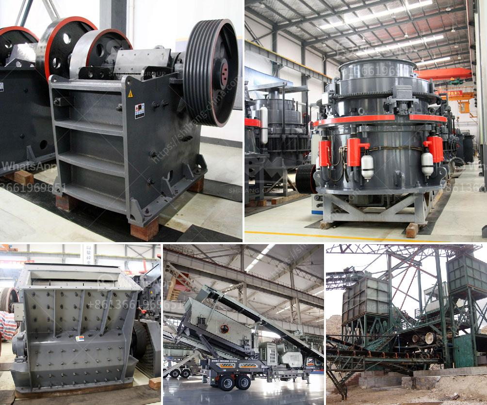

<h3>cement clinker plant machinery hyderabad</h3>
Cement clinker plants are among the most important industrial facilities in Hyderabad, India. These plants produce a vital raw material for the construction industry, which plays a significant role in the city's infrastructure development. To meet the growing demand for cement, these clinker plants rely heavily on advanced machinery and equipment.

The machinery used in cement clinker plants in Hyderabad is highly specialized and varies depending on the plant's capacity and specific requirements. Some common types of machinery used in these plants include crushers, kilns, ball mills, vertical roller mills, coolers, stackers, and reclaimers. Let's take a closer look at some of these key pieces of equipment.

Crushers are essential in the cement manufacturing process, as they break down the large rocks into smaller sizes. These machines use immense pressure to crush the rocks, facilitating the production of clinker. Different types of crushers, such as jaw crushers, impact crushers, and hammer crushers, are used to achieve the desired size reduction.

Kilns are another crucial machinery in cement clinker plants. These large cylindrical structures are heated to extremely high temperatures, around 1400°C, and are used to create the clinker from raw materials such as limestone, clay, and iron ore. The kilns are designed to maintain a constant flow of materials, ensuring efficient and consistent production.

Ball mills and vertical roller mills are used to grind the clinker to a fine powder. These mills use different grinding media, such as steel balls or ceramic beads, to achieve the desired fineness. The ground clinker is then mixed with gypsum and other additives to produce the final cement product.

Coolers play an important role in the cement manufacturing process as they lower the temperature of the clinker. After leaving the kiln, the clinker is cooled rapidly, preventing it from re-solidifying and ensuring its suitability for further processing. This machinery helps maintain the quality of the clinker and ensures its proper storage and transportation.

Stackers and reclaimers are used to handle and store bulk materials, including raw materials and finished products. These machines enable efficient and organized handling, storage, and retrieval of materials in the plant. They play a crucial role in ensuring the smooth operation of cement clinker plants.

The cement clinker plant machinery used in Hyderabad is designed to maximize efficiency while minimizing energy consumption and emissions. Advanced technologies, such as automation and digitalization, are being integrated into these machines to improve their performance. The use of modern machinery and equipment not only enhances productivity but also reduces the environmental impact of cement production.

In conclusion, cement clinker plant machinery in Hyderabad plays a vital role in meeting the demand for cement in the construction industry. These specialized machines, including crushers, kilns, mills, coolers, stackers, and reclaimers, are designed to ensure efficient and sustainable cement production. As Hyderabad continues to grow and develop, the cement clinker plants and their machinery will continue to play a significant role in the city's infrastructure development.
<h3>Contact us</h3><ul><li><strong>Whatsapp:&nbsp;<a href="https://wa.me/8613661969651">+8613661969651</a></strong></li><li><a href="https://swt.shibang-china.com/?git&amp;zhl&amp;cement clinker plant machinery hyderabad"><strong>Online Service(chat now)</strong></a></li></ul><h3>Related</h3><ul><li><a href='sand making machine kenya.md'>sand making machine kenya</a></li><li><a href='crusher for limestone.md'>crusher for limestone</a></li><li><a href='stone crusher output per hour india.md'>stone crusher output per hour india</a></li><li><a href='quarring and crushing and cost.md'>quarring and crushing and cost</a></li><li><a href='gypsum granules plant manufacturer in india.md'>gypsum granules plant manufacturer in india</a></li></ul>