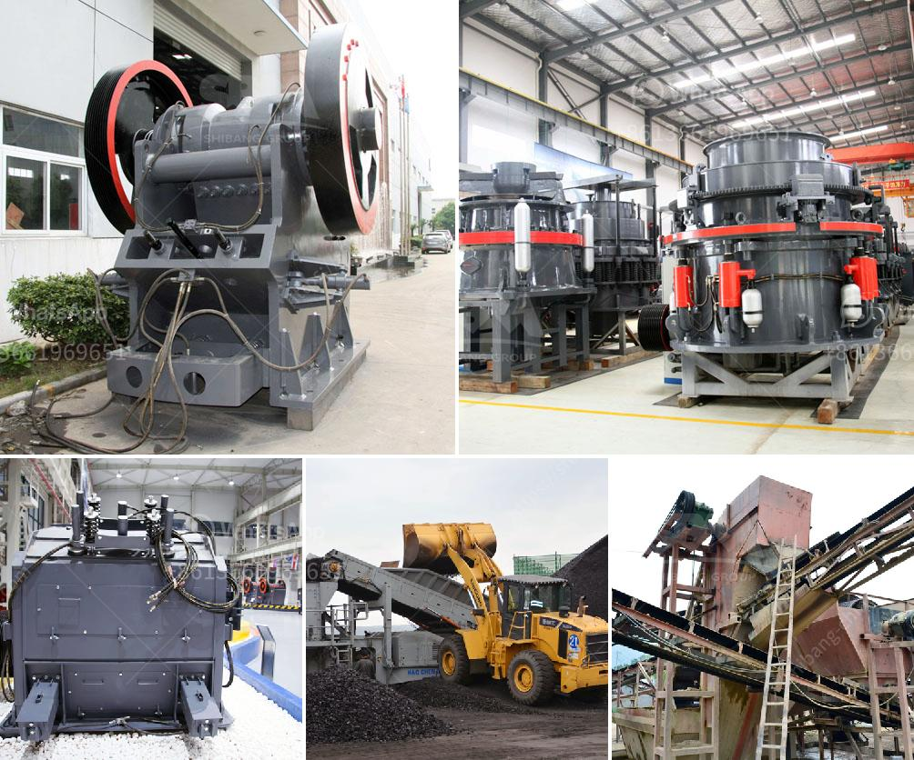

<h3>cement crusher machines price in india</h3>
Cement is an integral part of the construction industry and is used for various purposes. It is a key ingredient in the production of concrete, which is used for construction purposes. Cement crushers are machines that grind up chunks of cement into smaller pieces or even powder to make it usable for construction purposes. These machines are commonly used in cement plants, where cement is produced in large quantities.

When it comes to cement crusher machines, there are many types and models available in the market. Their prices vary depending on factors such as capacity, power, specifications, and features. However, one thing is certain – cement crusher machines are expensive.

The price of cement crusher machines is not dependent on the capacity or power of the machine. It is dependent on factors such as the type of machine, the input feed size of the machine, the number of screens required, and the discharge specification of the finished product.

A primary crusher, such as a jaw crusher, is used to reduce ore into particles less than 150 millimeters in diameter. Generally, crushing continues using a cone crusher and an internal sizing screen until the ore is less than 19 mm (3/4 inch). Crushing in jaw and cone crushers is a dry process, with water spray applied only to control dust.

Impact crushers are used to crush rocks and other materials with a higher reduction ratio and lower power consumption. They have high capacity and are easy to maintain.

Roller crushers are used mainly for crushing easily fractured materials such as soft limestone, chalk, and clay to between 1/3 and 1/5 of its original size.

Cone crushers are used in secondary and tertiary roles as an alternative to impact crushers when shape is an important requirement, but the proportion of fines produced needs to be minimized. Impact crushers can produce more fines, but the subsequent crushing stages become more efficient.

In some operations, impact crushers are used for primary crushing, but they may have a slightly higher cost per ton. Impact crushers may upgrade poor-quality aggregate and increase separation, such as removal of rebar from concrete in recycling operations.

Cement crusher machines are crucial equipment in cement production. They are used for crushing and grinding gypsum into powder to make cement. Crusher machines are powerful machines, but not all are suitable for crushing all types of cement. Therefore, here are some tips to choose the right cement crusher.

There are many types and models of cement crusher machines, each with its own advantages and specifications. The price of cement crusher machines will also significantly vary depending on the quantity and quality of the materials used to manufacture the machine.

However, because of the large price gap between the different models of the same brand, many users are often at a loss as to which one to buy and how to choose. This article mainly introduces the factors affecting the price of Cement Crusher Machine.

In conclusion, cement crusher machines price in India is influenced by multiple factors, encompassing the capacity, power consumption, inlet size, discharge size, mass handling capacity, and other specifications of the machine. It is important to note that the price of cement crusher machines in India varies greatly depending on many factors, including the specifications of the machines, the capacity of the machines, and the quantity of orders taken.

Therefore, it is necessary to thoroughly consider all these factors when purchasing cement crusher machines in India to ensure that you get the best value for your money.
<h3>Contact us</h3><ul><li><strong>Whatsapp:&nbsp;<a href="https://wa.me/8613661969651">+8613661969651</a></strong></li><li><a href="https://swt.shibang-china.com/?git&amp;zhl&amp;cement crusher machines price in india"><strong>Online Service(chat now)</strong></a></li></ul><h3>Related</h3><ul><li><a href='mining process for perlite.md'>mining process for perlite</a></li><li><a href='one ton per hour crushing mill.md'>one ton per hour crushing mill</a></li><li><a href='small stone crushers.md'>small stone crushers</a></li><li><a href='part of ball mill.md'>part of ball mill</a></li><li><a href='china talc processing factory.md'>china talc processing factory</a></li></ul>