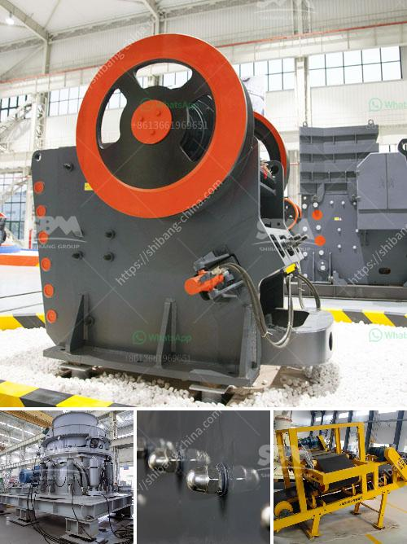

<h3>cement factory for sale india</h3>
India's rapid urbanization and booming construction industry have significantly increased the demand for cement in recent years. Cement production, one of the key components of infrastructure development, offers massive potential for investors. For those seeking an exceptional opportunity in this sector, a cement factory for sale in India presents an ideal investment option. This article explores the advantages, potential challenges, and the vast market potential associated with acquiring a cement factory in India.

1. High demand and market potential: The Indian construction industry is expected to grow at a robust rate in the coming years, significantly driving the demand for cement. This presents an excellent opportunity for investors to tap into a thriving market.

2. Strong government initiatives: The Indian government's focus on infrastructure development through initiatives such as 'Make in India' and 'Smart Cities' creates a favorable business environment for cement manufacturers, ensuring long-term growth prospects.

3. Cost-efficient operations: India boasts abundant limestone reserves, a key raw material for cement production. Acquiring a cement factory in India allows investors to capitalize on this availability, minimizing production costs and ensuring competitive pricing in the market.

1. Regulatory compliance: Ensuring compliance with environmental regulations and obtaining necessary permits and licenses is crucial in the cement manufacturing industry. Prospective buyers must thoroughly assess the factory's current compliance status.

2. Competitive landscape: India hosts a vast number of cement manufacturers, creating a competitive market. Investors should conduct a comprehensive analysis of existing players to understand their market positioning, strengths, and weaknesses.

3. Technological modernization: To meet evolving consumer demands and increase production efficiency, an outdated plant may require substantial investments in modernization. Buyers must carefully evaluate the factory's equipment and technology infrastructure.

Acquiring a cement factory in India offers investors a rare opportunity to become part of a rapidly growing industry. The high demand for cement, supported by government initiatives and cost-efficient operations, makes this investment option highly promising and lucrative. However, it is essential to carefully assess regulatory compliance, competition, and technological readiness to ensure a successful venture. With the right due diligence and strategic decision-making, purchasing a cement factory in India can prove to be a highly profitable long-term investment.
<h3>Contact us</h3><ul><li><strong>Whatsapp:&nbsp;<a href="https://wa.me/8613661969651">+8613661969651</a></strong></li><li><a href="https://swt.shibang-china.com/?git&amp;zhl&amp;cement factory for sale india"><strong>Online Service(chat now)</strong></a></li></ul><h3>Related</h3><ul><li><a href='cement plant equipment list for cost estimation.md'>cement plant equipment list for cost estimation</a></li><li><a href='costs a stone crushing machine when a stone crusher.md'>costs a stone crushing machine when a stone crusher</a></li><li><a href='sahuvala roller mills.md'>sahuvala roller mills</a></li><li><a href='beneficiation plant for feldspar japan.md'>beneficiation plant for feldspar japan</a></li><li><a href='rock crusher machine equipment in canada.md'>rock crusher machine equipment in canada</a></li></ul>