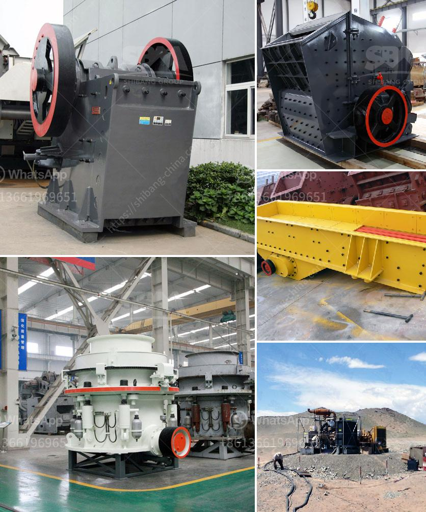

<h3>cement formation process</h3>
Cement is an essential component in the construction industry, used widely for its binding properties. It is primarily responsible for holding various materials together, such as bricks, stones, and concrete blocks, to construct buildings, bridges, and roads. Cement is formed through a complex process that involves multiple stages and careful control over ingredient proportions.

The first step in cement formation is quarrying, where limestone and other raw materials are extracted from the ground using explosives or drilling equipment. Limestone, which is the primary source material for cement production, is typically found in large quantities in geological formations.

Once the limestone is extracted, it is transported to a crushing plant where it is broken down into smaller pieces. Crushing enhances the surface area of the limestone, allowing for better chemical reactions during the subsequent steps. The crushed limestone is then mixed with other raw materials such as clay, shale, iron ore, and sand.

The next stage in cement formation is the grinding of raw materials. The finely ground mixture, called raw meal, is then fed into a rotary kiln. The kiln, which is a large cylindrical furnace, is heated to temperatures of around 1450 degrees Celsius (2642 degrees Fahrenheit). This high temperature is necessary for the chemical reactions that convert the raw meal into cement clinker.

Inside the kiln, a series of complex chemical reactions occur. The main reaction is the conversion of limestone (calcium carbonate) into lime (calcium oxide) through a process called calcination. This reaction releases carbon dioxide as a byproduct. Other reactions, such as the formation of silicates and aluminates, also contribute to the cement formation process.

After being heated in the kiln for several hours, the resulting cement clinker is then cooled. This cooling process is critical to ensure the formation of desirable cement properties. The cooled clinker is then ground into a fine powder using a ball mill or other grinding equipment.

To produce different types of cement, various additives can be included in the grinding process. These additives may include gypsum, fly ash, slag, or other materials that enhance the final cement's properties, such as setting time or compressive strength.

The final product, known as cement, is a fine gray powder. It is then stored in silos or bags for transportation and later use in construction projects. Cement can also be mixed with water, aggregate, and other materials to produce concrete, which is widely used in the construction industry.

The entire cement formation process requires careful quality control to ensure consistent and reliable results. The chemical composition of the raw materials, the temperature in the kiln, and the grinding process parameters all play a crucial role in determining the final cement's properties.

In conclusion, cement formation is a multi-step process that involves quarrying, crushing, grinding, and heating raw materials to produce cement clinker. This clinker is then mixed with additives and ground into a fine powder to create different types of cement. Considering the complexity of this process, it is no wonder that cement is a vital component in the construction industry due to its excellent binding properties.
<h3>Contact us</h3><ul><li><strong>Whatsapp:&nbsp;<a href="https://wa.me/8613661969651">+8613661969651</a></strong></li><li><a href="https://swt.shibang-china.com/?git&amp;zhl&amp;cement formation process"><strong>Online Service(chat now)</strong></a></li></ul><h3>Related</h3><ul><li><a href='composetion of terracotta tiles.md'>composetion of terracotta tiles</a></li><li><a href='quartz stone crusher application.md'>quartz stone crusher application</a></li><li><a href='grinding units of feldspar.md'>grinding units of feldspar</a></li><li><a href='process of gravel quarrying crusher.md'>process of gravel quarrying crusher</a></li><li><a href='hammer mills used in kenya.md'>hammer mills used in kenya</a></li></ul>