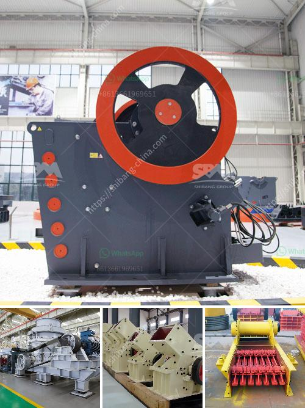

<h3>cement grinding machinery europe</h3>
Europe is one of the major regions contributing to the global cement production, and the demand for cement is expected to grow significantly in the coming years. With this increased demand, the cement industry is seeking advanced and efficient grinding machinery to ensure high-quality and cost-effective production. Europe, being a hub for innovation and technology, has witnessed a rise in the development and manufacturing of cement grinding machinery.

Cement grinding machinery includes various types of machinery such as ball mills, vertical roller mills, and roller presses. These machinery are used to grind, blend, and crush cement clinker into a fine powder, which is further mixed with gypsum to create the final cement product. The efficiency and performance of grinding machinery play a vital role in determining the overall productivity and quality of cement production.

In recent years, Europe has seen the emergence of several companies specializing in the manufacturing of cement grinding machinery. These companies invest heavily in research and development to introduce advanced technologies that enhance the grinding process. For instance, some European manufacturers have developed high-pressure grinding rolls (HPGR) that offer improved energy efficiency and reduced maintenance costs. HPGRs are widely used in cement grinding, as they consume less energy compared to traditional ball mills and provide a higher grinding capacity.

The introduction of automation and digitalization in cement grinding machinery has also been a significant trend in Europe. Manufacturers are incorporating sensors and advanced control systems to monitor and optimize the grinding process in real-time. This ensures precise control over the grinding parameters, resulting in a consistent and high-quality cement product. Furthermore, the use of artificial intelligence and machine learning algorithms is gaining traction to predict and prevent equipment failures, increasing the reliability and availability of grinding machinery.

Sustainability has become a crucial aspect of the cement industry, and European manufacturers are focusing on developing environmentally friendly grinding machinery. Technologies like vertical roller mills (VRM) have gained popularity due to their lower carbon footprint and higher energy efficiency. These mills use pressure and shear forces to grind the clinker, reducing the need for water and minimizing dust emissions.

The market for cement grinding machinery in Europe is highly competitive, with both local manufacturers and international players vying for market share. Local manufacturers have an advantage due to their proximity to customers, allowing for quick response times and tailored solutions. On the other hand, international players bring in global expertise and extensive distribution networks.

In conclusion, the demand for efficient cement grinding machinery in Europe is on the rise, driven by the increasing demand for cement and the need for sustainable and cost-effective production. European manufacturers are investing in research and development to introduce advanced technologies, automation, and sustainability measures in their machinery. As the cement industry continues to grow and evolve, the development and adoption of innovative grinding machinery will play a crucial role in meeting the market's requirements and ensuring the production of high-quality cement.
<h3>Contact us</h3><ul><li><strong>Whatsapp:&nbsp;<a href="https://wa.me/8613661969651">+8613661969651</a></strong></li><li><a href="https://swt.shibang-china.com/?git&amp;zhl&amp;cement grinding machinery europe"><strong>Online Service(chat now)</strong></a></li></ul><h3>Related</h3><ul><li><a href='basalt crushing machine.md'>basalt crushing machine</a></li><li><a href='used limestone crushing equipment houston.md'>used limestone crushing equipment houston</a></li><li><a href='marble crusher supplier.md'>marble crusher supplier</a></li><li><a href='complete mobile stone crushing machine.md'>complete mobile stone crushing machine</a></li><li><a href='gold wash plant equipment in ghana.md'>gold wash plant equipment in ghana</a></li></ul>