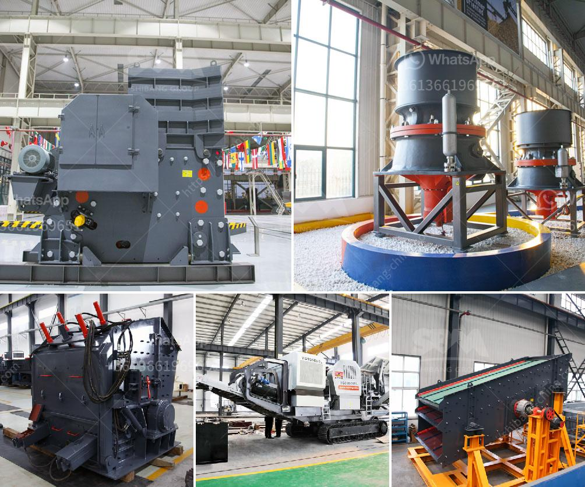

<h3>cement grinding mill manufacturer india</h3>
India is the second largest producer of cement in the world, contributing to more than 7% of global cement production. The country's cement industry plays a vital role in its economy, providing employment to more than a million people, directly or indirectly. Ever since it was deregulated in 1982, the Indian cement industry has attracted huge investments, both from domestic as well as foreign investors. And one of the crucial components driving this growth is the cement grinding mill.

Cement grinding mills are the machines used to grind the hard nodular clinker from the cement kiln into the fine grey powder that is cement. The emergence of Portland cement in the 1840s made grinding considerably easier, leading to the development of automated and efficient cement grinding mills. Today, cement grinding mills are highly energy-intensive, with an electric motor energy consumption of up to 110 kWh per tonne of cement produced. They can grind cement clinkers to a fine powder without the need for additional pre-processing equipment, making them a cost-effective option for many cement manufacturers.

In India, the cement grinding mill manufacturer constantly strives for improvement in productivity and operational performance. This company has achieved an admirable reputation for cost-effective technology solutions to meet the demands of many industries, including Indian cement manufacturing. Its grinding mills are known to be sturdy, customizable, and produce consistent results, making them highly sought after in the industry.

One of the key advantages of this cement grinding mill manufacturer India is its patented modular design, which helps avoid spares holding, resulting in improved availability and simplified maintenance. The cement grinding mills also offer the flexibility to grind a wide range of feed materials to various finenesses. They seamlessly integrate with the existing ball mills, ensuring high efficiency and high flexibility in terms of product quality.

Additionally, this manufacturer's mills are increasingly being used as stand-alone grinding machines, enhancing overall efficiency and reducing energy consumption. With a focus on sustainability, this company has also developed grinding mills that consume less power while delivering the same performance. These mills can also be retrofitted into existing installations, reducing the need for capital investments and lowering the carbon footprint.

Moreover, this cement grinding mill manufacturer India is continuously updating its product range to meet the growing demands of the market. They are investing in research and development, incorporating the latest technologies to improve the operational performance of their mills. The company also provides excellent after-sales services, offering expert assistance and technical support for its grinding mills.

In conclusion, the cement grinding mill manufacturer India aims to deliver a high-quality product and service, backed by innovative technology solutions that best fit the evolving needs of the Indian cement industry. They are continuously striving to reduce energy consumption and improve operational efficiency. Their commitment to sustainability, flexibility, and customer satisfaction makes them a reliable and preferred partner for cement manufacturers in India and beyond.
<h3>Contact us</h3><ul><li><strong>Whatsapp:&nbsp;<a href="https://wa.me/8613661969651">+8613661969651</a></strong></li><li><a href="https://swt.shibang-china.com/?git&amp;zhl&amp;cement grinding mill manufacturer india"><strong>Online Service(chat now)</strong></a></li></ul><h3>Related</h3><ul><li><a href='small scale gypsum powder plant.md'>small scale gypsum powder plant</a></li><li><a href='marble grinding mill.md'>marble grinding mill</a></li><li><a href='kenya crushing machinery performance.md'>kenya crushing machinery performance</a></li><li><a href='items for conveyor belts.md'>items for conveyor belts</a></li><li><a href='ceramic ball mill.md'>ceramic ball mill</a></li></ul>