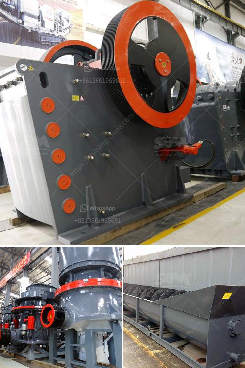

<h3>cement grinding station quotations</h3>
Cement grinding stations play a crucial role in the final production of cement, as they determine the quality and overall strength of the product. With the rapid development of infrastructure and urbanization projects, cement grinding stations have become vital in delivering high-quality cement on time.

When it comes to setting up a cement grinding station, many factors need to be taken into consideration, such as the location, capacity, and more importantly, the cost. As such, obtaining accurate and competitive quotations from suppliers is the first step towards ensuring a successful project.

The quotations for cement grinding stations can vary greatly depending on various factors. Firstly, the capacity of the station plays a significant role. The more substantial the capacity, the higher the investment required. The capacity can range from a few hundred tons per day to several thousand tons. The specific requirements of the project, such as the demand for cement in the target market, will determine the suitable capacity of the grinding station.

Secondly, the location of the grinding station will influence the cost of construction. The transportation of materials and finished products must be efficient and cost-effective. Choosing a location close to major highways or railways can significantly reduce transportation costs. Additionally, access to a reliable source of raw materials is crucial in determining the feasibility of the grinding station.

Furthermore, the quality of equipment and machinery used in the grinding station is directly proportional to the cost. High-quality equipment ensures efficient and uninterrupted operations, leading to better productivity and superior cement quality. It is crucial to request detailed specifications of the equipment offered in the quotation to compare and evaluate the quality and durability.

Another important aspect to consider when requesting quotations is the after-sales service, warranty, and support offered by suppliers. Cement grinding stations involve complex machinery, which requires regular maintenance and occasional repairs. Suppliers that offer comprehensive after-sales service and technical support will ensure smooth operations and minimize downtime, ultimately increasing the station's profitability.

When requesting quotations for cement grinding stations, it is essential to obtain multiple options from different suppliers. By comparing the quotations, one can identify any price discrepancies or hidden costs that might negatively impact the budget. However, it is equally important to consider the reputation and track record of the suppliers in terms of project management, delivery timelines, and customer satisfaction.

To conclude, cement grinding stations are crucial for the production of high-quality cement in the construction industry. Obtaining accurate and competitive quotations is the first step towards setting up a successful grinding station. Factors such as capacity requirements, location, equipment quality, and after-sales service need to be carefully evaluated when comparing quotations. By making informed decisions, project owners can ensure the efficient production of quality cement, ultimately contributing to the success of infrastructure and urbanization projects.
<h3>Contact us</h3><ul><li><strong>Whatsapp:&nbsp;<a href="https://wa.me/8613661969651">+8613661969651</a></strong></li><li><a href="https://swt.shibang-china.com/?git&amp;zhl&amp;cement grinding station quotations"><strong>Online Service(chat now)</strong></a></li></ul><h3>Related</h3><ul><li><a href='mobile cone crusher zenith.md'>mobile cone crusher zenith</a></li><li><a href='how to set up crusher.md'>how to set up crusher</a></li><li><a href='process of cement production.md'>process of cement production</a></li><li><a href='second hand stone crushing machines in united kingdom.md'>second hand stone crushing machines in united kingdom</a></li><li><a href='distributor crusher di indonesia.md'>distributor crusher di indonesia</a></li></ul>