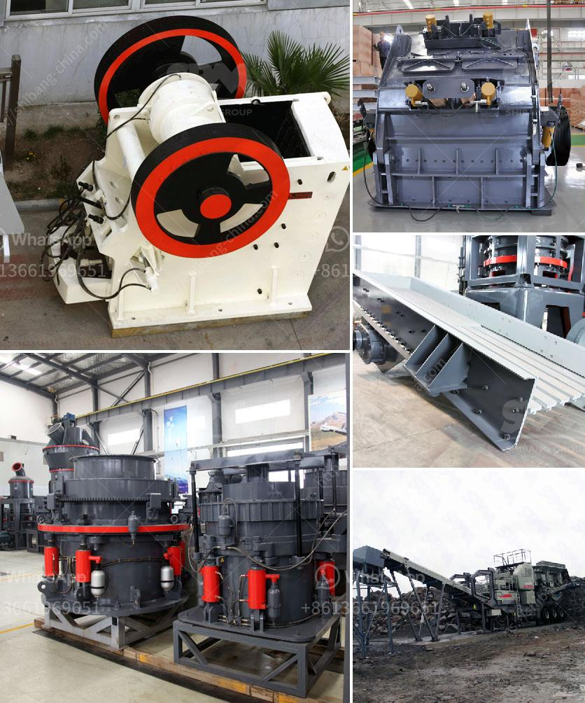

<h3>cement mill manufacturers in italy</h3>
Italy is renowned for its rich history in art, culture, and architecture. But did you know that Italy is also home to some of the top cement mill manufacturers? Cement machinery and equipment production has always been a strategic sector for the Italian economy, as it plays a fundamental role in the construction industry.

One of the leading cement mill manufacturers in Italy is FLSmidth, an international company that has been providing solutions for cement manufacturers worldwide for over 140 years. Their cement production equipment boasts state-of-the-art technology and highly efficient processes. With their wide range of products, FLSmidth serves both small and large cement producers.

Another prominent cement mill manufacturer is CEMAG, a German company that has been in operation for over 100 years. CEMAG specializes in providing tailor-made solutions for the cement industry and offers a wide range of equipment, such as mills, kilns, and filters. Their products are known for their durability and reliability.

SICOMA, an Italian company, is also a prominent cement mill manufacturer. They design and manufacture innovative equipment for various stages of cement production, including crushers, raw mills, preheaters, and kilns. Known for their advanced technology and high-quality products, SICOMA has gained trust and recognition from cement manufacturers worldwide.

Italy's cement mill manufacturers have always focused on technological advancements and sustainability. They continuously invest in research and development to improve energy efficiency, reduce emissions, and enhance the overall performance of cement plants. Additionally, they prioritize the use of recyclable materials and promote responsible waste management practices.

In conclusion, Italy boasts a strong presence in the cement mill manufacturing industry. From FLSmidth's cutting-edge technology to CEMAG and SICOMA's tailored solutions, these companies contribute significantly to the advancement of cement production globally. Italy's cement mill manufacturers continue to lead the way in innovation and sustainability, ensuring that the construction industry remains dynamic and environmentally friendly.
<h3>Contact us</h3><ul><li><strong>Whatsapp:&nbsp;<a href="https://wa.me/8613661969651">+8613661969651</a></strong></li><li><a href="https://swt.shibang-china.com/?git&amp;zhl&amp;cement mill manufacturers in italy"><strong>Online Service(chat now)</strong></a></li></ul><h3>Related</h3><ul><li><a href='quartz stone crusher application.md'>quartz stone crusher application</a></li><li><a href='m sand manufacturing machine.md'>m sand manufacturing machine</a></li><li><a href='tph stone crusher.md'>tph stone crusher</a></li><li><a href='mobile stone crusher price south africa.md'>mobile stone crusher price south africa</a></li><li><a href='techniques chips of metal conveyor belts.md'>techniques chips of metal conveyor belts</a></li></ul>