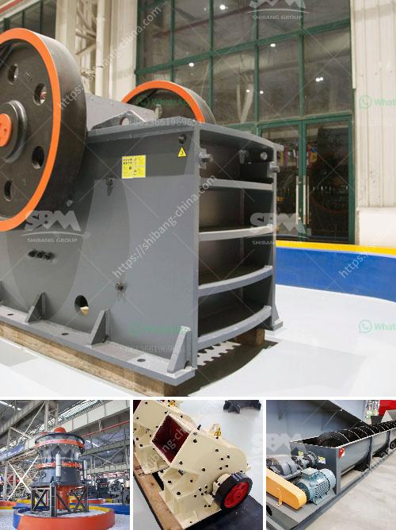

<h3>cement mill plants</h3>
Cement is an essential material for nearly every construction project, whether it is roads, buildings, bridges, dams, or even household projects. As the primary component of concrete, cement plays a crucial role in ensuring the durability and strength of structures. To meet the rising demand for cement, cement mill plants have become an integral part of the industry.

A cement mill plant is used for grinding raw materials such as clinker, limestone, gypsum, coal, and other materials into cement powder, that is commonly used in concrete. These plants are found in various parts of the world where limestone and other raw materials are abundant.

The process of cement mill plants is simple yet efficient. The raw materials are first crushed and ground in a jaw crusher and ball mill, respectively, to form a fine powder called raw meal. The raw meal is then preheated and fed into a rotary kiln, where it is heated to extremely high temperatures of up to 1,500°C. This process, known as clinkerization, results in the formation of small clinker beads.

After the clinkerization process, the clinker is cooled and then ground with gypsum and other additives, such as fly ash or slag, in a cement mill. The resulting cement powder is then packaged in bags or stored in silos for transportation and sale.

Cement mill plants offer several advantages to the construction industry. Firstly, they provide a reliable supply of high-quality cement throughout the year, ensuring a steady availability for construction projects. This is especially important in areas where cement production is limited or expensive due to logistical challenges or scarcity of raw materials.

Secondly, cement mill plants contribute to the reduction of greenhouse gas emissions. By using alternative fuels, such as biomass or waste materials, in the kiln, these plants can reduce their carbon footprint. Additionally, some plants have implemented carbon capture and storage technologies to further mitigate their environmental impact.

Furthermore, cement mill plants play a vital role in local economic development. These plants require a significant amount of labor and generate employment opportunities for both skilled and unskilled workers. Additionally, they provide a boost to the local economy through the procurement of raw materials, transportation services, and other auxiliary industries.

Despite their numerous benefits, cement mill plants face challenges that need to be addressed. One such challenge is the efficient use of energy and resources. Cement production is energy-intensive, and efforts should be made to optimize the process and reduce energy consumption. Additionally, the continuous monitoring of emissions and implementation of stricter environmental regulations are essential for sustainable production.

In conclusion, cement mill plants have revolutionized the construction industry by ensuring a reliable and consistent supply of high-quality cement. They provide economic, environmental, and social benefits to the communities in which they operate. However, it is important to address the challenges associated with cement production to ensure a sustainable future for the industry.
<h3>Contact us</h3><ul><li><strong>Whatsapp:&nbsp;<a href="https://wa.me/8613661969651">+8613661969651</a></strong></li><li><a href="https://swt.shibang-china.com/?git&amp;zhl&amp;cement mill plants"><strong>Online Service(chat now)</strong></a></li></ul><h3>Related</h3><ul><li><a href='stone crusher manufactured in new zealand.md'>stone crusher manufactured in new zealand</a></li><li><a href='crushers mobile crushers american mobile.md'>crushers mobile crushers american mobile</a></li><li><a href='dry processing machine supplier.md'>dry processing machine supplier</a></li><li><a href='rock crusher machine equipment in canada.md'>rock crusher machine equipment in canada</a></li><li><a href='stone crushing for sale.md'>stone crushing for sale</a></li></ul>