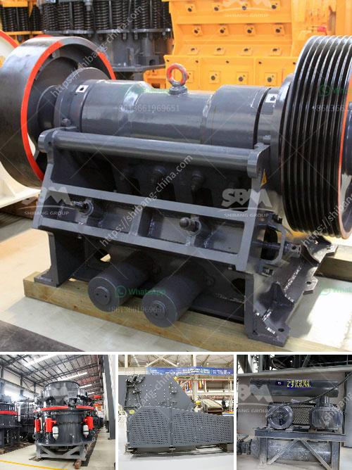

<h3>cement plant drawings pdf</h3>
When it comes to designing and constructing cement plants, architects and engineers rely heavily on detailed and accurate drawings. These drawings serve as the medium for communication between different stakeholders involved in the project, and the PDF format has become the standard for sharing and reviewing such drawings.

A cement plant drawing in PDF format typically consists of a combination of architectural, structural, and electrical drawings. These drawings provide a comprehensive overview of the entire plant, showcasing its layout, key structural elements, and important electrical connections and equipment.

Architectural drawings are crucial in cement plant design as they outline the overall layout and spatial arrangement of the plant. These drawings include floor plans, elevations, and sections, allowing architects and stakeholders to visualize the plant's physical structure, including buildings, storage areas, and processing units. This information is vital for ensuring efficient workflow and optimum use of available space.

Structural drawings, on the other hand, focus on the plant's supporting framework. They detail the various structural elements, such as beams, columns, and foundations, needed to ensure the stability and durability of the plant. By providing precise dimensions and reinforcing requirements, these drawings play a vital role in ensuring the plant's structural integrity and adherence to safety standards.

Electrical drawings are a critical component of cement plant drawings, considering the complex electrical systems required to power and control the various equipment and machinery. These drawings outline the location and connection of electrical panels, distribution boards, motors, and other electrical components. The PDF format allows for accurate and clear representations of these complex wiring diagrams, facilitating the installation and maintenance of the plant's electrical infrastructure.

PDF format has become the preferred choice for sharing cement plant drawings due to its compatibility, user-friendliness, and ability to retain the original design intent. Architects and engineers can easily view, print, and annotate these drawings using various software applications that support PDF files. Moreover, PDF drawings can be easily shared via email or cloud-based platforms, allowing for streamlined communication and collaboration among the project team.

The availability of cement plant drawings in PDF format also simplifies the process of documentation and permit approvals. Regulatory authorities and construction oversight agencies can efficiently review and assess these drawings, ensuring compliance with building codes and safety regulations. Moreover, stakeholders, such as investors or plant operators, can refer to these PDF drawings for future expansions, modifications, or maintenance of the plant.

In conclusion, cement plant drawings in PDF format play a vital role in the design, construction, and operation of cement plants. These drawings provide architects, engineers, and stakeholders with a comprehensive visual representation of the plant, facilitating efficient communication, collaboration, and informed decision-making. The PDF format's compatibility, accessibility, and ease of sharing make it the go-to choice for the industry, ensuring that these essential drawings are readily available to support the successful execution of cement plant projects.
<h3>Contact us</h3><ul><li><strong>Whatsapp:&nbsp;<a href="https://wa.me/8613661969651">+8613661969651</a></strong></li><li><a href="https://swt.shibang-china.com/?git&amp;zhl&amp;cement plant drawings pdf"><strong>Online Service(chat now)</strong></a></li></ul><h3>Related</h3><ul><li><a href='granite crusher factory.md'>granite crusher factory</a></li><li><a href='quartz plant machinery suppliers in china.md'>quartz plant machinery suppliers in china</a></li><li><a href='barite crusher manufacturer guatemala.md'>barite crusher manufacturer guatemala</a></li><li><a href='proposal for sand crushing machines industry.md'>proposal for sand crushing machines industry</a></li><li><a href='dry processing machine supplier.md'>dry processing machine supplier</a></li></ul>