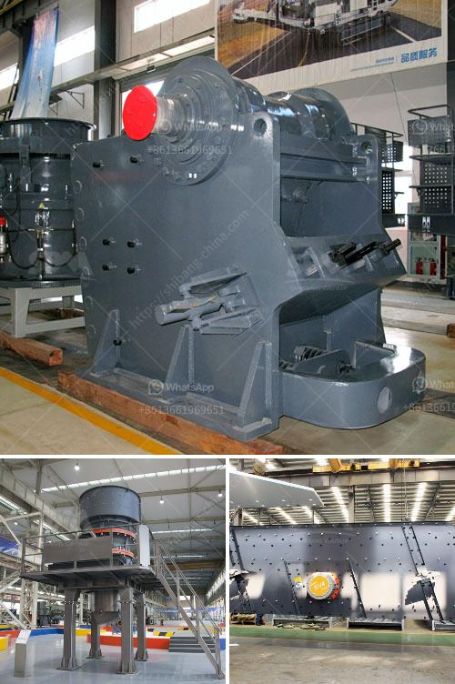

<h3>cement plant equipment list for cost estimation</h3>
When it comes to the construction industry, cement plants are an essential part of it. The cement plant equipment list is a crucial factor in determining the plant's cost estimation. In this article, we will discuss the equipment list and cost estimation of a typical cement plant.

The cement plant consists of various equipment, including crushers, conveyors, stackers, kilns, storage silos, preheaters, dust collectors, and more. These pieces of equipment work together to create the cement we use in various construction projects.

First on the list is the crusher. As the name suggests, this equipment crushes large rocks into smaller pieces, making it easier to transport and handle. Crushers are essential for the cement plant as they break down the raw material into manageable sizes.

Next is the conveyor system, which transports the crushed materials, limestone, clay, and other additives, to the next stage of the cement-making process. Conveyors play a crucial role in moving materials efficiently within the plant, reducing manual labor and increasing productivity.

Stackers and reclaimers are also necessary in a cement plant. These machines assist in stacking and reclaiming materials such as limestone, clay, and iron ore. They help in maintaining an efficient stockpile, ensuring the plant's continuous operation. These machines are equipped with advanced technology to stack materials in a way that prevents segregation and maintains the quality of the raw materials.

Kilns are at the heart of the cement manufacturing process. They are large cylindrical furnaces where raw materials are heated to high temperatures, transforming them into cement clinker. Kilns consume a significant amount of energy in the cement production process. Modern kilns are designed with features such as preheaters and cyclone preheaters to optimize energy consumption.

Storage silos are crucial for storing the finished cement product before it is dispatched for further use. These silos come in various sizes and can store large quantities of cement. They are designed to maintain the quality of cement and protect it from moisture and other environmental factors.

Dust collectors play a vital role in maintaining the air quality within the cement plant and its surrounding areas. They capture dust and other airborne particles generated during the cement manufacturing process, preventing them from being released into the atmosphere. Implementing effective dust collection systems also helps in complying with environmental regulations.

Apart from these major equipment, cement plants also require auxiliary equipment such as pumps, motors, compressors, and control systems. These auxiliary systems contribute to the overall efficiency, safety, and automation of the cement plant.

Now, let's talk about cost estimation. The cost of a cement plant depends on various factors, including the size of the plant, the quality of equipment, the location of the plant, and the local regulations and requirements. Generally, the cost of a cement plant ranges from a few million dollars to billions of dollars, depending on the scale and complexity.

In conclusion, the cement plant equipment list for cost estimation consists of various crucial machinery and auxiliary systems. Each equipment plays a specific role in the cement manufacturing process. Estimating the cost of a cement plant requires considering multiple factors, and it can vary significantly depending on the project's scale and requirements.
<h3>Contact us</h3><ul><li><strong>Whatsapp:&nbsp;<a href="https://wa.me/8613661969651">+8613661969651</a></strong></li><li><a href="https://swt.shibang-china.com/?git&amp;zhl&amp;cement plant equipment list for cost estimation"><strong>Online Service(chat now)</strong></a></li></ul><h3>Related</h3><ul><li><a href='mini crushing plant for sale.md'>mini crushing plant for sale</a></li><li><a href='stone crushers kenya.md'>stone crushers kenya</a></li><li><a href='basalt mobile crusher price price.md'>basalt mobile crusher price price</a></li><li><a href='howhow to set up a stone crushing business.md'>howhow to set up a stone crushing business</a></li><li><a href='stone crusherproduction line.md'>stone crusherproduction line</a></li></ul>