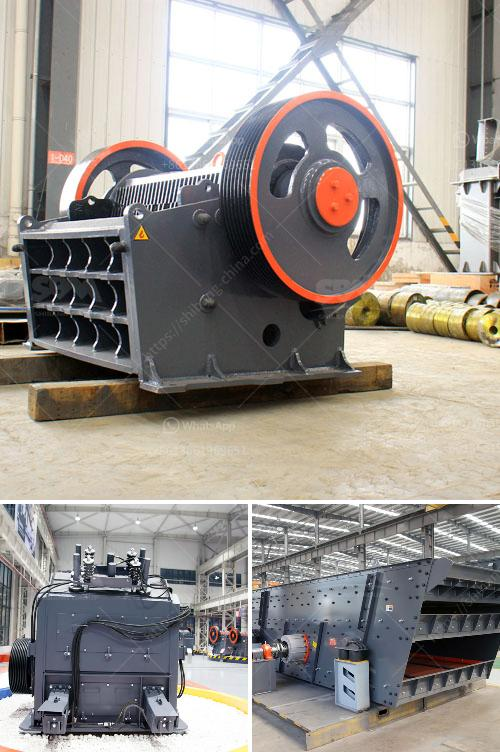

<h3>cement plant for sale</h3>
In the ever-evolving global infrastructure industry, cement remains an essential element for construction and development. Cement plants play a crucial role in the production of this versatile material, making them highly sought after by investors and entrepreneurs. Currently, there is an increasing trend of cement plants for sale worldwide, offering lucrative opportunities to those seeking to capitalize on the growing demand.

As economies continue to grow and populations expand, the demand for cement rises. This demand stems from various sectors, including residential, commercial, and infrastructure development projects. Cement is used in the construction of bridges, highways, buildings, dams, and tunnels, making it a pivotal component of the modern world.

With rapid urbanization and industrialization, emerging markets are investing heavily in infrastructure development. This is driving the demand for cement plants, as countries strive to meet the needs of their growing populations by constructing new roads, buildings, and transportation networks. Cement plants for sale provide a promising opportunity to capitalize on this ever-growing demand, ensuring a stable revenue stream for investors.

Purchasing an existing cement plant presents various advantages compared to building a new one from scratch. Firstly, the acquisition of a fully functioning cement plant eliminates the need for extensive planning, permissions, and initial setup, saving time and resources. Furthermore, purchasing an existing plant allows for immediate revenue generation and production, as the facility will already be equipped and operational.

Many cement plants for sale boast modern technology and enhanced production efficiencies. Investing in such plants allows entrepreneurs to capitalize on advanced manufacturing processes, resulting in cost savings, improved product quality, and reduced environmental impact. Moreover, utilizing up-to-date machinery and technologies positions the plant in a competitive edge, attracting more customers and ensuring long-term profitability.

The cement industry has witnessed significant consolidation over the years, with mergers and acquisitions becoming commonplace. This trend presents further opportunities for those interested in cement plants for sale. Acquiring an existing plant from a company looking to streamline its operations or expand into other markets can offer considerable advantages. It allows for immediate market entry, access to an established customer base, and potential synergies with the existing business.

Cement plants for sale provide a golden opportunity to enter an industry that supports the growth and development of modern societies. With the increasing demand for cement, driven by infrastructure projects worldwide, investing in a cement plant can prove to be a profitable venture. By acquiring existing plants with advanced technologies or participating in industry consolidations, entrepreneurs can ensure a smooth entry into this thriving sector. Cement's indispensable role in construction ensures a sustainable market, making cement plants for sale a compelling investment opportunity for those with a vision for success.
<h3>Contact us</h3><ul><li><strong>Whatsapp:&nbsp;<a href="https://wa.me/8613661969651">+8613661969651</a></strong></li><li><a href="https://swt.shibang-china.com/?git&amp;zhl&amp;cement plant for sale"><strong>Online Service(chat now)</strong></a></li></ul><h3>Related</h3><ul><li><a href='quartz plants in india.md'>quartz plants in india</a></li><li><a href='jaw crusher for sale china.md'>jaw crusher for sale china</a></li><li><a href='stone crushing quarry equipment.md'>stone crushing quarry equipment</a></li><li><a href='double rotor hammer crusher.md'>double rotor hammer crusher</a></li><li><a href='crushing plants for sale in sri lanka.md'>crushing plants for sale in sri lanka</a></li></ul>