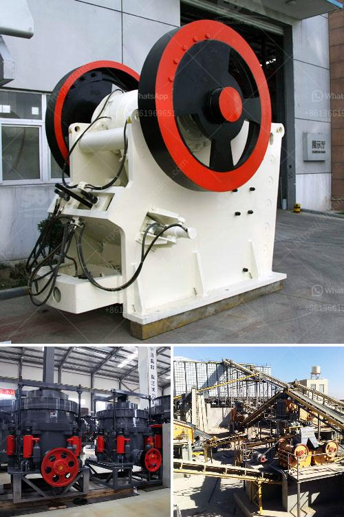

<h3>cement plant in riyadh</h3>
In the bustling city of Riyadh, Saudi Arabia, a prominent cement plant stands tall, embodying the city's commitment to progress and sustainability. This modern facility plays a crucial role in the construction industry, supplying the necessary building blocks for the dynamic urban landscape of the capital region. This article delves into the significance of the cement plant in Riyadh and its contribution towards a sustainable future.

Riyadh has experienced exponential growth in recent years, necessitating a strong foundation for its development activities. The cement plant in Riyadh serves as a bedrock for the city's construction requirements, manufacturing high-quality cement products that enable the realization of ambitious projects. From skyscrapers and bridges to roads and residential complexes, this plant forms an essential cog in Riyadh's infrastructure development.

The cement plant in Riyadh also embodies the city's commitment to sustainable practices. Cement production, historically known for its environmental impact, has evolved substantially in recent years, adopting green technologies to minimize its carbon footprint. The plant employs state-of-the-art equipment and adheres to stringent environmental regulations, ensuring responsible production processes and reduced emissions.

In Riyadh's endeavor to enhance sustainability, the cement plant prioritizes efficient utilization of resources. By implementing innovative recycling techniques, the plant reduces waste generation and minimizes resource consumption. Additionally, the incorporation of alternative fuels, such as biomass and waste-derived fuels, not only reduces dependency on fossil fuels but also helps in managing waste disposal efficiently.

The cement plant in Riyadh serves as a significant source of employment in the region. With thousands of workers involved in its operations, the plant bolsters the local economy, providing stable jobs and improving the overall standard of living. Additionally, numerous indirect job opportunities are created in transportation, maintenance, and supply chain sectors, further stimulating economic growth.

Beyond its economic contributions, the cement plant in Riyadh actively engages with the local community and promotes sustainable practices through corporate social responsibility initiatives. These initiatives involve active participation in community development programs, investing in education, healthcare, and infrastructure projects. By partnering with local organizations and authorities, the plant strives to create a positive impact on Riyadh's social fabric.

The cement plant in Riyadh is committed to continuous improvement and technological advancements in the industry. By investing in research and development, it stays ahead of the curve, exploring cutting-edge technologies that enhance product quality, energy efficiency, and environmental sustainability. Such investment not only benefits the plant itself but also contributes to the growth and development of the entire construction sector in Riyadh.

The cement plant in Riyadh stands as a testament to the city's commitment to sustainable development and economic growth. With its efficient resource utilization, job creation, and community engagement, the plant plays a vital role in shaping Riyadh's evolving urban landscape. By embracing technological advancements and green practices, the plant paves the way for a sustainable future, ensuring that Riyadh continues to thrive as a modern metropolis.
<h3>Contact us</h3><ul><li><strong>Whatsapp:&nbsp;<a href="https://wa.me/8613661969651">+8613661969651</a></strong></li><li><a href="https://swt.shibang-china.com/?git&amp;zhl&amp;cement plant in riyadh"><strong>Online Service(chat now)</strong></a></li></ul><h3>Related</h3><ul><li><a href='gold crusher for sale.md'>gold crusher for sale</a></li><li><a href='project report of dolomite powder plant.md'>project report of dolomite powder plant</a></li><li><a href='gypsum crusher manufacturing in odisha.md'>gypsum crusher manufacturing in odisha</a></li><li><a href='best crusher crushing mm coal of feed size mm.md'>best crusher crushing mm coal of feed size mm</a></li><li><a href='hammer mill for sale south africa.md'>hammer mill for sale south africa</a></li></ul>