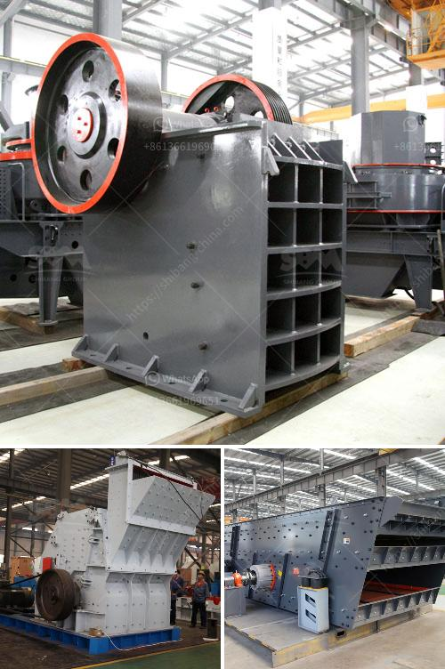

<h3>cement plant in turkey</h3>
Turkey, with its abundant resources and strategic location, has been a hub for industrial and economic growth in recent times. One of the key contributors to this growth is the cement industry, which plays a crucial role in the infrastructure development of the country. A cement plant in Turkey is more than just a manufacturing facility; it is a backbone of progress.

Turkey's cement industry has witnessed substantial growth over the past few decades. With both public and private investments pouring into infrastructure projects, the demand for cement has been consistently increasing. This surge in demand has led to the establishment of numerous cement plants across the country, contributing to its economic development.

One of the major advantages for cement production in Turkey is the availability of prime raw materials. Turkey has vast limestone deposits, which are the primary component of cement production. These limestone deposits are mostly found in the Marmara, Aegean, and Central Anatolian regions, making them easily accessible for cement plants. Additionally, Turkey also has abundant reserves of clay and aggregate, further supporting the cement production process.

Cement plants in Turkey are not only meeting the domestic demand but are also exporting cement to neighboring countries. With its strategic location at the crossroads of Europe and Asia, Turkey has a significant advantage in exporting cement to various markets. This not only generates foreign revenue but also enhances the country's reputation as a reliable supplier of high-quality cement.

Apart from providing cement for infrastructure projects, cement plants in Turkey also create employment opportunities. The construction and operation of these plants require skilled and semi-skilled workers, providing a livelihood to many individuals. Moreover, the multiplier effect of the cement industry stimulates economic growth in other related sectors, such as transportation, logistics, and construction.

In recent years, the Turkish government has implemented several policies to support the cement industry's sustainable development. This includes encouraging investment in modern cement production technologies that reduce energy consumption and carbon emissions. As environmental concerns become more prominent globally, Turkey aims to improve the environmental performance of its cement industry by adopting greener practices. This not only benefits the environment but also enhances the industry's competitiveness and reputation.

Furthermore, the Turkish cement industry actively promotes research and development to improve the quality of cement and develop innovative products. This fosters technological advancements, allowing for the production of specialized cements tailored for specific construction requirements. The industry's focus on research and development has positioned Turkey as a leader in cement technology, attracting foreign investment and collaborations.

In conclusion, the cement plants in Turkey are not only a means for manufacturing cement but also a catalyst for economic development. With its abundant raw material reserves, strategic location, and focus on sustainable practices, Turkey's cement industry has become a backbone for infrastructure growth. The industry's contributions go beyond meeting domestic demand, as it plays a significant role in Turkey's export economy. Additionally, the employment opportunities and advancements in research and development further strengthen the cement industry's position in the country's growth trajectory.
<h3>Contact us</h3><ul><li><strong>Whatsapp:&nbsp;<a href="https://wa.me/8613661969651">+8613661969651</a></strong></li><li><a href="https://swt.shibang-china.com/?git&amp;zhl&amp;cement plant in turkey"><strong>Online Service(chat now)</strong></a></li></ul><h3>Related</h3><ul><li><a href='cost of 200 tpd clinker grinding plant.md'>cost of 200 tpd clinker grinding plant</a></li><li><a href='copper refinery machine south africa.md'>copper refinery machine south africa</a></li><li><a href='types of diaphragm in ball mill.md'>types of diaphragm in ball mill</a></li><li><a href='how to select machines for stone crushing plant.md'>how to select machines for stone crushing plant</a></li><li><a href='basalt mobile crusher price price.md'>basalt mobile crusher price price</a></li></ul>