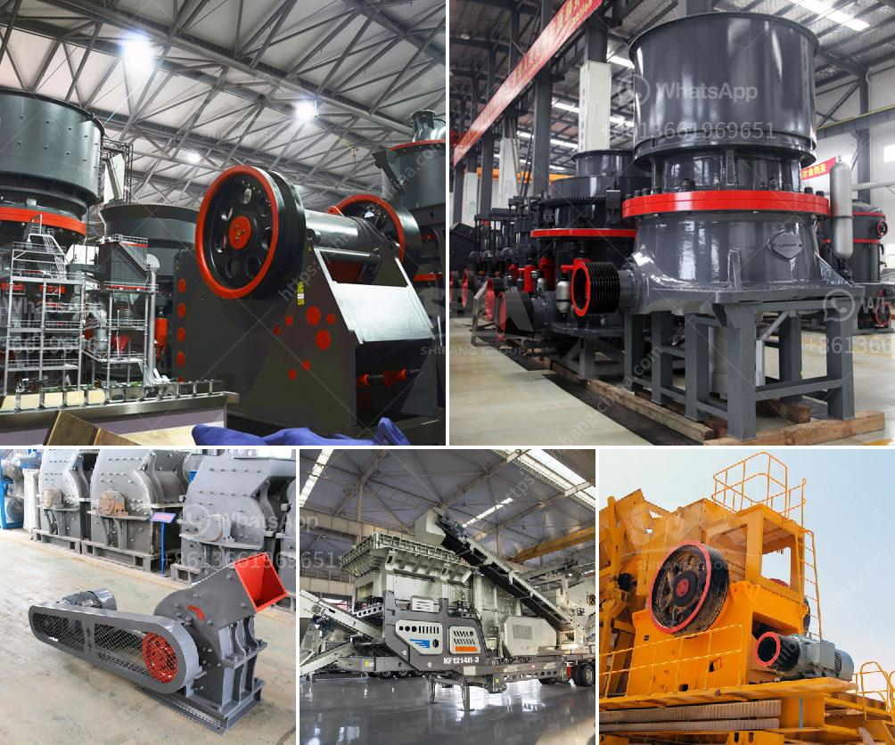

<h3>cement plant layout consultants in south kolkata</h3>
When it comes to constructing a cement plant, having a well-designed and efficient layout is crucial for maximizing productivity and ensuring smooth operations. This is where cement plant layout consultants in South Kolkata come into the picture. These experts specialize in creating optimal plant layouts that are tailored to meet industry standards and specific project requirements.

Cement plant layout consultants are professionals with extensive knowledge of the cement manufacturing process, machinery, and equipment. They understand the intricacies involved in setting up a cement plant, including factors such as raw material sourcing, storage, processing, and distribution. Their expertise lies in integrating these components to create an efficient and cost-effective plant layout that minimizes operational challenges and maximizes output.

One of the key advantages of hiring cement plant layout consultants in South Kolkata is their ability to design layouts that conform to local regulations and environmental standards. Kolkata, being a rapidly growing metropolitan city, has stringent guidelines for industrial establishments, including cement plants. Consultants are well-versed in these regulations and ensure that the plant layout adheres to all legal requirements, ensuring a smooth and hassle-free approval process.

A well-designed cement plant layout is vital for streamlining production processes and improving overall efficiency. Consultants focus on optimizing workflow by designing layouts that minimize material handling, reduce transit time, and improve operational flow. They consider factors such as the layout of machinery and equipment, the positioning of storage facilities, and the flow of raw materials during the manufacturing process. This attention to detail helps to minimize delays, improve productivity, and reduce operational costs.

Cement plant layout consultants also play a crucial role in enhancing safety standards within the plant. They carefully design layouts that prioritize the safety of workers and visitors, ensuring that there are proper access points, emergency exits, and evacuation routes. Additionally, they incorporate safety measures such as fire-resistant materials, adequate lighting, and ventilation systems. By considering these aspects, they create a safe working environment that complies with industry standards and significantly reduces the risk of accidents.

In addition to the technical aspects, cement plant layout consultants in South Kolkata provide valuable insights into cost optimization. They have a comprehensive understanding of the market, including the availability of raw materials, transportation costs, and other variables that impact project budgets. By leveraging their expertise, consultants help plant owners make informed decisions that maintain a balance between quality and cost, thereby maximizing profitability.

A successful cement plant requires a solid foundation, both literally and metaphorically. Hiring a cement plant layout consultant in South Kolkata ensures that the plant is built on a sturdy foundation of planning and expertise. These consultants provide invaluable guidance and support throughout the construction process, from the initial design to the final execution, ultimately giving plant owners the confidence they need to embark on a successful cement manufacturing venture.

In conclusion, cement plant layout consultants in South Kolkata are the go-to experts for designing efficient and cost-effective cement plant layouts. Their expertise in cement manufacturing processes, regulations, and safety standards is invaluable in creating a plant layout that optimizes productivity, minimizes costs, and enhances safety. By hiring these consultants, cement plant owners can set the stage for a successful and profitable venture in Kolkata's growing construction industry.
<h3>Contact us</h3><ul><li><strong>Whatsapp:&nbsp;<a href="https://wa.me/8613661969651">+8613661969651</a></strong></li><li><a href="https://swt.shibang-china.com/?git&amp;zhl&amp;cement plant layout consultants in south kolkata"><strong>Online Service(chat now)</strong></a></li></ul><h3>Related</h3><ul><li><a href='pebbel stone crusher.md'>pebbel stone crusher</a></li><li><a href='dolamite 450 mash grinding machine.md'>dolamite 450 mash grinding machine</a></li><li><a href='mobile crusher capacity 200 ton per hour.md'>mobile crusher capacity 200 ton per hour</a></li><li><a href='stone crushing project complete quarry project machine.md'>stone crushing project complete quarry project machine</a></li><li><a href='mtm 160 trapezium mill shanghai.md'>mtm 160 trapezium mill shanghai</a></li></ul>