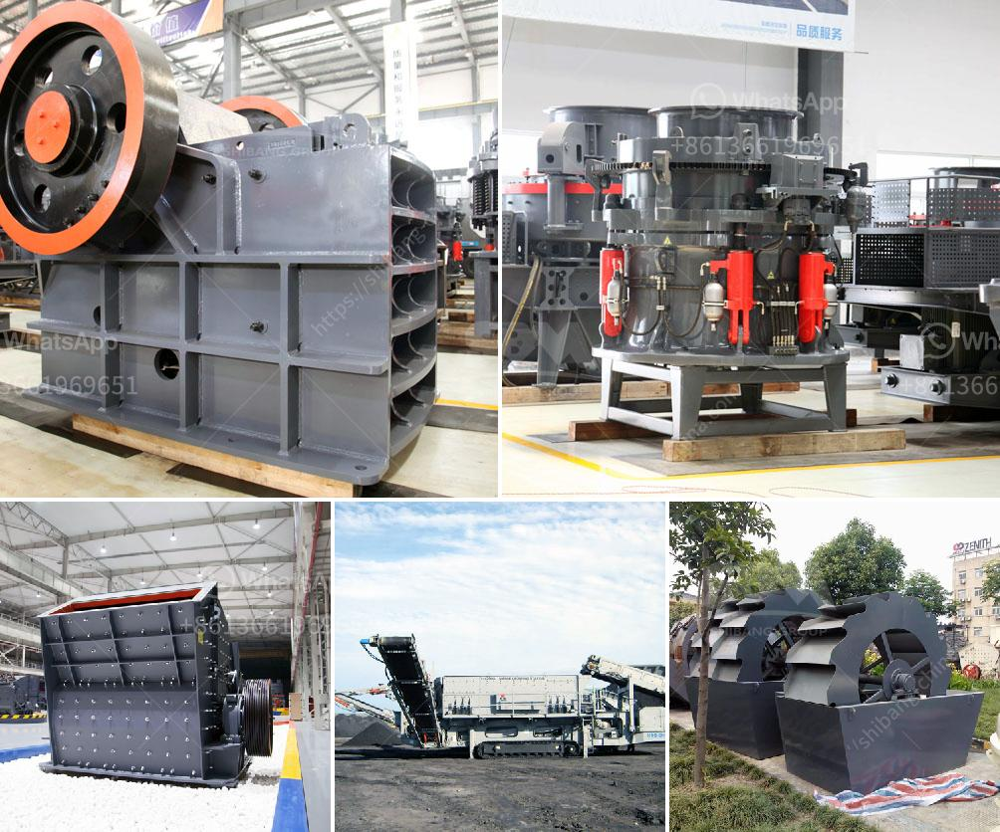

<h3>cement production line 1500 tpd</h3>
Cement is one of the most widely used construction materials in the world, and its production plays a crucial role in meeting the demand for infrastructure development. A cement production line with a capacity of 1500 tpd (tons per day) is an efficient and cost-effective solution for medium to large-scale cement manufacturing plants.

The cement production line of 1500 tpd typically consists of crushing, pre-blending, raw material grinding, homogenization, clinker burning, and cement grinding. Each of these steps requires specific equipment, ensuring a smooth and continuous production process.

The first step in the cement production line is the crushing and pre-blending of raw materials. Raw materials, such as limestone, clay, shale, and iron ore, are crushed to a size that can be handled by the subsequent grinding equipment. The pre-blending process ensures a consistent composition of the raw materials, enhancing the quality of the final cement product.

Next, the crushed and pre-blended raw materials are homogenized in a homogenization silo. This process improves the chemical composition and reduces the variations in the raw material quality, resulting in a more uniform and stable clinker production.

The homogenized raw materials are then ground in a vertical roller mill or ball mill to a fine powder. This grinding process transforms the raw materials into a homogeneous mixture known as raw meal, which is then fed into a rotary kiln for clinker production.

Inside the rotary kiln, the raw meal is heated to temperatures exceeding 1450°C, resulting in the formation of clinker. The clinker is then cooled and ground to produce cement. Lastly, the cement is stored in silos before being dispatched for use in construction projects.

A cement production line with a capacity of 1500 tpd offers several advantages, including high production efficiency, reduced energy consumption, and higher quality cement. It allows cement manufacturers to meet the demands of the market while maintaining cost-effectiveness.

Overall, a cement production line of 1500 tpd is a reliable and efficient solution for cement plants looking to upscale their production capacity. With advancements in technology and equipment, cement manufacturers can continuously improve their production processes and meet the increasing demands of the construction industry.
<h3>Contact us</h3><ul><li><strong>Whatsapp:&nbsp;<a href="https://wa.me/8613661969651">+8613661969651</a></strong></li><li><a href="https://swt.shibang-china.com/?git&amp;zhl&amp;cement production line 1500 tpd"><strong>Online Service(chat now)</strong></a></li></ul><h3>Related</h3><ul><li><a href='hammer mill edipesa.md'>hammer mill edipesa</a></li><li><a href='granite crushing machine for sale.md'>granite crushing machine for sale</a></li><li><a href='hammer mill south africa.md'>hammer mill south africa</a></li><li><a href='mining crusher equipment south africa.md'>mining crusher equipment south africa</a></li><li><a href='impact crushing machine price.md'>impact crushing machine price</a></li></ul>