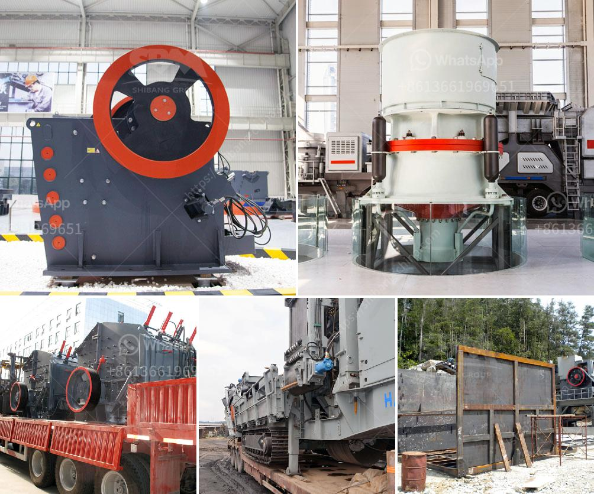

<h3>ceramic ball mill</h3>
Grinding has been an essential and unavoidable process in various industries such as chemicals, minerals, mining, and many others. In the past, grinding mills were primarily used for production and manufacturing purposes, but with technological advancements, grinding mills have evolved to become more efficient and functional. One such revolutionary development is the ceramic ball mill.

The ceramic ball mill is a ball mill made of ceramic, with a small capacity-suitable for small batch production in the trial production stage. It is developed by domestic concentrator ceramic ball mill machinery experts in combination with the latest domestic ball mill technology-a new type of energy saving ball mill equipment, it not only improves the production capacity and crushing efficiency, but also expands the scope of application.

One of the key features of the ceramic ball mill is its high wear-resistance. Unlike traditional ball mills made of metal, the ceramic ball mill uses ceramic liners. This not only prevents the materials from contacting with the metal, but also plays a significant role in extending the service life of the ball mill. It allows for longer grinding time and generates less wear and tear, thus reducing maintenance and replacement costs.

Moreover, the ceramic ball mill has a unique structure design. The main body of the ceramic ball mill is a cylinder-shaped hollow shaft that is welded and supported by large-sized steel balls and a bracket. This design ensures that the ceramic ball mill runs smoothly and has a stable operation with low noise. It also helps in achieving uniform grinding and dispersing of the materials.

Furthermore, the ceramic ball mill is equipped with a variety of accessories, such as ceramic lining plates, inertial impellers, and air classifiers, which further improve its performance. The ceramic lining plates prevent the materials from sticking to the inner wall of the mill, reducing the risks of contamination and cross-contamination. The inertial impellers promote the circulation and mixing of the materials, enhancing the grinding efficiency. The air classifiers separate and classify the materials, ensuring the uniformity of the fineness of the final product.

The ceramic ball mill has gained popularity due to its advantages over traditional ball mills. It not only has a higher grinding efficiency but also consumes less energy, making it more environmentally friendly. Its compact size and easy operation and maintenance make it suitable for small-scale and laboratory applications. Additionally, it can be used for both dry and wet grinding, further expanding its versatility.

In conclusion, the ceramic ball mill is a revolutionary grinding technology that offers numerous benefits over traditional ball mills. With its high wear-resistance, unique structure design, and various accessories, it has become a game-changer in the grinding industry. Its efficiency, energy-saving, and ease of use make it a top choice for the production and manufacturing sector. As technology continues to advance, the ceramic ball mill will undoubtedly play a vital role in shaping the future of grinding processes.
<h3>Contact us</h3><ul><li><strong>Whatsapp:&nbsp;<a href="https://wa.me/8613661969651">+8613661969651</a></strong></li><li><a href="https://swt.shibang-china.com/?git&amp;zhl&amp;ceramic ball mill"><strong>Online Service(chat now)</strong></a></li></ul><h3>Related</h3><ul><li><a href='diamond plant for sale in south africa.md'>diamond plant for sale in south africa</a></li><li><a href='grinding of limestone mill grinding.md'>grinding of limestone mill grinding</a></li><li><a href='sand crusher for sale.md'>sand crusher for sale</a></li><li><a href='best crusher crushing mm coal of feed size mm.md'>best crusher crushing mm coal of feed size mm</a></li><li><a href='hammer mills used in kenya.md'>hammer mills used in kenya</a></li></ul>