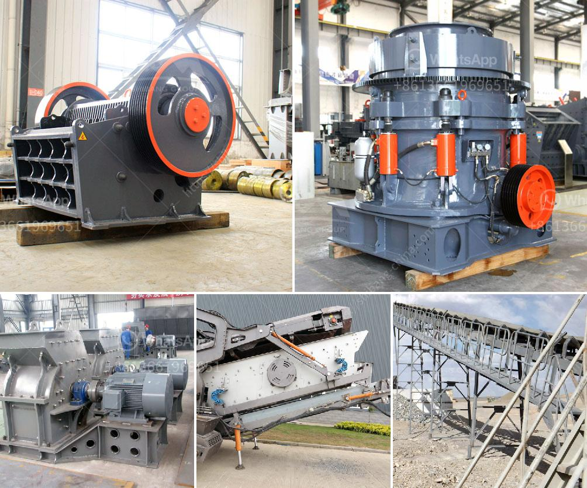

<h3>china clay processing plant cost in india</h3>
China clay, also known as kaolin, is a natural mineral found abundantly in many parts of the world, including India. It is highly valued for its superior quality and multiple applications in various industries such as ceramics, paper, paint, rubber, and cosmetics. To meet the growing demand for china clay, numerous processing plants have been established in India.

The cost of setting up a china clay processing plant in India can vary greatly depending on the specific requirements and scale of the plant. As an estimate, an average-sized plant with a production capacity of 10,000-20,000 tons per annum can cost around $1 million to $2 million. This cost includes land, building, machinery, and other infrastructure required for the plant.

One of the major cost factors in setting up a china clay processing plant is the machinery and equipment required for the extraction, purification, and drying of the clay. This can include crushers, ball mills, magnetic separators, flotation machines, rotary dryers, and other specialized equipment. The cost of these machinery can range from a few hundred thousand dollars to several million dollars, depending on the size and complexity of the plant.

Another significant cost consideration is the land and building required for the plant. The availability and price of land can vary significantly depending on the location and proximity to raw material deposits and transportation networks. Additionally, the construction of buildings and other infrastructure, such as storage facilities and waste management systems, can add to the overall cost.

Apart from the initial set-up cost, there are also ongoing operational and maintenance costs associated with running a china clay processing plant. These can include labor costs, electricity, water supply, fuel, and raw material transportation costs. Additionally, costs for quality control and compliance with environmental regulations should also be taken into account.

In conclusion, setting up a china clay processing plant in India can involve substantial investment. However, with the growing demand for china clay in various industries, it can prove to be a profitable venture in the long run. Careful planning and consideration of various cost factors can help in optimizing the investment and ensuring a successful operation of the plant.
<h3>Contact us</h3><ul><li><strong>Whatsapp:&nbsp;<a href="https://wa.me/8613661969651">+8613661969651</a></strong></li><li><a href="https://swt.shibang-china.com/?git&amp;zhl&amp;china clay processing plant cost in india"><strong>Online Service(chat now)</strong></a></li></ul><h3>Related</h3><ul><li><a href='mobile limestone crusher for sale indonessia.md'>mobile limestone crusher for sale indonessia</a></li><li><a href='bauxite production line in germany.md'>bauxite production line in germany</a></li><li><a href='pe 400 by 600 single toggle jaw crusher specifications.md'>pe 400 by 600 single toggle jaw crusher specifications</a></li><li><a href='screen mobile crusher.md'>screen mobile crusher</a></li><li><a href='carbon black grinder pulvilizer fine powder india.md'>carbon black grinder pulvilizer fine powder india</a></li></ul>