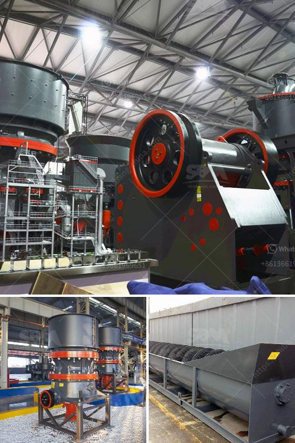

<h3>china cone crusher</h3>
China is a manufacturing hub and the world's largest exporter of machinery. The ever-growing construction industry has further fueled the demand for China cone crushers in the global market. The Cone Crusher Market analysis is provided for the international markets, including development trends, competitive landscape analysis, and key regions development status. 

China cone crushers are built with advanced technology that helps enhance productivity, efficiency, and safety in the construction site. It has a sturdy and durable body that can withstand the toughest of conditions. China cone crushers are widely used in the construction industry for processing materials such as granite, basalt, iron ore, limestone, and other minerals.

With the rapid growth in infrastructure projects, the demand for large-scale cone crushers is also increasing. To cater to the growing demands, China cone crusher manufacturers are investing heavily in research and development to produce high-quality cone crushers that deliver excellent performance and high reliability.

One of the leading manufacturers in the Chinese market is SBM. It offers a wide range of cone crushers that include spring cone crusher, hydraulic cone crusher, and multi-cylinder cone crusher. These cone crushers have different specifications and can be used in different applications. For instance, the multi-cylinder cone crusher is suitable for crushing hard and medium-hard materials while the hydraulic cone crusher is ideal for crushing limestone, gypsum, and quartz.

China cone crushers are easy to operate and maintain. The automation feature allows the crusher to adjust the settings automatically, saving the operator's time and effort. The cone crusher also comes with overload protection, which ensures that the crusher doesn't get damaged in case of an excessive load or foreign material entering the crushing chamber.

The China cone crusher market is estimated to witness a positive growth trajectory due to the government's initiatives to boost infrastructure development. The construction industry in China has been growing at a rapid pace, which has led to an increase in the demand for cone crushers. The cone crushers are used in the construction site to crush and shape stones into aggregates that are used for various infrastructure projects.

China cone crushers have a competitive advantage over their international counterparts due to their cost-effectiveness. The Chinese manufacturers offer cone crushers at a relatively lower price compared to their global competitors. This price advantage has further boosted the demand for China cone crushers in the international market.

Moreover, China cone crushers have high energy efficiency and low emissions, making them environmentally friendly. The cone crushers are designed to reduce the environmental footprint and minimize the impact on the surroundings. This has made them a preferred choice for environmentally conscious construction companies.

In conclusion, China cone crushers have become an essential equipment in the construction industry. With their advanced technology, high reliability, and cost-effectiveness, China cone crushers have gained a significant market share in the global market. The demand for cone crushers is expected to further increase with the growth in infrastructure projects, making China cone crushers a great addition to the construction industry.
<h3>Contact us</h3><ul><li><strong>Whatsapp:&nbsp;<a href="https://wa.me/8613661969651">+8613661969651</a></strong></li><li><a href="https://swt.shibang-china.com/?git&amp;zhl&amp;china cone crusher"><strong>Online Service(chat now)</strong></a></li></ul><h3>Related</h3><ul><li><a href='stone crusher accounting in tally.md'>stone crusher accounting in tally</a></li><li><a href='crusher prices in kenya.md'>crusher prices in kenya</a></li><li><a href='pe 500 750 jaw crusher price.md'>pe 500 750 jaw crusher price</a></li><li><a href='conveyor belt manufacturers in africa.md'>conveyor belt manufacturers in africa</a></li><li><a href='simple formula for belt conveyor counter weight.md'>simple formula for belt conveyor counter weight</a></li></ul>