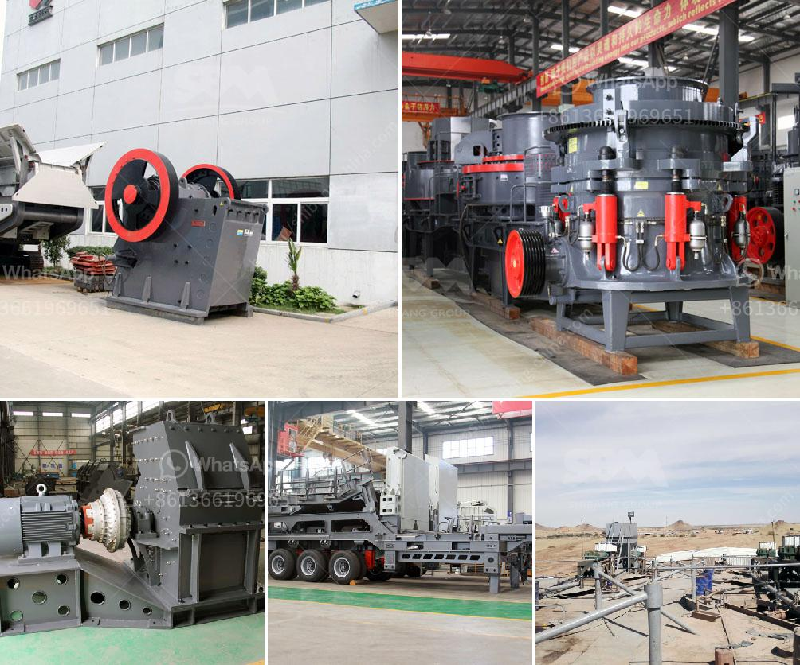

<h3>china cone crushers</h3>
China is a country with a vast population and diverse industrial sector. When it comes to heavy machinery and equipment, China is one of the leading countries in manufacturing and exporting. One of the most commonly used crushing machines in China is the cone crusher.

Cone crushers are a type of compression crusher used by aggregate, coal, concrete, crushing, and mining industries. Its crushing principle is centered on the compression between the mantle and the concave. More specifically, it uses the rotating motion of the eccentric shaft to apply a compressive force on the material entering the crushing chamber.

The cone crushers used in China come in different sizes, capacities, and configurations. Manufacturers provide cone crushers with different features such as hydraulic adjustment mechanisms, anti-spin systems, automation, and others. This variety allows customers to select the cone crusher that best suits their specific needs and requirements.

China cone crushers are known for their high productivity, reliability, and durability. With their robust construction and excellent performance, they have gained popularity both in China and internationally. Many countries import cone crushers from China to enhance their mining and aggregate operations.

One of the main advantages of cone crushers from China is their versatility. They can handle a wide range of materials, including hard rocks, ores, and minerals. This versatility makes them ideal for various industries, from mining to construction. Additionally, the application of cone crushers is not limited to primary or secondary crushing. They are also used for tertiary and quaternary crushing applications.

Another reason for the popularity of China cone crushers is their cost-effectiveness. Compared to other crushing equipment, cone crushers offer a relatively low cost per ton of material processed. The maintenance and operational costs of cone crushers are also lower compared to other types of crushers. This makes them an economical choice for many customers, especially in large-scale operations.

China's cone crushers are also admired for their high reliability. They are built using quality materials and precision engineering, ensuring their long service life and minimal downtime. Additionally, the availability of spare parts and after-sales support from the manufacturers adds to their reliability.

Furthermore, China cone crushers are designed with a focus on environmental protection. They are equipped with dust and noise suppression systems, minimizing the impact on the surrounding environment. This makes them compliant with international environmental standards.

In conclusion, China cone crushers have gained recognition for their high productivity, reliability, versatility, cost-effectiveness, and environmental friendliness. With their robust construction, cutting-edge features, and strong after-sales support, they have become a popular choice for customers worldwide. Whether it is for mining, construction, or other industries, China cone crushers provide efficient and reliable crushing solutions.
<h3>Contact us</h3><ul><li><strong>Whatsapp:&nbsp;<a href="https://wa.me/8613661969651">+8613661969651</a></strong></li><li><a href="https://swt.shibang-china.com/?git&amp;zhl&amp;china cone crushers"><strong>Online Service(chat now)</strong></a></li></ul><h3>Related</h3><ul><li><a href='used crushers in america.md'>used crushers in america</a></li><li><a href='equipment used in small scale mining in ghana.md'>equipment used in small scale mining in ghana</a></li><li><a href='tractor mounted rock crusher uk.md'>tractor mounted rock crusher uk</a></li><li><a href='cone crushers for sale south africa.md'>cone crushers for sale south africa</a></li><li><a href='sand dryer for sale in zimbabwe.md'>sand dryer for sale in zimbabwe</a></li></ul>