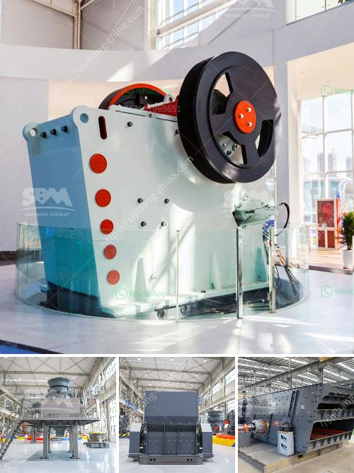

<h3>china gold processing mills</h3>
China has emerged as a leading player in the global gold processing industry, with its state-of-the-art mills attracting attention from investors and mining companies worldwide. The country's commitment to advancements in technology and infrastructure has created an environment conducive to efficient gold processing operations.

Gold processing mills in China are known for their modern and advanced machinery, which enables them to extract gold from ore with higher precision and greater efficiency. These mills utilize a combination of techniques, including crushing, grinding, and cyanidation, to extract gold particles from mined materials. The use of advanced equipment ensures that the process is not only effective but also environmentally friendly.

China's gold processing mills have been successful in producing high-quality gold products, meeting international standards and satisfying the demands of both domestic and international markets. This achievement is a result of significant investments in research and development, as well as continuous improvement in operational practices. The mills have adopted automation and digitalization technologies, enhancing their overall productivity and reducing human errors.

Moreover, China's abundant gold reserves and favorable mining policies provide further support to the growth of its gold processing industry. The country has a long history of gold mining, and its government has implemented measures to attract private investment and encourage technological advancements within the sector. These efforts have led to the establishment of numerous gold processing mills, aiding in the country's economic development and job creation.

As a result of China's commitment to the gold processing industry, the country has become a major exporter of gold products. Its mills have gained recognition for the production of refined gold bars, gold jewelry, and gold coins, which are highly sought-after by investors and consumers around the world. The availability of such quality products has significantly contributed to China's prominence in the global gold market.

In conclusion, China's gold processing mills are a testament to its economic prowess and commitment to technological advancements. These mills have positioned the country as a global leader in gold mining and processing, with their capabilities attracting attention and investment from various stakeholders. As the industry continues to evolve, China is expected to maintain its dominance and further contribute to the growth of the global gold market.
<h3>Contact us</h3><ul><li><strong>Whatsapp:&nbsp;<a href="https://wa.me/8613661969651">+8613661969651</a></strong></li><li><a href="https://swt.shibang-china.com/?git&amp;zhl&amp;china gold processing mills"><strong>Online Service(chat now)</strong></a></li></ul><h3>Related</h3><ul><li><a href='lime stone crusher plant.md'>lime stone crusher plant</a></li><li><a href='crusher for crushing ore in gold mining plant.md'>crusher for crushing ore in gold mining plant</a></li><li><a href='crusher plants in kuwait.md'>crusher plants in kuwait</a></li><li><a href='stone crusher plant philippines.md'>stone crusher plant philippines</a></li><li><a href='turkish manufacturer belt conveyor.md'>turkish manufacturer belt conveyor</a></li></ul>