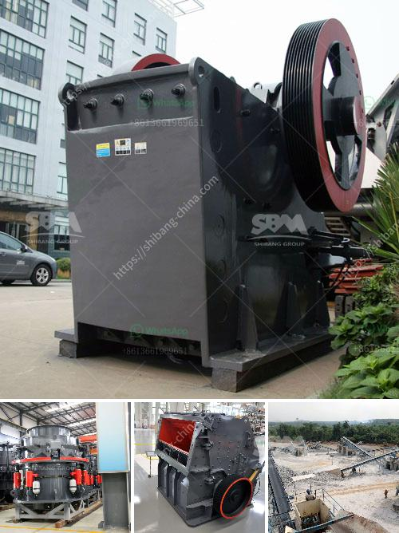

<h3>china gold stamp mills for sale in south africa</h3>
Gold ore grinding equipment plays a crucial role in gold ore mining and beneficiation. To extract the gold from gold ore, you need to crush and grind the ore first and then use beneficiation methods such as gravity separation, flotation, amalgamation, magnetic separation, and electrostatic separation to separate the gold from the ore. Among these methods, gravity separation and flotation are the commonly used techniques in gold ore processing.

When it comes to the crushing and grinding equipment, stamp mills are widely used in gold ore mining operations. In China, there are abundant gold resources and many gold stamp mills operate effectively in South Africa for extracting gold.

The gold stamp mills, also known as gold mill equipment, have specific functions to grind gold ore down to a suitable particle size for further processing, such as the ball mill or crusher. They are highly efficient grinding machines that drive the grinding process to grind gold-bearing rocks into fine powder.

Traditionally, stamp mills were used by miners in the early days of gold mining to crush ore into fine particles and extract gold. This process involved heavy metal stamps that pounded the ore, breaking it apart and releasing the valuable gold particles. The crushed ore was then further processed to separate the gold from the waste material.

Today, stamp mills are still used in some gold mining operations, especially in regions where traditional methods are still practiced. These mills have evolved to become more efficient and automated, enhancing the extraction process and reducing the time and effort required to extract gold from ore.

China is one of the leading producers of gold worldwide, and its gold stamp mills are in high demand in South Africa. The availability of these mills on the market ensures that gold mining operations have access to efficient and reliable grinding equipment. Moreover, the competitive pricing of Chinese mills makes them an attractive option for miners looking to enhance their gold extraction processes.

The stamp mills produced in China are designed to handle a variety of gold ore types, including free-milling ores, refractory ores, and gold ores with high sulfide content. These mills are suitable for both small-scale miners and large-scale mining operations.

In conclusion, gold stamp mills are essential equipment in gold ore mining and beneficiation. China's gold stamp mills are popular among miners in South Africa due to their high efficiency and competitive pricing. These mills play a crucial role in enhancing the extraction process and helping miners extract gold from ore more efficiently. With the continuous development of technology, stamp mills will continue to evolve, offering even more advanced and efficient gold processing solutions in the future.
<h3>Contact us</h3><ul><li><strong>Whatsapp:&nbsp;<a href="https://wa.me/8613661969651">+8613661969651</a></strong></li><li><a href="https://swt.shibang-china.com/?git&amp;zhl&amp;china gold stamp mills for sale in south africa"><strong>Online Service(chat now)</strong></a></li></ul><h3>Related</h3><ul><li><a href='average cost of graphite mining plant.md'>average cost of graphite mining plant</a></li><li><a href='crusher and screening plant.md'>crusher and screening plant</a></li><li><a href='chinese diesel propelled stone crushers for sale.md'>chinese diesel propelled stone crushers for sale</a></li><li><a href='crushers double toggle.md'>crushers double toggle</a></li><li><a href='second hand stone crushing machines in united kingdom.md'>second hand stone crushing machines in united kingdom</a></li></ul>