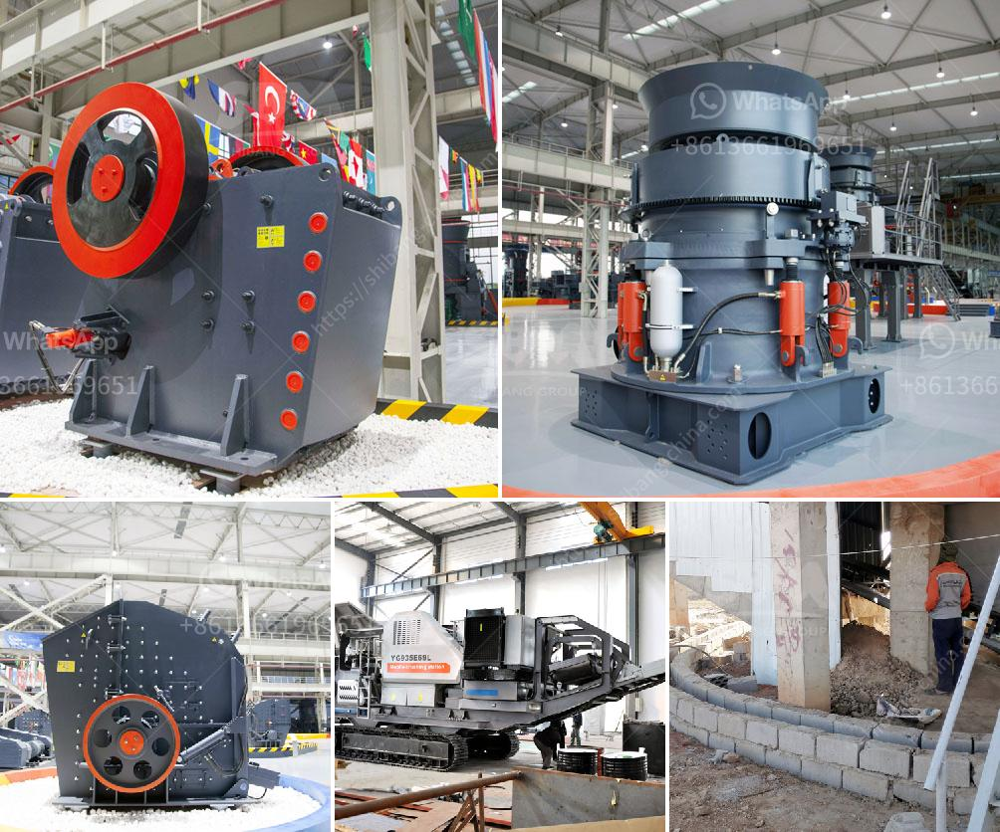

<h3>china granite jaw crusher</h3>
China is a country that is rich in mineral resources and has a huge mining industry. With rapid development and urbanization, the demand for construction materials has surged over the years, particularly granite. Granite is a versatile and durable stone that is widely used in various construction projects, such as buildings, roads, bridges, and monuments.

To meet the growing demand for granite, quarry operators and construction companies in China rely heavily on machinery like the granite jaw crusher. These crushers are specifically designed to break down granite stones into smaller pieces for further usage in construction.

The China granite jaw crusher is a product of many years of research and development by engineers from different industries. It has a simple structure and reliable performance, making it an essential piece of equipment in the crushing process. This jaw crusher is fed with granite stones measuring up to 600mm in size, and it can crush them down to 50-150mm in size.

One of the main advantages of this jaw crusher is its adjustable discharge opening, which can easily be adjusted to suit various crushing applications. This feature allows operators to control the size of the final product, making it suitable for different construction needs. Whether the project requires coarse or fine stones, the China granite jaw crusher can deliver the desired output.

Another notable feature of the China granite jaw crusher is its efficient crushing capacity. With a strong and powerful motor, this crusher can easily process large quantities of granite stones, ensuring a high productivity rate. This makes it an ideal choice for quarrying and mining operations that deal with a significant amount of granite.

Moreover, the China granite jaw crusher is designed with advanced technology to minimize the effects of wear and tear. The high-quality materials used in its construction ensure that it can withstand heavy-duty usage in tough working conditions. This means that the jaw crusher can handle the demands of a construction site without frequent breakdowns, saving time and money for operators.

Furthermore, this jaw crusher is equipped with safety features that prioritize the well-being of operators and the longevity of the machinery. It is equipped with a hydraulic system that protects the crusher from any potential damage caused by overload or obstructions. The system automatically releases the pressure, preventing any major accidents or breakdowns.

In conclusion, the China granite jaw crusher is an essential piece of equipment for the construction industry. Its reliable performance, adjustable discharge opening, efficient crushing capacity, and advanced technology make it a versatile and cost-effective machinery for crushing granite stones. With its safety features and durability, it is a valuable asset for any quarry operator or construction company in China.

As the demand for granite continues to rise, investing in a China granite jaw crusher can significantly improve productivity and profitability for businesses in the construction industry. With its reliable performance and feature-packed design, this machinery ensures efficient crushing of granite stones, ultimately contributing to the development of infrastructure across China.
<h3>Contact us</h3><ul><li><strong>Whatsapp:&nbsp;<a href="https://wa.me/8613661969651">+8613661969651</a></strong></li><li><a href="https://swt.shibang-china.com/?git&amp;zhl&amp;china granite jaw crusher"><strong>Online Service(chat now)</strong></a></li></ul><h3>Related</h3><ul><li><a href='stone crusher machine for home use in south africa.md'>stone crusher machine for home use in south africa</a></li><li><a href='used limestone milling machine.md'>used limestone milling machine</a></li><li><a href='type of crusher machine is best.md'>type of crusher machine is best</a></li><li><a href='alluvial gold processing plant for small scale.md'>alluvial gold processing plant for small scale</a></li><li><a href='vertical grinding machine.md'>vertical grinding machine</a></li></ul>