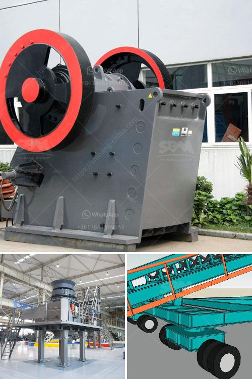

<h3>china grinding unit</h3>
China, known for its unparalleled manufacturing capabilities, has become a global hub for industrial production. As the demand for high-quality products continues to rise, the need for efficient and precise grinding units has become increasingly significant. Grinding units, widely used in various industries such as automotive, aerospace, and construction, play a crucial role in achieving the desired shape, size, and surface finish of different materials.

A grinding unit, also known as a grinding machine or grinder, is a powerful tool that utilizes an abrasive wheel or belt to remove excess material from a workpiece, thereby refining its dimensions and surface finish. Compared to manual grinding methods, grinding units offer several advantages such as increased productivity, consistency, and reduced human error. China, with its extensive expertise in manufacturing, has become a leading producer and supplier of grinding units globally.

The Chinese grinding unit industry thrives on its ability to meet diverse customer requirements by offering a wide range of grinding machines. These machines include cylindrical grinders, surface grinders, centerless grinders, and tool and cutter grinders. Each type of grinder caters to specific grinding needs, allowing manufacturers to benefit from customization and flexibility in their operations. Moreover, advancements in technology have led to the development of computer numerical control (CNC) grinding machines, further enhancing precision and automation in the grinding process.

One of the key factors that contribute to the success of China's grinding unit industry is its emphasis on research and development. Chinese manufacturers invest significant resources in innovation, striving to develop cutting-edge technologies and improve the performance of grinding units. Constant research and development efforts enable China to produce grinding machines that are not only efficient but also environmentally friendly. This commitment to sustainability has positioned China as a frontrunner in the global grinding unit market.

In addition to its robust product portfolio, China's grinding unit industry is characterized by its competitive pricing. The country's expansive manufacturing infrastructure and economies of scale allow manufacturers to offer cost-effective solutions to customers worldwide. This affordability advantage, coupled with China's reputation for quality, has made its grinding units highly sought after in international markets.

China's grinding units also contribute significantly to the country's overall economic growth. The industry supports job creation and fosters a skilled workforce. As the demand for more advanced and efficient grinding units increases, manufacturers are compelled to invest in their facilities, thereby stimulating economic development. Furthermore, the thriving grinding unit industry fosters a healthy ecosystem of supporting industries, such as the production of abrasive wheels and belts, which adds further value to the economy.

In conclusion, China's grinding unit industry plays a fundamental role in enhancing the country's industrial economy. Through its commitment to innovation, precision, and competitiveness, China has established itself as a global leader in grinding unit manufacturing. The industry's contribution to economic growth, job creation, and technological advancement further solidifies its significance in the overall landscape of China's manufacturing sector. As the demand for quality grinding units continues to rise, China's capacity to meet these requirements positions it for continued success both domestically and internationally.
<h3>Contact us</h3><ul><li><strong>Whatsapp:&nbsp;<a href="https://wa.me/8613661969651">+8613661969651</a></strong></li><li><a href="https://swt.shibang-china.com/?git&amp;zhl&amp;china grinding unit"><strong>Online Service(chat now)</strong></a></li></ul><h3>Related</h3><ul><li><a href='price of a stone crusher machine in zambia.md'>price of a stone crusher machine in zambia</a></li><li><a href='china top limestone crusher brands.md'>china top limestone crusher brands</a></li><li><a href='demand of stage concassage mobile.md'>demand of stage concassage mobile</a></li><li><a href='multi hammer crusher.md'>multi hammer crusher</a></li><li><a href='rental mobile stone crusher machine in malaysia.md'>rental mobile stone crusher machine in malaysia</a></li></ul>