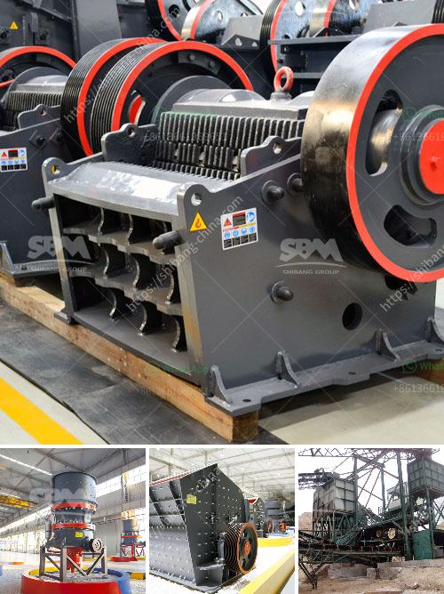

<h3>china jaw crusher importer in pakistan</h3>
The mining industry is considered as one of the major sources of revenue for any country. To pave the way for smooth mining operations, a reliable source of crushing equipment is essential. As a leading mining country, China has consistently provided jaw crushers and other equipment to meet the requirements of the mining industry in Pakistan.

China's jaw crusher importer in Pakistan plays a critical role in the country's mining industry. Jaw crushers crush stones or rocks into smaller sizes, which can be used as building materials or gravel for construction purposes. These machines are also used for crushing ores, minerals, and other raw materials in various industries such as cement, metallurgy, and power generation.

One of the main advantages of China-made jaw crushers is their affordable prices compared to other international brands. Chinese manufacturers have been able to produce high-quality jaw crushers at competitive prices due to their advanced manufacturing processes and economies of scale. This has made it easier for importers in Pakistan to acquire the necessary equipment for their mining operations.

China's jaw crusher importer in Pakistan not only offers affordable prices but also provides a wide range of crusher models to choose from. This allows buyers to select the equipment that best suits their specific requirements and budget. Whether it's a small-scale mining operation or a large-scale industrial project, there is a jaw crusher model available to meet the needs of every customer.

Furthermore, Chinese manufacturers are known for their excellent after-sales service. They ensure that spare parts are readily available and provide technical support to customers whenever needed. This has proven to be a significant advantage for importers in Pakistan, as it reduces downtime and maintenance costs, ensuring smooth and efficient mining operations.

In addition to jaw crushers, Chinese manufacturers also supply other types of crushing equipment, such as cone crushers, impact crushers, and hammer crushers. This provides importers with a wide range of options to cater to different crushing requirements.

However, while importing jaw crushers from China can be advantageous, importers must also ensure that they deal with reputable and reliable manufacturers. Proper due diligence should be conducted to verify the manufacturer's credentials, quality control procedures, and certifications.

Importers must also ensure compliance with local regulations and ensure that the imported equipment meets safety and quality standards. Additionally, importers should consider engaging local technical experts or engineers to inspect the equipment before making any final decisions.

In conclusion, China's jaw crusher importer in Pakistan has played a crucial role in supporting the country's mining industry. Chinese manufacturers offer affordable prices, a wide range of models, and excellent after-sales service. However, importers must exercise caution and ensure that they deal with reliable manufacturers and comply with local regulations to ensure a successful mining operation.
<h3>Contact us</h3><ul><li><strong>Whatsapp:&nbsp;<a href="https://wa.me/8613661969651">+8613661969651</a></strong></li><li><a href="https://swt.shibang-china.com/?git&amp;zhl&amp;china jaw crusher importer in pakistan"><strong>Online Service(chat now)</strong></a></li></ul><h3>Related</h3><ul><li><a href='grinding mill cocoa powder plant duyvis.md'>grinding mill cocoa powder plant duyvis</a></li><li><a href='crusher price in kazakhstan.md'>crusher price in kazakhstan</a></li><li><a href='vsi crusher suppliers in europe.md'>vsi crusher suppliers in europe</a></li><li><a href='price for china crusher.md'>price for china crusher</a></li><li><a href='gold crusher for sale.md'>gold crusher for sale</a></li></ul>