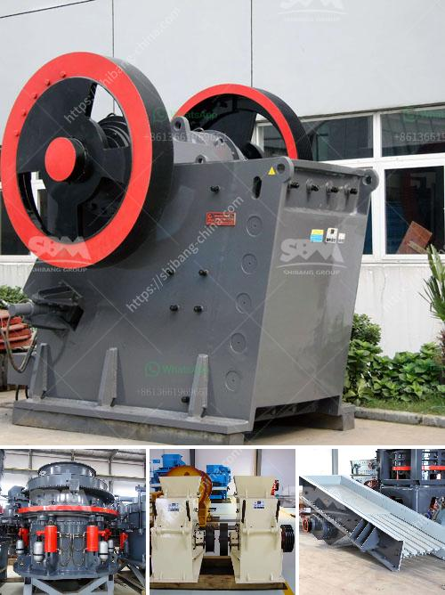

<h3>china multifunction peeling and crushing</h3>
China has always been at the forefront of technological advancements, consistently pushing the boundaries to create innovative and efficient machinery. One such example is the China multifunction peeling and crushing machine, a revolution in the agricultural industry that has simplified and expedited the process of food preparation.

The multifunction peeling and crushing machine is specifically designed to tackle the labor-intensive task of peeling and crushing various agricultural products such as potatoes, carrots, and cassava. Traditionally, this process required a significant amount of time and effort, often involving manual labor and multiple tools. However, with the introduction of this innovative Chinese machine, peeling and crushing can now be done effortlessly and efficiently.

One of the key features of this multifunction machine is its ability to peel and crush simultaneously, saving both time and manpower. The machine consists of a peeling chamber and a crushing chamber, both equipped with cutting-edge technology that ensures a precise and uniform result. The peeling chamber utilizes advanced techniques to swiftly remove the outer layer of the produce, while the crushing chamber employs sharp blades to effectively crush the peeled products into the desired consistency.

Moreover, this multifunction machine is capable of handling a wide range of agricultural products, making it a versatile tool for farmers and food processors. Whether it's potatoes, carrots, or cassava, this machine can efficiently peel and crush them all. This versatility not only increases its utility for users but also contributes to reducing overall expenses by reducing the need for separate machines for each product.

In addition to its functional capabilities, the machine is also designed with user convenience in mind. It features a user-friendly interface that allows operators to easily control and monitor the process. The machine's sturdy and durable construction ensures longevity, making it a cost-effective investment for businesses.

The introduction of the multifunction peeling and crushing machine has undoubtedly revolutionized the agricultural industry in China. It has simplified food preparation processes, reduced labor costs, and increased overall productivity. Farmers and food processors can now complete tasks that would have previously taken hours in a matter of minutes, ultimately boosting their efficiency and profitability.

Furthermore, this Chinese innovation has the potential to transform the lives of individuals across the globe. Its versatility and efficiency make it an invaluable asset, particularly in regions where agricultural productivity plays a crucial role in the economy. With China's reputation for manufacturing high-quality machinery, it is no surprise that the multifunction peeling and crushing machine has gained popularity and demand worldwide.

In conclusion, the China multifunction peeling and crushing machine is an exemplary representation of Chinese innovation in the agricultural sector. Its ability to simultaneously peel and crush various agricultural products, coupled with user convenience and durability, makes it an indispensable tool for farmers and food processors. As a result, this machine has revolutionized the industry, transforming labor-intensive tasks into effortless and efficient processes.
<h3>Contact us</h3><ul><li><strong>Whatsapp:&nbsp;<a href="https://wa.me/8613661969651">+8613661969651</a></strong></li><li><a href="https://swt.shibang-china.com/?git&amp;zhl&amp;china multifunction peeling and crushing"><strong>Online Service(chat now)</strong></a></li></ul><h3>Related</h3><ul><li><a href='vibration screen machine.md'>vibration screen machine</a></li><li><a href='gypsum grinding machine manufacturer.md'>gypsum grinding machine manufacturer</a></li><li><a href='graphite beneficiation plant at nigeria.md'>graphite beneficiation plant at nigeria</a></li><li><a href='hammer mill for limestone in south africa.md'>hammer mill for limestone in south africa</a></li><li><a href='lime stone crusher plant.md'>lime stone crusher plant</a></li></ul>